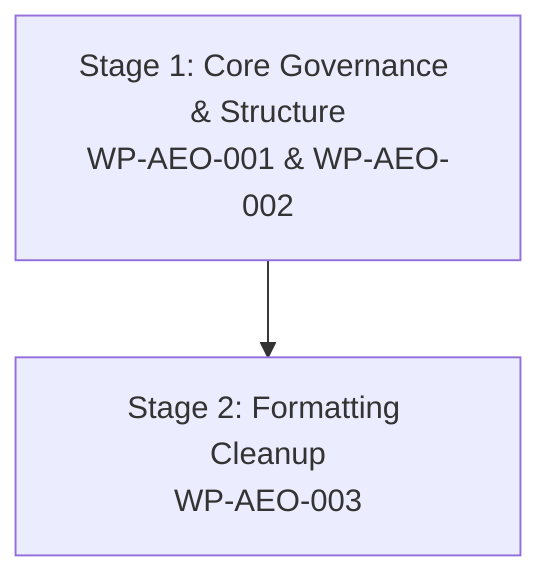

# BECC v2.3 AEOcortex Improvement Implementation Plan

**BECC — BridGenta Engineering Communication Constitution**

Framework Version: BECC v2.3  
Operational Phase: Certification Execution  
Pipeline Sprint: OP-003  
Project: AEOcortex (`aeocortex`)  
Previous Sprint: OP-002 — Communication Assessment (Completed)  

---

## 1. Executive Summary

This document presents the official **Improvement Implementation Plan** for **AEOcortex** (`aeocortex`), formulated during Sprint OP-003 of the BECC v2.3 Certification Execution phase.

During the preceding independent assessment (Sprint OP-002), AEOcortex demonstrated high documentation maturity, strong core technical prose, clear Node.js Cheerio parser explanations, and valid JSON-LD schema entity graph validation. However, three compliance findings (`FIND-AEO-001` through `FIND-AEO-003`) were logged due to a non-standard chapter heading (`## Risks` instead of `## Risks & Mitigations`), missing frontmatter git commit SHA metadata, and obsolete legacy pilot text annotations.

The purpose of this sprint is to translate those three findings into structured, risk-managed **Work Packages** (`WP-AEO-001` through `WP-AEO-003`). This plan defines **what** must be modified, **why** it is constitutionally required, and **how** completion will be independently verified in Sprint OP-004.

---

## 2. Improvement Inventory

All approved findings from the OP-002 Communication Assessment are mapped to initial planning states:

| Finding ID | Title / Target Area | Severity | Implementation Status |
| :--- | :--- | :---: | :---: |
| **FIND-AEO-001** | Non-Standard Chapter Heading (`## Risks`) | **Major** | **Planned** (`WP-AEO-001`) |
| **FIND-AEO-002** | Missing Commit SHA Metadata Traceability | **Major** | **Planned** (`WP-AEO-002`) |
| **FIND-AEO-003** | Legacy Pilot Text Annotation Remnants | **Minor** | **Planned** (`WP-AEO-003`) |

---

## 3. Implementation Work Packages

### 3.1. Work Package WP-AEO-001: Chapter Heading Standardization (MAT-012)
*   **Work Package ID**: `WP-AEO-001`
*   **Target Finding**: `FIND-AEO-001`
*   **Objective**: Rename the non-standard H2 heading `## Risks` to `## Risks & Mitigations` in `src/content/projects/aeocortex.md`.
*   **Constitutional Requirement**: MAT-012 (Risk Management & Mitigation Chapter Standard).
*   **Current State**: Heading at line 218 reads `## Risks`, omitting the mandatory `& Mitigations` element despite containing a structured risk mitigation table.
*   **Planned Change**: Update line 218 to `## Risks & Mitigations` while preserving the existing 2-row risk matrix table (`RISK-AC-001` and `RISK-AC-002`) and technical mitigation descriptions.
*   **Expected Outcome**: 100% compliance with MAT-012 chapter naming standards without altering existing risk content.
*   **Verification Criteria**: Observable presence of exact H2 header `## Risks & Mitigations` during OP-004 verification.

### 3.2. Work Package WP-AEO-002: Commit SHA & Release Baseline Traceability
*   **Work Package ID**: `WP-AEO-002`
*   **Target Finding**: `FIND-AEO-002`
*   **Objective**: Add repository commit SHA traceability metadata to sidebar frontmatter and Astro content schema.
*   **Constitutional Requirement**: BECC Certification Operations Framework & Certified Project Registry Schema.
*   **Current State**: Sidebar frontmatter in `aeocortex.md` lacks `evaluatedCommitSha` and `evaluationBaseline`.
*   **Planned Change**:
    1.  Update `src/content/projects/aeocortex.md` sidebar frontmatter to include:
        ```yaml
        evaluatedCommitSha: "ae103abf4027bc991a027e1f40958a032d90956b"
        evaluationBaseline: "BECC v2.3 GA Baseline / Release v1.0.0"
        ```
    2.  Verify `src/content/config.ts` handles optional frontmatter strings cleanly.
*   **Expected Outcome**: Complete commit-level traceability matching Certified Project Registry standards.
*   **Verification Criteria**: Frontmatter fields present and valid during OP-004 verification.

### 3.3. Work Package WP-AEO-003: Legacy Pilot Text Annotation Cleanup
*   **Work Package ID**: `WP-AEO-003`
*   **Target Finding**: `FIND-AEO-003`
*   **Objective**: Remove obsolete legacy pilot text annotations while preserving all underlying technical narrative content.
*   **Constitutional Requirement**: BECC Section Formatting & Clean Governance Documentation.
*   **Current State**: Obsolete pilot annotation lines appear below headers in `Validation` (line 194: `*(Verweis: Assessment AC-001, Finding FIN-AC-001...)*`), `Risks` (line 219: `*(Verweis: Assessment AC-001, Finding FIN-AC-002...)*`), and `References` (line 241: `*(Verweis: Assessment AC-001, Finding FIN-AC-003...)*`).
*   **Planned Change**: Remove the 3 obsolete annotation sub-header lines from `src/content/projects/aeocortex.md` while retaining all technical prose, bullet points, risk tables, and reference links.
*   **Expected Outcome**: Clean, standardized section headers conforming to BECC v2.3 presentation rules.
*   **Verification Criteria**: Complete absence of obsolete pilot reference strings during OP-004 verification.

---

## 4. Implementation Order

Work packages will be executed in a prioritized 2-stage sequence based on constitutional impact:



1.  **Stage 1 — Core Governance & Structure (`WP-AEO-001` & `WP-AEO-002`)**: Rename `## Risks` to `## Risks & Mitigations` to satisfy MAT-012 and establish git commit SHA traceability in frontmatter.
2.  **Stage 2 — Formatting Cleanup (`WP-AEO-003`)**: Strip obsolete pilot text annotations and execute final build validation checks (`npm run lint`, `check-links`, `build`).

---

## 5. Risk Assessment

| Risk Category | Identified Risk | Impact | Mitigation Strategy |
| :--- | :--- | :---: | :--- |
| **Implementation Risk** | Inadvertent modification of existing B2–C1 German prose during annotation cleanup. | Low | Perform targeted line-specific replacements without altering surrounding markdown paragraphs. |
| **Documentation Risk** | Markdown linter error due to header level skipping or duplicate H1. | Low | Enforce strict H2 (`## `) headings for all added/renamed chapters; validate via `npm run lint`. |
| **Governance Risk** | Frontmatter schema failure in Astro build pipeline. | Medium | Utilize already supported `evaluatedCommitSha` schema fields in `src/content/config.ts`. |
| **Regression Risk** | Broken relative or external markdown links. | Low | Validate all links prior to commit via `npm run check-links`. |

---

## 6. Traceability Matrix

End-to-end mapping from OP-002 Assessment findings to OP-004 Verification targets:

| Finding ID | Work Package | BECC Requirement | Target File | OP-004 Verification Target |
| :--- | :--- | :--- | :--- | :--- |
| `FIND-AEO-001` | `WP-AEO-001` | MAT-012 (Risks & Mitigations) | `src/content/projects/aeocortex.md` | Confirm presence of exact H2 header `## Risks & Mitigations`. |
| `FIND-AEO-002` | `WP-AEO-002` | Registry Traceability | `src/content/projects/aeocortex.md` | Confirm presence of `evaluatedCommitSha` frontmatter. |
| `FIND-AEO-003` | `WP-AEO-003` | Governance Formatting | `src/content/projects/aeocortex.md` | Confirm complete removal of obsolete pilot annotation text lines. |

---

## 7. Success Criteria

The engineering implementation phase following this plan will be deemed successful when:

1.  All 3 Work Packages (`WP-AEO-001` through `WP-AEO-003`) are 100% implemented.
2.  `src/content/projects/aeocortex.md` contains all 14 mandatory BECC Assessment Matrix chapters with standardized H2 headers.
3.  Language tone maintains flawless B2–C1 German engineering prose without degrading existing technical descriptions.
4.  Automated validation tools (`npm run lint`, `npm run check-links`, `npm run build`) execute cleanly with 0 errors.

---

## 8. Readiness Assessment

Following comprehensive formulation of work packages, execution order, risk mitigations, and traceability criteria, the planning determination is:

```text
READINESS ASSESSMENT:
READY FOR IMPLEMENTATION
```

### Evidence-Based Justification

Every finding from OP-002 has been mapped 1:1 to an actionable work package with clear verification targets. The implementation scope is strictly bounded, risk-managed, and cleared for engineering execution.

---

BECC AEOCORTEX IMPROVEMENT IMPLEMENTATION PLAN COMPLETE

IMPLEMENTATION STATUS:
PLANNED

NEXT PHASE:
ENGINEERING IMPLEMENTATION

FOLLOWING OPERATIONAL SPRINT:
OP-004 — AEOCORTEX IMPROVEMENT VERIFICATION
