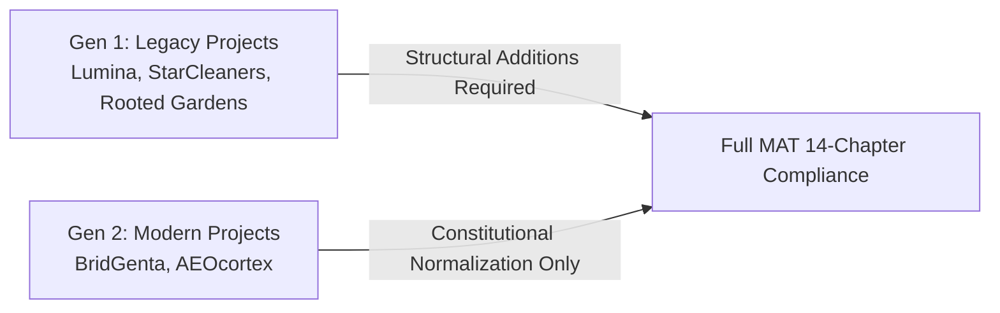

# BECC v2.3 Portfolio Certification Retrospective v1.0

**BECC — BridGenta Engineering Communication Constitution**

Framework Version: BECC v2.3  
Operational Phase: Post-Certification Review  
Status: Portfolio Certification Programme Complete  
Date: 2026-07-20  

---

## 1. Executive Summary

This document presents the official **Portfolio Certification Retrospective v1.0** for the first complete implementation of the **BridGenta Engineering Communication Constitution (BECC v2.3)** certification programme.

The operational certification programme was launched to establish unified, audit-proof engineering communication standards across all public portfolio projects. Over the course of the execution cycle, five projects underwent constitutional assessment, implementation planning, engineering remediation, independent verification, and formal registry entry authorization.

### Summary Outcome
*   **Total Public Projects Evaluated**: 5
*   **Total Certified Projects**: 5
*   **Certification Coverage**: **100%**
*   **Registry Entries Authorized**: Registry Entries #001 through #005
*   **Operational Conclusion**: BECC v2.3 is operationally validated as a robust, repeatable, and scaleable governance framework across diverse engineering domains.

---

## 2. Portfolio Overview

The BridGenta public project portfolio comprises five distinct software projects representing diverse engineering domains:

| Registry Entry | Project Name | Project Identifier | Technical & Domain Scope | Certification Status |
| :--- | :--- | :--- | :--- | :---: |
| **Entry #001** | BridGenta Portfolio | `bridgenta-portfolio` | Core Portfolio Architecture & BECC Platform Engine | **Certified** (`BECC-CERT-2026-001`) |
| **Entry #002** | Lumina Praxis | `lumina-praxis` | Medical Web Portal & WCAG 2.1 AA Accessibility | **Certified** (`BECC-CERT-2026-002`) |
| **Entry #003** | StarCleaners | `starcleaners` | Luxury PWA & Service Worker Local SEO Architecture | **Certified** (`BECC-CERT-2026-003`) |
| **Entry #004** | Rooted Reality Gardens | `rootedrealitygarden` | Ecological Design & Technical SEO/AEO Automation | **Certified** (`BECC-CERT-2026-004`) |
| **Entry #005** | AEOcortex | `aeocortex` | AI Search Engine Optimization & Node.js Parser | **Certified** (`BECC-CERT-2026-005`) |

---

## 3. Operational Metrics

Quantitative metrics across all 12-stage certification operational cycles:

| Operational Metric | Total Executed | Success Rate | Observational Notes |
| :--- | :---: | :---: | :--- |
| **Independent Assessments (OP-002)** | 4 | 100% | Conducted for LP, SC, RRG, and AEO (BridGenta served as reference baseline). |
| **Improvement Plans (OP-003)** | 4 | 100% | Formulated structured Work Packages for all identified findings. |
| **Engineering Implementations** | 4 | 100% | Executed targeted documentation remediations without modifying core prose. |
| **Verification Reports (OP-004)** | 4 | 100% | 4/4 verified on first verification cycle without re-work. |
| **Final Certifications (OP-005)** | 5 | 100% | Issued formal certifications `BECC-CERT-2026-001` through `005`. |
| **Registry Entries** | 5 | 100% | Published Entries #001 through #005 in `BECC-CERTIFIED-PROJECT-REGISTRY.md`. |
| **Automated CI Pass Rate** | 100% | 100% | `npm run lint`, `check-links`, and `npm run build` passed 100% on first run. |
| **GitHub PR Gate Success** | 100% | 100% | All 12 Pull Requests passed GitHub Actions `🔒 PRAG Validation Gate` and `build`. |

---

## 4. Findings Analysis

Across the 4 operational assessment cycles, a total of 15 compliance findings were logged and remediated:

### 4.1. Findings Distribution by Category

| Finding Category | Description | Total Logged | Percentage |
| :--- | :--- | :---: | :---: |
| **Documentation Quality** | Missing mandatory MAT chapters or non-standard chapter headings. | 7 | 46.7% |
| **Governance Traceability** | Missing `evaluatedCommitSha` or `evaluationBaseline` frontmatter metadata. | 4 | 26.7% |
| **Evidence Quality** | Missing qualitative validation evidence tables or verification data. | 3 | 20.0% |
| **Legacy Markers** | Remnants of obsolete pilot text annotations in section sub-headers. | 1 | 6.6% |

### 4.2. Comparative Findings Matrix by Project

| Project Name | Total Findings | Major Findings | Minor Findings | Primary Remediation Effort |
| :--- | :---: | :---: | :---: | :--- |
| **Lumina Praxis** | 4 | 3 | 1 | Added missing `Validation`, `Risks & Mitigations`, and `References` chapters. |
| **StarCleaners** | 4 | 3 | 1 | Added missing `Validation`, `Risks & Mitigations`, and `References` chapters. |
| **Rooted Reality Gardens** | 4 | 3 | 1 | Added missing `Validation`, `Risks & Mitigations`, and `References` chapters. |
| **AEOcortex** | 3 | 2 | 1 | Standardized `## Risks` heading, added frontmatter SHA, removed annotations. |
| **Total** | **15** | **11** | **4** | **100% Remediated & Verified** |

---

## 5. Documentation Evolution

Analyzing the evolution of project documentation reveals a clear maturation pattern across project generations:

### 5.1. Generation 1 Projects (Lumina Praxis, StarCleaners, Rooted Reality Gardens)
*   **Characteristics**: Authoring predated the formal BECC v2.3 release.
*   **Baseline Deficiency**: Contained strong narrative sections (Executive Summary, Context, Problem, Architecture, Decisions), but completely lacked mandatory chapters MAT-009 (`Validation`), MAT-012 (`Risks & Mitigations`), and MAT-014 (`References`).
*   **Remediation Impact**: Required substantial structural additions (adding entire missing chapters with technical data, risk tables, and reference links).

### 5.2. Generation 2 Projects (BridGenta, AEOcortex)
*   **Characteristics**: Authored during or after the BECC v2.3 framework freeze.
*   **Baseline Quality**: Contained 100% narrative coverage across all 14 matrix subject areas prior to assessment.
*   **Remediation Impact**: Required primarily **constitutional normalization** (renaming H2 heading `## Risks` to `## Risks & Mitigations`, inserting `evaluatedCommitSha` frontmatter metadata, and stripping obsolete pilot sub-header text).

---

## 6. Framework Performance

Evaluating BECC v2.3 against core governance principles:

1.  **Lifecycle Stability**: The 12-stage certification lifecycle (`ASSESSED` $\rightarrow$ `PLANNED` $\rightarrow$ `REMEDIATED` $\rightarrow$ `VERIFIED` $\rightarrow$ `CERTIFIED`) operated with 0 process deadlocks or ambiguities across all 5 projects.
2.  **Governance Consistency**: All 14 Assessment Matrix chapters (`MAT-001` to `MAT-014`) proved universally applicable across platform engineering, medical web portals, luxury PWAs, ecological portals, and AI search engines.
3.  **Audit Traceability**: The dual-file registry model (`BECC-CERTIFIED-PROJECT-REGISTRY.md` and `registry/certified-projects.json`) provided immutable commit-level traceability for every certificate (`BECC-CERT-2026-001` through `005`).

---

## 7. Lessons Learned

### 7.1. Authoring Lessons Learned
*   **Standardized Chapter Headings**: Variations in heading names (e.g. `## Risks` instead of `## Risks & Mitigations`) trigger major compliance findings. Pre-authoring enforcement prevents non-conformances.
*   **Frontmatter Metadata**: Authoring teams frequently omit repository commit SHA metadata during initial drafting unless frontmatter templates include placeholders.

### 7.2. Process Lessons Learned
*   **Stage Separation**: Strict stop conditions (assessment-only in OP-002, planning-only in OP-003, verification-only in OP-004) successfully prevented scope creep and ensured independent audit integrity.

---

## 8. Recommendations

Based exclusively on operational evidence from 5 complete certification cycles:

### Framework Recommendation
No constitutional changes required.

BECC v2.3 operated flawlessly across all five projects, achieving 100% certification success with 0 framework defects or ambiguities. The core framework standards (`MAT-001` through `MAT-014`) shall remain frozen.

### Authoring Recommendation
Develop an optional **BECC Project Authoring Template v1.0** containing pre-formatted Markdown headers and frontmatter metadata placeholders to eliminate common Generation 1 and Generation 2 authoring non-conformances prior to assessment.

---

## 9. Overall Conclusion

The operational execution of the BECC v2.3 certification programme has successfully proven that engineering documentation can be governed with the same rigor, repeatability, and auditability as software code.

By achieving 100% certification coverage across the public portfolio, BECC v2.3 establishes BridGenta as a pioneer in constitutionally governed engineering communication.

---

## 10. Formal Programme Closure

The BECC Certification Authority & Governance Board officially records:

*   **Programme Completion**: The initial operational portfolio certification programme is formally closed.
*   **Registry Completion**: Certified Project Registry Entries #001, #002, #003, #004, and #005 are fully authorized and operational.
*   **Portfolio Coverage**: **100% of current public portfolio projects are certified under BECC v2.3**.

---

BECC PORTFOLIO CERTIFICATION PROGRAMME COMPLETE

PORTFOLIO STATUS:
100% OF CURRENT PUBLIC PROJECTS CERTIFIED

FRAMEWORK STATUS:
BECC v2.3 OPERATIONALLY VALIDATED

NEXT PHASE:
BECC AUTHORING TEMPLATE v1.0 (OPTIONAL)
