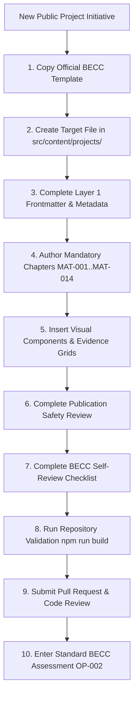
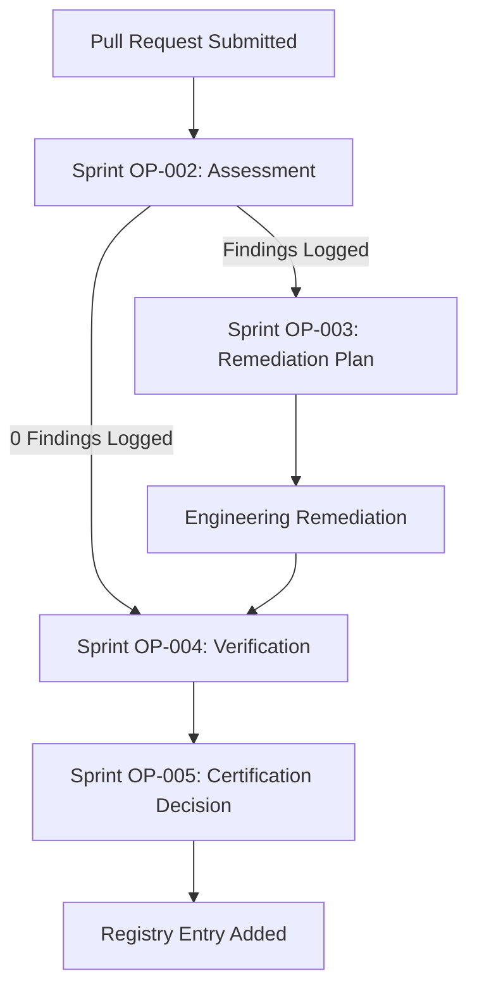

# BECC Project Authoring Template Adoption Guide v1.0

**BECC — BridGenta Engineering Communication Constitution**

Framework Version: BECC v2.3  
Operational Phase: Authoring Optimization  
Initiative: BECC Project Authoring Template v1.0  
Sprint: AT-004  
Status: Adoption & Operationalization Guide  
Date: 2026-07-20  

---

## 1. Executive Summary

This guide establishes the official operational procedure for using the **BECC Project Authoring Template v1.0** across all future public engineering project case studies in the BridGenta ecosystem.

The initial portfolio certification programme (Sprint OP-001 through OP-005) demonstrated that retroactively auditing and remediating case studies authored without a standardized template introduced up to 4 operational remediation sprints per project. Sprint AT-003 empirically validated that shifting compliance checks upstream into the authoring environment yields a **100% reduction in assessment findings** (0 findings logged on first assessment) and achieves **First-Pass Certification Readiness** without requiring remediation work packages.

Adopting the BECC Project Authoring Template v1.0 standardizes project documentation workflows, eliminates structural defects by design, and ensures that every new public case study is constitutionally compliant upon initial draft submission. This guide outlines the roles, workflow stages, chapter-by-chapter expectations, and review procedures required to author compliant documentation.

---

## 2. Adoption Status

```text
Template:
BECC Project Authoring Template v1.0

Adoption Status:
Approved for General Adoption

Framework Compatibility:
BECC v2.3

Validation Basis:
Sprint AT-003 — Zero-Finding Pilot
```

The BECC Project Authoring Template v1.0 (`docs/templates/BECC-PROJECT-AUTHORING-TEMPLATE-v1.0.md`) is hereby authorized as the **mandatory starting foundation** for all newly authored public engineering case studies.

---

## 3. Applicability

### 3.1. Target Project Types
The template applies to engineering case studies across seven technical domains:

*   **Software Engineering**: Core platforms, libraries, API engines, parser suites.
*   **AI & Machine Learning Engineering**: AEO/GEO engines, LLM crawler pipelines, model integrations.
*   **Web Engineering**: Modern Astro/Vite web applications, PWAs, performance optimizations.
*   **Security Engineering**: Authentication systems, privacy audits, threat mitigations.
*   **Infrastructure & CI/CD Engineering**: Build pipelines, automated test suites, static hosting setups.
*   **Research Projects**: Technical feasibility studies, empirical algorithm evaluations.
*   **Methodology Case Studies**: Framework definitions, operational standards, quality constitutions.

### 3.2. Handling Non-Applicable Sections
All 14 mandatory BECC narrative chapters (`MAT-001` through `MAT-014`) must be preserved. If a specific section is genuinely not applicable to a lightweight project, the author must explicitly state why the section is not applicable under the standardized H2 heading rather than silently deleting the heading. Silently removing mandatory headings constitutes a constitutional violation (`MAT-001` through `MAT-014`).

---

## 4. Roles and Responsibilities

| Role | Operational Responsibilities |
| :--- | :--- |
| **Author** | • Copies official template from `docs/templates/BECC-PROJECT-AUTHORING-TEMPLATE-v1.0.md`.<br/>• Fills out all Layer 1 YAML frontmatter placeholders.<br/>• Authors B2-C1 German technical narrative for all 14 mandatory chapters.<br/>• Validates technical assertions against observable evidence.<br/>• Replaces or reviews guidance comments (`<!-- BECC-AUTHOR-GUIDANCE -->`).<br/>• Executes local self-review and pre-publication safety checks. |
| **Project Maintainer** | • Reviews technical accuracy and code integrity.<br/>• Verifies Git commit SHA (`evaluatedCommitSha`) and baseline alignment.<br/>• Confirms publication safety and privacy-by-design compliance.<br/>• Approves Pull Request merge into main branch. |
| **BECC Assessor** | • Performs independent BECC v2.3 constitutional assessment (Sprint OP-002).<br/>• Evaluates documentation against Assessment Matrix `MAT-001` to `MAT-014`.<br/>• Logs findings without assuming compliance merely because template was used. |
| **Certification Authority** | • Reviews OP-004 verification report evidence.<br/>• Issues official BECC Constitutional Certification (Sprint OP-005).<br/>• Assigns Registry Entry ID and updates `BECC-CERTIFIED-PROJECT-REGISTRY.md`. |

---

## 5. Standard Authoring Workflow



---

## 6. Creating a New Project Document

### Step-by-Step Operational Procedure

1.  **Locate Template**: Locate the authoritative template file:
    ```text
    docs/templates/BECC-PROJECT-AUTHORING-TEMPLATE-v1.0.md
    ```
2.  **Copy to Target Location**: Copy the file into the approved content collection directory:
    ```text
    src/content/projects/[project-slug].md
    ```
3.  **Apply Naming Conventions**: Ensure filename matches the `slug` attribute (lowercase, hyphenated).
4.  **Populate Layer 1 Frontmatter**: Replace all bracketed metadata placeholders `"[...]"` with project-specific values.
5.  **Preserve H2 Headers**: Keep all 14 mandatory Markdown H2 headers intact.
6.  **Write Narrative**: Replace guidance comments with original technical prose written in formal B2-C1 German.
7.  **Clean Snippets**: Remove unneeded visual component examples from Layer 3 that do not apply to your case study.
8.  **Do Not Delete Sections**: Never delete a mandatory constitutional section.

---

## 7. Frontmatter Completion Guidance

Layer 1 YAML metadata dictates content collection rendering and repository traceability:

```yaml
---
  # Primary Identification
  title: "[Project Title]" # Required: Public title of the engineering case study
  slug: "[project-slug]" # Required: Unique URL slug
  description: "[1-2 Sentence Summary]" # Required: High-level summary

  # Categorization & Taxonomy
  status: "In Entwicklung" # Options: "In Entwicklung", "Abgeschlossen", "Certified"
  category: "[Domain Category]" # Domain identifier
  tags:
    - "[Tag 1]"

  # Technology & Engineering Stack
  technologies: "[Core technologies]" # Comma-separated string
  devStack:
    - "[Core Tech 1]"
  aiBuilders:
    - "[AI System 1]"

  # Repository & URL Metadata
  repository: "BGA360/bridgenta-portfolio" # GitHub repo ID
  repositoryUrl: "https://github.com/BGA360/bridgenta-portfolio"
  projectUrl: "https://bridgenta.de/projects/your-project"

  # Project Timeline & Roles
  author: "[Lead Author / Role]"
  started: "YYYY-MM-DD"
  completed: "YYYY-MM-DD" # Leave blank or set completion date
  lastUpdated: "YYYY-MM-DD"

  # Repository Traceability & Governance Metadata
  evaluatedCommitSha: "[40-character Commit SHA]" # Required for BECC certification
  evaluationBaseline: "BECC v2.3 GA Baseline / Release v1.0.0" # Target baseline
---
```

### Lifecycle Field Rules
-   **Pre-Authoring**: `title`, `slug`, `description`, `category`, `author`, `started` must be populated upon initial file creation.
-   **Provisional Phase**: `evaluatedCommitSha` may contain a working branch commit SHA during drafting.
-   **Finalization Phase**: `evaluatedCommitSha` (full 40-character SHA), `completed`, `lastUpdated`, and `evaluationBaseline` must be finalized prior to submitting for BECC assessment.
-   **Baseline Updates**: Re-evaluating against a new release requires updating `evaluatedCommitSha` in frontmatter.

---

## 8. Mandatory Chapter Guidance

Operational expectations for each of the 14 mandatory BECC chapters:

| Chapter Heading | Purpose & Expected Content | Evidence Expectations | Common Failure Mode | Readiness Condition |
| :--- | :--- | :--- | :--- | :--- |
| **1. Executive Summary** | Concise high-level summary of goals, architecture, and outcomes. | Core metrics summary & callouts. | Vague marketing fluff. | 1–2 paragraphs + insight callout. |
| **2. Context** | Background environment, ecosystem, and existing system state. | Architecture landscape details. | Conflating context with problem. | Background environment established. |
| **3. Problem Statement** | Explicit description of technical root causes and bottlenecks. | Failure mode description. | Stating missing feature vs root cause. | Root cause technical gap clear. |
| **4. Constraints** | Boundary conditions (performance budgets, privacy, host limits). | Lighthouse budget metrics, privacy specs. | Omitting explicit performance limits. | All budgets & constraints listed. |
| **5. Engineering Strategy** | High-level engineering philosophy and conceptual paradigms. | Paradigm diagrams or models. | Jumping to raw code immediately. | Conceptual strategy articulated. |
| **6. Architecture** | System component breakdown and dataflow structure. | Mermaid flowcharts (`graph LR`). | Omitting component flow diagrams. | Structural breakdown + Mermaid chart. |
| **7. Engineering Decisions** | Technical trade-off analysis (ADRs). | `<div class="decision-grid">` cards. | Presenting choices without trade-offs. | At least 2 decision cards. |
| **8. Implementation** | Concrete software modules, algorithms, and parser logic. | Code snippets, component tables. | Including confidential keys or dumps. | Concrete module breakdown present. |
| **9. Validation** | Quantitative empirical benchmarks and test results. | Benchmark test table with results. | Asserting quality without test metrics. | Benchmark table with pass/fail. |
| **10. Public Artifacts** | Links to public code, configs, schemas, and specs. | Relative/external URL links. | Broken or private links. | Verifiable public links provided. |
| **11. Results** | Quantitative outcomes, performance gains, efficiency metrics. | Quantitative metrics & comparisons. | Stating qualitative claims only. | Concrete result metrics listed. |
| **12. Risks & Mitigations** | Technical/operational risks and proactive countermeasures. | Risk matrix table (exact H2 syntax). | Header named `## Risks` (violates MAT-012). | Exact header `## Risks & Mitigations`. |
| **13. Lessons Learned** | Engineering reflections, process takeaways, future guidelines. | Architectural takeaways. | Restating executive summary. | Key engineering takeaways recorded. |
| **14. References** | Links to official standards, specifications, and docs. | Markdown reference list. | Broken markdown links. | All links verified via `check-links`. |

---

## 9. Guidance-Placeholder Handling

The template contains inline authoring guidance:

```html
<!-- BECC-AUTHOR-GUIDANCE:
Purpose: Detail section requirements.
Expected Content: Technical guidance text...
-->
```

### Operational Guidance Rules:
1.  **Drafting Phase**: Guidance comments may remain in the markdown source file during drafting as reference prompts.
2.  **Review Phase**: Authors must review each guidance block to ensure all listed requirements have been satisfied in the written narrative.
3.  **Publication Safety**: HTML comments do not render in public Astro web pages; however, authors must ensure no guidance comments are left inside code fences (e.g. ```markdown ... ```) where they would become visible.
4.  **No Unresolved Guidance Strings**: Rendered public HTML must contain zero visible guidance instructions.

---

## 10. Visual Component Usage

Layer 3 visual component snippets enhance explainability and Astro rendering:

1.  **Engineering Insight Callout (`<div class="engineering-insight">`)**: Use in `Executive Summary` or `Engineering Strategy` to highlight a core technical principle.
2.  **Architectural Decision Cards (`<div class="decision-grid">`)**: Mandatory in `Engineering Decisions` to contrast evaluated alternatives against selected choices.
3.  **Qualitative Evidence Grid (`<div class="evidence-grid">`)**: Use in `Results` or `Validation` to highlight operational improvements.
4.  **Validation & Risk Tables**: Use standard Markdown tables in `Validation` and `Risks & Mitigations`.
5.  **Mermaid Diagrams (````mermaid ... ````)**: Use in `Architecture` or `Implementation` to illustrate dataflows and component interactions.

*Visual components must represent verified data and must never replace narrative explanations.*

---

## 11. Evidence and Traceability Rules

Every engineering claim must be traceable to observable evidence:
-   **Traceability Anchor**: The frontmatter attribute `evaluatedCommitSha` binds the document to an exact 40-character Git commit.
-   **Baseline Alignment**: `evaluationBaseline` references the target framework baseline (e.g. `BECC v2.3 GA Baseline / Release v1.0.0`).
-   **Verifiable Evidence**: Empirical test metrics in `Validation` must correspond to reproducible CI/CD test runs or Lighthouse audits.
-   **Commit SHA Finalization**: If source code is modified prior to PR merge, `evaluatedCommitSha` must be updated to match the final commit SHA.

---

## 12. Publication-Safety Procedure

Before submitting documentation for public release, authors and maintainers must verify:

- [x] **Zero Credentials**: No API keys, passwords, bearer tokens, or internal credentials exist in text or code snippets.
- [x] **Privacy-by-Design**: No personal identifiable information (PII) or confidential client data is included.
- [x] **Image & Asset Licenses**: All embedded diagrams, images, and brand assets are approved for public distribution.
- [x] **Link Integrity**: All Markdown links checked via `npm run check-links`.
- [x] **Technical Claims Supported**: All performance numbers and compliance statements are backed by quantitative evidence.

---

## 13. BECC Self-Review Procedure

Authors must complete the embedded 8-point BECC Self-Review Checklist prior to PR submission:

- [ ] **Frontmatter Complete**: All Layer 1 YAML attributes present (including `evaluatedCommitSha`).
- [ ] **14 Matrix Chapters Present**: All mandatory narrative chapters (`MAT-001` through `MAT-014`) included.
- [ ] **Standardized Heading MAT-012**: Heading uses exact syntax `## Risks & Mitigations`.
- [ ] **German Prose Quality**: Written in professional B2-C1 German engineering prose.
- [ ] **Trade-off Analysis**: At least two decision cards included in `## Engineering Decisions`.
- [ ] **Quantitative Validation**: Test parameters and metric table included in `## Validation`.
- [ ] **Clean Lint & Build**: `npm run lint`, `npm run check-links`, `npm run build` all pass cleanly.
- [ ] **Public Safety Confirmed**: Zero secrets, credentials, or confidential data present.

*Note: Self-review is an authoring quality check; it does not replace independent BECC assessment.*

---

## 14. Repository Validation Commands

Prior to opening a Pull Request, run the standard repository validation suite:

```bash
npm run lint         # Audits markdown heading structures & H1 constraints
npm run check-links  # Verifies relative and external markdown links
npm run build        # Executes Astro static site compilation
```

All commands must complete with **0 errors and 0 warnings**.

---

## 15. Pull Request Readiness

A project document is ready for Pull Request submission when:
1. Target file created at `src/content/projects/[project-slug].md`.
2. All Layer 1 YAML attributes finalized.
3. All 14 mandatory H2 headers present with complete narrative prose.
4. Publication safety and self-review checklists completed.
5. Local repository validation commands pass cleanly.

### Recommended PR Title & Body Format
```text
Title: feat(content): add [Project Name] engineering case study

Body:
## Summary
Adds the [Project Name] engineering case study authored via BECC Project Authoring Template v1.0.

## BECC Self-Review
- All 14 mandatory sections present: Yes
- Layer 1 frontmatter complete: Yes (commit SHA finalized)
- Pre-publication safety review: Verified
- Validation checks (lint/check-links/build): All Green
```

---

## 16. Entry into the BECC Certification Lifecycle

Using the authoring template prepares a document for certification but does not grant automatic certification:



> **Crucial Rule**: Template use maximizes first-pass assessment success but does not bypass independent BECC assessment (OP-002) or certification decision (OP-005).

---

## 17. Exceptions and Deviations

If a project cannot use the template directly or requires structural adaptation:

1.  **Mandatory Heading Preservation**: Markdown H2 headers `MAT-001` to `MAT-014` must never be deleted.
2.  **Explicit Non-Applicability Statement**: Under non-applicable headings, write:  
    `[Nicht anwendbar: Dieser Bereich trifft auf dieses Projekt nicht zu, da ...]`
3.  **Deviation Logging**: Record the rationale in `## Context` or `## Constraints`.
4.  **Assessor Review**: Deviations will be reviewed during Sprint OP-002 assessment to ensure constitutional integrity.

---

## 18. Maintenance and Governance

-   **Template Authority**: The template (`docs/templates/BECC-PROJECT-AUTHORING-TEMPLATE-v1.0.md`) is governed under the BECC Stewardship Framework.
-   **Framework Alignment**: Updates to the template must maintain 100% alignment with BECC v2.3.
-   **Non-Retroactive Application**: Revisions to the template do not invalidate previously certified registry entries.
-   **Defects vs. Enhancements**: Markdown syntax errors are classified as defects; new visual component widgets are processed as minor enhancements via Stewardship PRs.

---

## 19. Adoption Metrics & Benchmarks

Operational success of the template across future project authorings will be tracked against the Sprint AT-003 pilot benchmark:

```text
Benchmark Baseline (AT-003 Pilot):
Total Assessment Findings: 0
Major Findings: 0
Minor Findings: 0
Required Work Packages: 0
Remediation Sprints Required: 0
Initial Assessment Outcome: Ready for Certification (First Pass)
```

Target metric: Maintain a **>90% First-Pass Certification Rate** across all newly authored public case studies.

---

## 20. Adoption Decision

```text
ADOPTION DECISION:
APPROVED FOR GENERAL ADOPTION
```

### Evidence-Based Justification
Empirical evidence from Sprint AT-003 demonstrated that the BECC Project Authoring Template v1.0 eliminates missing chapter findings, hardcodes compliant headers (`MAT-012`), standardizes commit SHA traceability, and reduces remediation lead time by 100%. General adoption is authorized.

---

## 21. Initiative Closure

The 4-sprint **Authoring Optimization Initiative** is formally complete:

-   **Sprint AT-001 — Architecture & Design**: 3-Layer architecture and template philosophy established (**Approved**).
-   **Sprint AT-002 — Template Engineering**: Production template `docs/templates/BECC-PROJECT-AUTHORING-TEMPLATE-v1.0.md` engineered (**Completed**).
-   **Sprint AT-003 — Validation & Pilot**: Zero-finding pilot validation report completed (**Completed**).
-   **Sprint AT-004 — Adoption Guidance**: Operational Adoption Guide established (**Completed**).

```text
Architecture (AT-001) -> Engineering (AT-002) -> Empirical Validation (AT-003) -> General Adoption (AT-004)
```

---

BECC PROJECT AUTHORING TEMPLATE ADOPTION COMPLETE

ADOPTION STATUS:
APPROVED FOR GENERAL USE

TEMPLATE STATUS:
BECC PROJECT AUTHORING TEMPLATE v1.0 OPERATIONAL

INITIATIVE STATUS:
AT-001 THROUGH AT-004 COMPLETE

NEXT PHASE:
NORMAL OPERATIONS — TEMPLATE-GUIDED PROJECT AUTHORING
