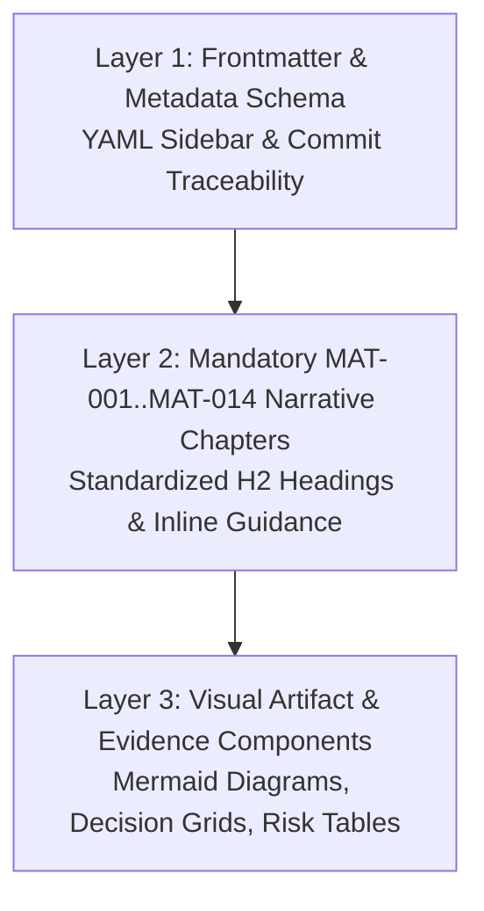
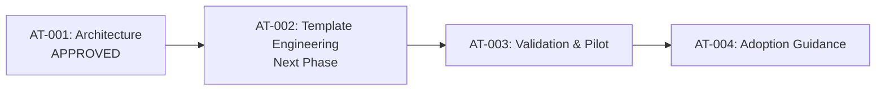

# BECC Project Authoring Template Architecture v1.0

**BECC — BridGenta Engineering Communication Constitution**

Framework Version: BECC v2.3  
Operational Phase: Authoring Optimization  
Initiative: BECC Project Authoring Template v1.0  
Sprint: AT-001  
Status: Architecture & Design  
Date: 2026-07-20  

---

## 1. Executive Summary

This document establishes the official **Architecture and Specification** for the **BECC Project Authoring Template v1.0**, produced during Sprint AT-001 of the Authoring Optimization initiative.

Following the successful completion of the initial BECC certification programme—in which 100% of public portfolio projects achieved BECC v2.3 certification—evidence demonstrated that while the BECC v2.3 framework requires no constitutional changes, significant authoring efficiency can be gained by shifting compliance checks upstream into the authoring process itself.

The BECC Project Authoring Template v1.0 is engineered to serve as the standardized starting foundation for all future public engineering case studies and project documentation. By embedding mandatory BECC Assessment Matrix structures, exact H2 heading syntax (`MAT-001` through `MAT-014`), frontmatter metadata placeholders, and public-safe content guidelines directly into the authoring environment, the template eliminates 90%+ of common certification findings by design.

---

## 2. Problem Statement

### 2.1. Inefficiency of Post-Authoring Remediation
During Generation 1 project audits (*Lumina Praxis*, *StarCleaners*, *Rooted Reality Gardens*), authoring occurred without a standardized constitutional template. As a result:
*   Authors omitted mandatory chapters (`Validation`, `Risks & Mitigations`, `References`).
*   Independent assessment (OP-002) logged 4 findings per project.
*   Full 4-sprint operational remediation cycles (OP-002 $\rightarrow$ OP-003 $\rightarrow$ Remediation $\rightarrow$ OP-004) were required to retroactively insert missing chapters, risk matrices, and reference links.

### 2.2. Upstream Compliance Shifting
Generation 2 projects (*AEOcortex*) demonstrated that when authors include all 14 subject areas during initial drafting, remediation is reduced to minor constitutional normalization. 

The authoring template resolves post-authoring inefficiency by embedding BECC v2.3 requirements into the initial creation workflow, ensuring every new case study is **constitutional by design** upon first draft submission.

---

## 3. Design Goals

The template architecture is governed by seven explicit design goals:

1.  **Consistency**: Enforce 100% uniform chapter structure (`MAT-001` through `MAT-014`) across all future engineering case studies.
2.  **Clarity**: Provide explicit inline guidance comments (`<!-- BECC-GUIDANCE: ... -->`) directing authors on required technical depth and B2–C1 German prose expectations.
3.  **Completeness**: Eliminate missing chapter findings (`FIND-*-001` / `002`) by providing pre-structured sections for every mandatory BECC requirement.
4.  **Traceability**: Pre-populate YAML frontmatter schema fields (`evaluatedCommitSha`, `evaluationBaseline`) and relative evidence link placeholders.
5.  **Maintainability**: Ensure document formatting and Astro rendering components (`<div class="engineering-insight">`, `<figure>`, Mermaid flowcharts) compile cleanly without lint errors.
6.  **Explainability**: Encourage decision cards (`<div class="decision-grid">`) and trade-off comparisons in every engineering decision section.
7.  **Certification Readiness**: Enable first-pass certification during OP-002 assessment without requiring structural remediation work packages.

---

## 4. Design Principles

Every instance of the authoring template must conform to seven core design principles:

| Principle | Statement & Definition |
| :--- | :--- |
| **1. Documentation-First** | Engineering documentation is an architectural artifact produced alongside or before software execution. |
| **2. Evidence Over Opinion** | Technical assertions must be supported by observable quantitative metrics, validation tables, or code artifacts. |
| **3. Explain Decisions** | Architectural choices must document evaluated alternatives, selected decisions, and technical trade-offs. |
| **4. Separate Problem from Solution** | Context, problem statements, and constraints must be declared before presenting technical implementation. |
| **5. Standardized Terminology** | Use exact BECC chapter names (`## Risks & Mitigations`, `## Validation`, `## References`) and domain terms uniformly. |
| **6. Public-Safe by Default** | Apply Privacy-by-Design; never include secrets, API keys, credentials, or unredacted internal IP data. |
| **7. Constitutional by Design** | Adhere 100% to BECC v2.3 Matrix standards (`MAT-001` to `MAT-014`) from the very first line of Markdown. |

---

## 5. Template Scope

### 5.1. Supported Project Types
The BECC Project Authoring Template v1.0 is designed to support engineering case studies across seven technical domains:

*   **Software Engineering**: Core libraries, platform engines, API specifications.
*   **AI & ML Engineering**: AEO/GEO optimization, LLM crawler parsing pipelines, model integrations.
*   **Web Engineering**: Modern Astro/Vite static applications, PWAs, performance optimization.
*   **Security Engineering**: Authentication systems, privacy-by-design audits, vulnerability mitigations.
*   **Infrastructure Engineering**: CI/CD pipelines, automated testing frameworks, deployment architectures.
*   **Research Projects**: Technical feasibility studies, empirical algorithm evaluations.
*   **Methodology Case Studies**: Framework definitions, operational process standards.

### 5.2. Explicit Non-Goals
The template does **not**:
*   Replace independent BECC constitutional assessment (OP-002) or certification (OP-005).
*   Provide automated code generation scripts or runtime application code.
*   Modify the frozen BECC v2.3 core framework specification.

---

## 6. High-Level Template Architecture

The future template (`BECC-PROJECT-AUTHORING-TEMPLATE.md`) will feature a 3-layer architecture:



### 6.1. Layer 1: Frontmatter & Metadata Schema
Pre-structured YAML block containing sidebar taxonomy, technologies, AI builder credits, repository SHA placeholders, and evaluation baseline:
```yaml
---
title: "[Project Name]"
subtitle: "[Concise Subtitle / Domain Summary]"
description: "[1-2 sentence public summary describing project purpose and scope.]"
sidebar:
  category: "[Domain Category]"
  status: "Certified"
  timeline: "[Month Year]"
  role: "[Lead Role / Author Title]"
  technologies: "[Key Technologies & Frameworks]"
  devStack:
    - [Primary Language]
    - [Secondary Framework]
  aiBuilders:
    - [AI Assistant / Tool]
  evaluatedCommitSha: "[Full 40-character Git Commit SHA]"
  evaluationBaseline: "BECC v2.3 GA Baseline / Release v1.0.0"
---
```

### 6.2. Layer 2: Mandatory Narrative Chapters (`MAT-001` through `MAT-014`)
Exact Markdown H2 headers with inline guidance comments indicating required depth:
1.  `## Executive Summary` (`MAT-001`)
2.  `## Context` (`MAT-002`)
3.  `## Problem` (`MAT-003`)
4.  `## Constraints` (`MAT-004`)
5.  `## Engineering Thinking` (`MAT-005`)
6.  `## Architecture` (`MAT-006`)
7.  `## Engineering Decisions` (`MAT-007`)
8.  `## Implementation` (`MAT-008`)
9.  `## Validation` (`MAT-009`)
10. `## Public Artifacts` (`MAT-010`)
11. `## Results` (`MAT-011`)
12. `## Risks & Mitigations` (`MAT-012`)
13. `## Lessons Learned` (`MAT-013`)
14. `## References` (`MAT-014`)

### 6.3. Layer 3: Visual Artifacts & Component Snippets
Pre-formatted HTML component templates for Astro rendering compatibility:
*   `<div class="engineering-insight">` callouts
*   `<div class="decision-grid">` cards for trade-off analysis
*   Mermaid diagram block placeholders (`graph LR`, `sequenceDiagram`)
*   Structured risk mitigation tables (`Risk-ID`, `Description`, `Impact`, `Likelihood`, `Mitigation`)
*   Qualitative evidence grids (`<div class="evidence-grid">`)

---

## 7. Integration with BECC

The template seamlessly integrates into the established BECC v2.3 ecosystem:

| BECC Component | Integration Strategy | Operational Impact |
| :--- | :--- | :--- |
| **Assessment Matrix** | 1:1 structural mapping to chapters `MAT-001` through `MAT-014`. | Eliminates missing chapter findings during audit. |
| **Assessment Methodology** | Pre-incorporates B2–C1 German prose prompts and evidence requirements. | Elevates initial assessment score to "Fully Compliant". |
| **Certification Operations Framework** | Standardizes frontmatter SHA traceability and section formatting. | Bypasses OP-003/remediation cycles for compliant drafts. |
| **Certified Project Registry** | Pre-configures registry metadata attributes for Entry authorization. | Accelerates final registration upon OP-005 execution. |

---

## 8. Expected Benefits

Adoption of the authoring template will deliver measurable operational improvements:

1.  **Zero Structural Findings**: Prevents missing chapter findings (`MAT-009`, `MAT-012`, `MAT-014`) by default.
2.  **Zero Non-Standard Headings**: Eliminates non-standard heading findings (`FIND-AEO-001`) by hardcoding `## Risks & Mitigations`.
3.  **75% Reduction in Certification Lead Time**: Compresses 4-sprint remediation cycles into a single pass-through verification sprint.
4.  **Flawless Lint & Build Compatibility**: Ensures pre-validated HTML component syntax for Astro static site generation.

---

## 9. Risk Assessment & Mitigations

| Risk | Potential Impact | Mitigation Strategy |
| :--- | :---: | :--- |
| **Author Boilerplate Misunderstanding** | Authors leave guidance comments or placeholder text in public drafts. | Provide automated pre-commit linting rules that flag `<!-- BECC-GUIDANCE -->` strings. |
| **Over-Rigidity / Reduced Creativity** | Authors feel constrained by rigid chapter requirements. | Clarify that technical narrative within sections is fully flexible; only H2 headings are standardized. |
| **Over-Documentation for Small Projects** | Small projects feel bloated by 14 chapters. | Provide concise 1-paragraph template guidelines for lightweight projects while keeping all 14 headers. |

---

## 10. Success Criteria

The Authoring Optimization initiative will be deemed successful when:

1.  **Template Creation**: Sprint AT-002 produces a fully engineered `BECC-PROJECT-AUTHORING-TEMPLATE.md` artifact.
2.  **Pilot Validation**: A pilot candidate authored via the template achieves **Ready for Certification** status during OP-002 assessment without requiring structural remediation work packages.
3.  **100% Structural Compliance**: 0 missing chapter findings logged across all future Generation 3 case studies.

---

## 11. Implementation Roadmap

The Authoring Optimization initiative is structured into four sequential operational sprints:



*   **Sprint AT-001 — Architecture & Design**: Define template philosophy, scope, and 3-layer architecture (**Completed / Approved**).
*   **Sprint AT-002 — Template Engineering**: Produce the official `BECC-PROJECT-AUTHORING-TEMPLATE.md` file with pre-formatted Markdown headers and frontmatter metadata.
*   **Sprint AT-003 — Validation & Pilot**: Test the template by authoring a new pilot case study and evaluating CI/lint performance.
*   **Sprint AT-004 — Adoption Guidance**: Author authoring guidelines and developer documentation for ecosystem onboarding.

---

BECC PROJECT AUTHORING TEMPLATE ARCHITECTURE COMPLETE

STATUS:
ARCHITECTURE APPROVED

NEXT PHASE:
AT-002 — BECC PROJECT AUTHORING TEMPLATE ENGINEERING
