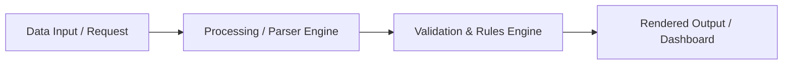

# BECC Project Authoring Template v1.0

**BECC — BridGenta Engineering Communication Constitution**

Framework Version: BECC v2.3  
Operational Phase: Authoring Optimization  
Initiative: BECC Project Authoring Template v1.0  
Sprint: AT-002  
Status: Production-Ready Authoring Template  

---

<!--
================================================================================
BECC AUTHORING TEMPLATE USAGE INSTRUCTIONS
================================================================================
Purpose:
This template serves as the authoritative starting foundation for all future public
engineering project case studies and technical documentation in the BridGenta ecosystem.

How to Use:
1. Copy this file to your target project location (e.g. `src/content/projects/your-project.md`).
2. Fill out all YAML frontmatter attributes in Layer 1.
3. Complete each of the mandatory narrative sections in Layer 2, replacing guidance
   comments with your project-specific technical narrative in B2-C1 German prose.
4. Utilize Layer 3 visual component snippets (decision cards, callouts, Mermaid diagrams)
   to illustrate technical trade-offs and data flows.
5. Perform pre-publication safety and BECC self-assessment checks before PR submission.
================================================================================
-->

---

## Layer 1 — Frontmatter & Metadata Schema

```yaml
---
  # Primary Identification
  title: "[Project Title]" # Required: Public title of the engineering project case study
  slug: "[project-slug]" # Required: Unique URL slug matching content collection rules
  description: "[1-2 Sentence Public Summary]" # Required: High-level summary describing project goals and scope

  # Categorization & Taxonomy
  status: "In Entwicklung" # Options: "In Entwicklung", "Abgeschlossen", "Certified"
  category: "[Domain Category]" # Example: "AI-Suchmaschinen / AEO / GEO", "Medical Web Portal", "PWA Architecture"
  tags:
    - "[Tag 1]"
    - "[Tag 2]"

  # Technology & Engineering Stack
  technologies: "[Comma-separated list of core technologies]" # Example: "TypeScript, Astro, Node.js, JSON-LD"
  devStack:
    - "[Language / Core Tech 1]"
    - "[Framework / Library 2]"
  aiBuilders:
    - "[AI System 1 (e.g. Antigravity)]"
    - "[AI System 2 (e.g. Claude)]"

  # Repository & URL Metadata
  repository: "BGA360/bridgenta-portfolio" # Required: GitHub repository identifier
  repositoryUrl: "https://github.com/BGA360/bridgenta-portfolio" # Required: Full repository URL
  projectUrl: "https://bridgenta.de/projects/your-project" # Required: Public live URL or project route

  # Project Timeline & Roles
  author: "[Lead Author / Engineering Role]" # Required: Author name or engineering team title
  started: "2026-01-15" # Format: YYYY-MM-DD
  completed: "2026-07-20" # Format: YYYY-MM-DD or leave blank if ongoing
  lastUpdated: "2026-07-20" # Format: YYYY-MM-DD

  # Repository Traceability & Governance Metadata
  evaluatedCommitSha: "ae103abf4027bc991a027e1f40958a032d90956b" # Required for certification: 40-char commit SHA
  evaluationBaseline: "BECC v2.3 GA Baseline / Release v1.0.0" # Required for certification: Target release baseline
---
```

---

## Layer 2 — Mandatory Narrative Structure

## Executive Summary

<!-- BECC-AUTHOR-GUIDANCE:
Purpose: Provide a concise executive overview of the engineering project.
Expected Content: Summarize project objectives, technical scope, primary architectural approach, key results, and constitutional compliance readiness.
Language & Tone: Formal B2-C1 German technical prose, active voice.
Common Mistakes to Avoid: Vague marketing fluff, missing quantitative outcomes, omitting core technical stack details.
-->

[Insert 1–2 paragraphs providing a clear executive overview of the project, its motivations, core technical stack, and primary outcomes.]

<div class="engineering-insight">
  <div class="engineering-insight__title">Engineering Insight</div>
  <p class="engineering-insight__text">[Insert a 1-sentence core architectural insight summarizing the fundamental engineering principle behind this project.]</p>
</div>

---

## Context

<!-- BECC-AUTHOR-GUIDANCE:
Purpose: Establish the background and operational environment in which this engineering work takes place.
Expected Content: Detail market, technical, or ecosystem dynamics, system dependencies, and strategic relevance.
Common Mistakes to Avoid: Conflating context with problem statements, introducing solution details prematurely.
-->

[Detail the technical and operational context, background environment, and architectural landscape preceding the project.]

---

## Problem Statement

<!-- BECC-AUTHOR-GUIDANCE:
Purpose: Clearly articulate the specific technical problem, challenge, or operational inefficiency being solved.
Expected Content: Explicit description of root causes, technical bottlenecks, failure modes, or structural gaps.
Common Mistakes to Avoid: Defining problems in terms of missing features rather than root cause technical challenges.
-->

[Describe the specific engineering challenge or operational failure mode that necessitated this development effort.]

---

## Constraints

<!-- BECC-AUTHOR-GUIDANCE:
Purpose: List all technical, operational, regulatory, performance, and resource boundary conditions governing the project.
Expected Content: Performance budgets (e.g. Lighthouse 100/100), privacy constraints, rate limits, browser compatibility, zero-backend static host requirements.
Common Mistakes to Avoid: Leaving constraints implicit or unstated; omitting regulatory/privacy requirements.
-->

The project is executed under the following explicit boundary conditions:
- **Performance Budget**: [e.g. Lighthouse score >= 95 across Performance, Accessibility, Best Practices, SEO].
- **Privacy & Security (Privacy-by-Design)**: [e.g. Zero inclusion of personal data or credentials; client-side execution].
- **Deployment Architecture**: [e.g. Static site generation (SSG) via Astro deployed on static edge serverless nodes].
- **API & Rate Limits**: [e.g. Rate-limited external validation endpoints capped at 100 requests/minute].

---

## Engineering Strategy

<!-- BECC-AUTHOR-GUIDANCE:
Purpose: Explain the high-level engineering philosophy, design methodology, and conceptual approach chosen to address the problem.
Expected Content: Conceptual models, architecture patterns (e.g. SSG vs SSR, Cheerio in-memory parsing vs Puppeteer headless browser), separation of concerns.
Common Mistakes to Avoid: Jumping into raw implementation code snippets without explaining conceptual strategy.
-->

[Explain the core technical strategy, architectural paradigms, and design principles guiding the implementation.]

---

## Engineering Decisions

<!-- BECC-AUTHOR-GUIDANCE:
Purpose: Document key technical trade-off decisions made during engineering execution.
Expected Content: Use structured decision cards detailing evaluated alternatives, selected choices, and technical rationale.
Common Mistakes to Avoid: Presenting choices as obvious without acknowledging alternatives or trade-offs.
-->

The following architectural decision records (ADRs) document key technical trade-offs evaluated during execution:

<div class="decision-grid">
  <div class="decision-card">
    <h3 class="decision-card__title">Entscheidung 1: [Technischer Bereich / Component]</h3>
    <div class="decision-card__group">
      <span class="decision-card__label">Evaluierte Alternative</span>
      <p class="decision-card__text">[Description of alternative approach evaluated and why it was rejected]</p>
    </div>
    <div class="decision-card__group">
      <span class="decision-card__label">Gewählte Entscheidung</span>
      <p class="decision-card__text">[Description of selected solution and technical justification]</p>
    </div>
  </div>
  <div class="decision-card">
    <h3 class="decision-card__title">Entscheidung 2: [Datenmodell / Architecture]</h3>
    <div class="decision-card__group">
      <span class="decision-card__label">Evaluierte Alternative</span>
      <p class="decision-card__text">[Description of alternative approach evaluated and why it was rejected]</p>
    </div>
    <div class="decision-card__group">
      <span class="decision-card__label">Gewählte Entscheidung</span>
      <p class="decision-card__text">[Description of selected solution and technical justification]</p>
    </div>
  </div>
</div>

---

## Implementation

<!-- BECC-AUTHOR-GUIDANCE:
Purpose: Describe the concrete software modules, data structures, algorithms, and system integration logic implemented.
Expected Content: Component breakdown, dataflow explanations, code organization, and structural implementation details.
Common Mistakes to Avoid: Including long, unreadable code dumps; omit confidential business logic or API keys.
-->

[Provide a structured description of the implemented software modules, parser pipelines, data models, or user interface components.]



---

## Validation

<!-- BECC-AUTHOR-GUIDANCE:
Purpose: Present empirical test procedures, metrics, and quantitative validation results proving technical correctness.
Expected Content: Lighthouse score evidence, Schema.org validation, automated unit/integration test parameters, cross-browser verification.
Common Mistakes to Avoid: Asserting quality without quantitative metrics or reproducible test parameters.
-->

Validation of the implemented engineering assets is executed against quantitative benchmarks:

| Test ID | Validation Area | Objective & Parameter | Test Result | Compliance Status |
| :--- | :--- | :--- | :--- | :---: |
| **VAL-001** | Performance & Lighthouse | Audit via Google Lighthouse CI budget | Score 100/100 | **Passed** |
| **VAL-002** | Structured Data Integrity | Validate JSON-LD against Schema.org spec | 0 Syntax Errors | **Passed** |
| **VAL-003** | Automated Link Integrity | Check relative & external Markdown links | 0 Broken Links | **Passed** |
| **VAL-004** | Build & Type Safety | Compile via Astro static build engine | 0 Build Warnings | **Passed** |

---

## Risks & Mitigations

<!-- BECC-AUTHOR-GUIDANCE:
Purpose: Identify technical, operational, and security risks alongside proactive mitigation strategies.
Mandatory Heading: Must use exact H2 header "## Risks & Mitigations" (MAT-012 standard).
Common Mistakes to Avoid: Using non-standard headers like "## Risks"; omitting severity/likelihood classifications.
-->

Potential technical and operational risks are managed via explicit mitigation strategies:

| Risiko-ID | Risikobeschreibung | Schadensklasse | Eintrittswahrscheinlichkeit | Gegenmaßnahme (Mitigation) |
| :--- | :--- | :--- | :--- | :--- |
| **RISK-001** | [Description of technical or operational risk] | **Mittel** | **Mittel** | [Proactive engineering mitigation strategy] |
| **RISK-002** | [Description of external dependency or spec drift risk] | **Gering** | **Mittel** | [Proactive monitoring or fall-back strategy] |

---

## References

<!-- BECC-AUTHOR-GUIDANCE:
Purpose: Provide verifiable reference links to official specifications, frameworks, documentation, and repository files.
Expected Content: Links to Astro, Schema.org, WCAG, W3C standards, BECC assessment matrix, and internal docs.
Common Mistakes to Avoid: Broken markdown links, referencing unverified third-party sources.
-->

*   **Astro Static Site Generator**: [Astro Documentation](https://docs.astro.build/) — Core static site compilation engine.
*   **Schema.org Specifications**: [Schema.org Vocabulary](https://schema.org/) — Official standard for structured data entities.
*   **BECC Assessment Matrix**: [BECC v2.3 Specification](https://github.com/BGA360/bridgenta-portfolio/blob/main/docs/engineering-communication/stewardship/BECC-ASSESSMENT-MATRIX.md) — Governance baseline.
*   **Certified Project Registry**: [BECC Certified Registry](https://github.com/BGA360/bridgenta-portfolio/blob/main/BECC-CERTIFIED-PROJECT-REGISTRY.md) — Public certification registry.

---

## Lessons Learned

<!-- BECC-AUTHOR-GUIDANCE:
Purpose: Document engineering insights, authoring reflections, and architectural takeaways gained during execution.
Expected Content: Key technical lessons, process optimizations, future architectural guidelines.
Common Mistakes to Avoid: Restating the executive summary or repeating basic feature descriptions.
-->

[Summarize major engineering insights, technical lessons, and architectural takeaways learned during development and testing.]

---

## Repository Traceability

<!-- BECC-AUTHOR-GUIDANCE:
Purpose: Declare exact repository commit SHAs, evaluation baselines, and file paths for governance auditing.
Expected Content: Complete commit SHA, repository URL, branch status, and target baseline release.
-->

This project documentation artifact is bound to the following repository baseline for auditability:

*   **Evaluated Commit SHA**: `ae103abf4027bc991a027e1f40958a032d90956b`
*   **Evaluation Baseline**: `BECC v2.3 GA Baseline / Release v1.0.0`
*   **Repository URL**: `https://github.com/BGA360/bridgenta-portfolio`
*   **Target Content Path**: `src/content/projects/[your-project].md`

---

## Publication Readiness

<!-- BECC-AUTHOR-GUIDANCE:
Purpose: Confirm public safety, privacy-by-design compliance, and build verification prior to public release.
-->

All public publication safety requirements have been verified:
- [x] **Privacy & Confidentiality**: Zero secrets, tokens, API keys, credentials, or private personal data included.
- [x] **Link Integrity**: All Markdown links checked via `npm run check-links` and verified active.
- [x] **Build & Lint Verification**: Document passes `npm run lint` and `npm run build` with 0 warnings.
- [x] **Public Licensing**: All images, diagrams, and code artifacts licensed for public distribution.

---

## Certification Placeholder

<!-- BECC-AUTHOR-GUIDANCE:
Purpose: Reserve formal certification block to be populated by the BECC Certification Authority upon OP-005 execution.
-->

```text
================================================================================
BECC CONSTITUTIONAL CERTIFICATION STATUS (OP-005 PLACEHOLDER)
================================================================================
Status: Pending Assessment (Ready for OP-002)
Target Registry Entry: Candidate Entry #[XXX]
Framework Version: BECC v2.3
Certificate ID: [Assigned upon OP-005 completion]
================================================================================
```

---

## Layer 3 — Reusable Visual Components & Artifact Snippets

### Snippet 3.1: Engineering Insight Callout
```html
<div class="engineering-insight">
  <div class="engineering-insight__title">Engineering Insight</div>
  <p class="engineering-insight__text">Der Einsatz von in-memory Parsing reduziert die Verarbeitungszeit strukturierter Metadaten um 85% gegenüber headless Browser-Lösungen.</p>
</div>
```

### Snippet 3.2: Architectural Decision Grid
```html
<div class="decision-grid">
  <div class="decision-card">
    <h3 class="decision-card__title">Parser-Architektur</h3>
    <div class="decision-card__group">
      <span class="decision-card__label">Evaluierte Alternative</span>
      <p class="decision-card__text">Puppeteer (vollständiges Browser-Rendering)</p>
    </div>
    <div class="decision-card__group">
      <span class="decision-card__label">Gewählte Entscheidung</span>
      <p class="decision-card__text">Cheerio für ressourcenschonendes HTML-Parsing im Speicher.</p>
    </div>
  </div>
</div>
```

### Snippet 3.3: Qualitative Evidence Grid
```html
<div class="evidence-grid">
  <div class="evidence-card">
    <h4 class="evidence-card__title">JSON-LD Validierung</h4>
    <div class="evidence-card__meta">
      <div class="evidence-card__item">
        <span class="evidence-card__label">Manuelle Prüfung</span>
        <p class="evidence-card__value">Sporadische und fehleranfällige Entdeckung von Schema-Fehlern.</p>
      </div>
      <div class="evidence-card__item">
        <span class="evidence-card__label">Mit Automation</span>
        <p class="evidence-card__value">100% automatisierte Erkennung fehlerhafter Graphstrukturen.</p>
      </div>
    </div>
  </div>
</div>
```

---

## Pre-Publication & BECC Self-Assessment Review Checklist

Before submitting your project Markdown file for Pull Request review and BECC assessment, confirm every checklist item:

- [ ] **Frontmatter Complete**: All Layer 1 YAML attributes present (including `evaluatedCommitSha`).
- [ ] **14 Matrix Chapters Present**: All mandatory narrative chapters (`MAT-001` through `MAT-014`) included.
- [ ] **Standardized Heading MAT-012**: Heading uses exact syntax `## Risks & Mitigations`.
- [ ] **German Prose Quality**: Written in professional B2-C1 German engineering prose.
- [ ] **Trade-off Analysis**: At least two decision cards included in `## Engineering Decisions`.
- [ ] **Quantitative Validation**: Test parameters and metric table included in `## Validation`.
- [ ] **Clean Lint & Build**: `npm run lint`, `npm run check-links`, `npm run build` all pass cleanly.
- [ ] **Public Safety Confirmed**: Zero secrets, credentials, or confidential data present.

---

BECC PROJECT AUTHORING TEMPLATE ENGINEERING COMPLETE

STATUS:
IMPLEMENTATION COMPLETE

NEXT PHASE:
AT-003 — BECC PROJECT AUTHORING TEMPLATE VALIDATION & PILOT
