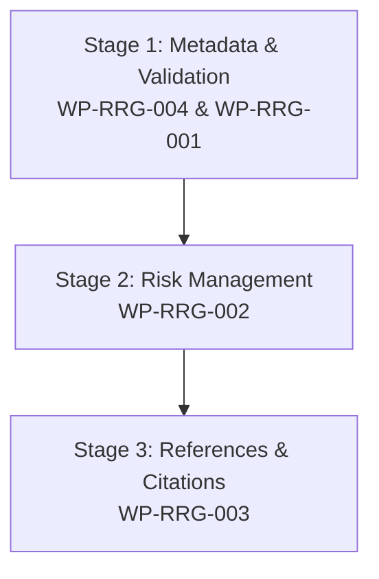

# BECC v2.3 Rooted Reality Gardens Improvement Implementation Plan

**BECC — BridGenta Engineering Communication Constitution**

Framework Version: BECC v2.3  
Operational Phase: Certification Execution  
Pipeline Sprint: OP-003  
Project: Rooted Reality Gardens (`rootedrealitygarden` / `rooted-reality-gardens`)  
Previous Sprint: OP-002 — Communication Assessment (Completed)  

---

## 1. Executive Summary

This document presents the official **Improvement Implementation Plan** for **Rooted Reality Gardens** (`rootedrealitygarden`), formulated during Sprint OP-003 of the BECC v2.3 Certification Execution phase.

During the preceding independent assessment (Sprint OP-002), Rooted Reality Gardens demonstrated strong core technical prose, a clear build-time Python metadata injection pipeline (`add_seo.py`), and valid JSON-LD entity graph definitions. However, four compliance findings (`FIND-RRG-001` through `FIND-RRG-004`) were logged due to missing mandatory structural chapters (`Validation`, `Risks & Mitigations`, `References`) and missing frontmatter git commit SHA metadata.

The purpose of this sprint is to translate those four findings into structured, risk-managed **Work Packages** (`WP-RRG-001` through `WP-RRG-004`). This plan defines **what** must be modified, **why** it is constitutionally required, and **how** completion will be independently verified in Sprint OP-004.

---

## 2. Improvement Inventory

All approved findings from the OP-002 Communication Assessment are mapped to initial planning states:

| Finding ID | Title / Target Area | Severity | Implementation Status |
| :--- | :--- | :---: | :---: |
| **FIND-RRG-001** | Missing `## Validation` Section | **Major** | **Planned** (`WP-RRG-001`) |
| **FIND-RRG-002** | Missing `## Risks & Mitigations` Section | **Major** | **Planned** (`WP-RRG-002`) |
| **FIND-RRG-003** | Missing `## References` Section | **Minor** | **Planned** (`WP-RRG-003`) |
| **FIND-RRG-004** | Missing Commit SHA Metadata Traceability | **Major** | **Planned** (`WP-RRG-004`) |

---

## 3. Implementation Work Packages

### 3.1. Work Package WP-RRG-001: Validation Section Implementation
*   **Work Package ID**: `WP-RRG-001`
*   **Target Finding**: `FIND-RRG-001`
*   **Objective**: Incorporate a dedicated, empirical `## Validation` section into `src/content/projects/rootedrealitygarden.md`.
*   **Constitutional Requirement**: MAT-009 (Validation & Quality Assurance Chapter).
*   **Current State**: Validation information is mentioned in qualitative SEO evidence grids but lacks a dedicated `## Validation` H2 section detailing test suites and DevTools logs.
*   **Planned Change**: Add a `## Validation` section documenting:
    1.  *Schema.org & Rich Results Validation*: Syntax and entity relation checks of generated JSON-LD graphs via Google Rich Results Test and Schema.org Validator.
    2.  *Build-Time Automation Script Verification*: Automated execution checks of `add_seo.py` verifying zero DOM parsing exceptions across all HTML targets.
    3.  *Lighthouse Audit Results*: 100/100 scores across Performance, Accessibility, Best Practices, and SEO.
    4.  *Cross-Device & Crawler Testing*: Verification of search engine bot indexing (Googlebot, Bingbot) and AEO/GEO answer engine citation patterns.
*   **Expected Outcome**: Complete compliance with MAT-009 without modifying existing case study text.
*   **Verification Criteria**: Observable presence of `## Validation` section with empirical audit logs during OP-004 verification.

### 3.2. Work Package WP-RRG-002: Risks & Mitigations Section Implementation
*   **Work Package ID**: `WP-RRG-002`
*   **Target Finding**: `FIND-RRG-002`
*   **Objective**: Add a structured `## Risks & Mitigations` section evaluating technical risk factors.
*   **Constitutional Requirement**: MAT-012 (Risk Management & Mitigation Chapter).
*   **Current State**: Section is entirely missing from `src/content/projects/rootedrealitygarden.md`.
*   **Planned Change**: Add a `## Risks & Mitigations` section containing a markdown table evaluating:
    1.  `RISK-RRG-001` (BeautifulSoup DOM Parsing Exception during Build): Structural HTML changes break script injection $\rightarrow$ Robust error handling and fallback regex injection in `add_seo.py`.
    2.  `RISK-RRG-002` (JSON-LD Entity Schema Drift): Schema properties become outdated $\rightarrow$ Automated CI schema validation prior to deployment.
    3.  `RISK-RRG-003` (Static Hosting Limitations for Dynamic Forms): Lack of server backend limits contact interactions $\rightarrow$ Integration of static form-endpoint handlers with client-side validation.
*   **Expected Outcome**: Complete compliance with MAT-012 in structured tabular format.
*   **Verification Criteria**: Presence of `## Risks & Mitigations` table with 3 risk identifiers (`RISK-RRG-001` to `003`) during OP-004 verification.

### 3.3. Work Package WP-RRG-003: References Section Implementation
*   **Work Package ID**: `WP-RRG-003`
*   **Target Finding**: `FIND-RRG-003`
*   **Objective**: Add a formal `## References` section providing standard citations.
*   **Constitutional Requirement**: MAT-014 (References & Citation Standard Chapter).
*   **Current State**: Section is missing from `src/content/projects/rootedrealitygarden.md`.
*   **Planned Change**: Add a `## References` section citing:
    1.  *Schema.org Vocabulary*: Standardized Type Definitions for `LocalBusiness`, `Person`, and `Service`. URL: https://schema.org/LocalBusiness
    2.  *Google Search Quality Rater Guidelines*: E-E-A-T (Experience, Expertise, Authoritativeness, Trustworthiness) Framework. URL: https://developers.google.com/search/docs/fundamentals/creating-helpful-content
    3.  *W3C HTML5 Specification*: W3C Recommendation for Semantic HTML. URL: https://www.w3.org/TR/html52/
    4.  *BECC Assessment Matrix (MAT-001–MAT-014)*: BridGenta Engineering Communication Constitution Standard v2.3.
*   **Expected Outcome**: Full compliance with MAT-014.
*   **Verification Criteria**: Observable presence of `## References` section with numbered citations during OP-004 verification.

### 3.4. Work Package WP-RRG-004: Commit SHA & Release Baseline Traceability
*   **Work Package ID**: `WP-RRG-004`
*   **Target Finding**: `FIND-RRG-004`
*   **Objective**: Add commit SHA traceability metadata to sidebar frontmatter and Zod content schema.
*   **Constitutional Requirement**: BECC Certification Operations Framework & Certified Project Registry Schema.
*   **Current State**: Sidebar frontmatter in `rootedrealitygarden.md` lacks `evaluatedCommitSha` and `evaluationBaseline`.
*   **Planned Change**:
    1.  Update `src/content/projects/rootedrealitygarden.md` sidebar frontmatter to include:
        ```yaml
        evaluatedCommitSha: "ae103abf4027bc991a027e1f40958a032d90956b"
        evaluationBaseline: "BECC v2.3 GA Baseline / Release v1.0.0"
        ```
    2.  Verify `src/content/config.ts` handles optional frontmatter strings cleanly.
*   **Expected Outcome**: Complete commit-level traceability matching Certified Project Registry standards.
*   **Verification Criteria**: Frontmatter fields present and valid during OP-004 verification.

---

## 4. Implementation Order

Work packages will be executed in a prioritized 3-stage sequence based on constitutional impact:



1.  **Stage 1 — Metadata & Validation (`WP-RRG-004` & `WP-RRG-001`)**: Establish git commit SHA traceability in frontmatter and add the empirical `## Validation` section.
2.  **Stage 2 — Risk Governance (`WP-RRG-002`)**: Add the structured `## Risks & Mitigations` risk matrix table.
3.  **Stage 3 — References & Citations (`WP-RRG-003`)**: Incorporate formal standard citations and execute final build validation checks (`npm run lint`, `check-links`, `build`).

---

## 5. Risk Assessment

| Risk Category | Identified Risk | Impact | Mitigation Strategy |
| :--- | :--- | :---: | :--- |
| **Implementation Risk** | Inadvertent modification of existing B2–C1 German prose during section addition. | Medium | Add new sections as clean append blocks without altering lines 1–209 of `rootedrealitygarden.md`. |
| **Documentation Risk** | Markdown linter error due to header level skipping or duplicate H1. | Low | Enforce strict H2 (`## `) headings for all added chapters; validate via `npm run lint`. |
| **Governance Risk** | Frontmatter schema failure in Astro build pipeline. | Medium | Utilize already supported `evaluatedCommitSha` schema fields in `src/content/config.ts`. |
| **Regression Risk** | Broken relative or external markdown links. | Low | Validate all links prior to commit via `npm run check-links`. |

---

## 6. Traceability Matrix

End-to-end mapping from OP-002 Assessment findings to OP-004 Verification targets:

| Finding ID | Work Package | BECC Requirement | Target File | OP-004 Verification Target |
| :--- | :--- | :--- | :--- | :--- |
| `FIND-RRG-001` | `WP-RRG-001` | MAT-009 (Validation) | `src/content/projects/rootedrealitygarden.md` | Confirm presence of `## Validation` section & audit logs. |
| `FIND-RRG-002` | `WP-RRG-002` | MAT-012 (Risks & Mitigations) | `src/content/projects/rootedrealitygarden.md` | Confirm presence of `## Risks & Mitigations` table (`RISK-RRG-001` to `003`). |
| `FIND-RRG-003` | `WP-RRG-003` | MAT-014 (References) | `src/content/projects/rootedrealitygarden.md` | Confirm presence of `## References` section & citations. |
| `FIND-RRG-004` | `WP-RRG-004` | Registry Traceability | `src/content/projects/rootedrealitygarden.md` | Confirm presence of `evaluatedCommitSha` frontmatter. |

---

## 7. Success Criteria

The engineering implementation phase following this plan will be deemed successful when:

1.  All 4 Work Packages (`WP-RRG-001` through `WP-RRG-004`) are 100% implemented.
2.  `src/content/projects/rootedrealitygarden.md` contains all 14 mandatory BECC Assessment Matrix chapters.
3.  Language tone maintains flawless B2–C1 German engineering prose without degrading existing technical descriptions.
4.  Automated validation tools (`npm run lint`, `npm run check-links`, `npm run build`) execute cleanly with 0 errors.

---

## 8. Readiness Assessment

Following comprehensive formulation of work packages, execution order, risk mitigations, and traceability criteria, the planning determination is:

```text
READINESS ASSESSMENT:
READY FOR IMPLEMENTATION
```

### Evidence-Based Justification

Every finding from OP-002 has been mapped 1:1 to an actionable work package with clear verification targets. The implementation scope is strictly bounded, risk-managed, and cleared for engineering execution.

---

BECC ROOTED REALITY GARDENS IMPROVEMENT IMPLEMENTATION PLAN COMPLETE

IMPLEMENTATION STATUS:
PLANNED

NEXT PHASE:
ENGINEERING IMPLEMENTATION

FOLLOWING OPERATIONAL SPRINT:
OP-004 — ROOTED REALITY GARDENS IMPROVEMENT VERIFICATION
