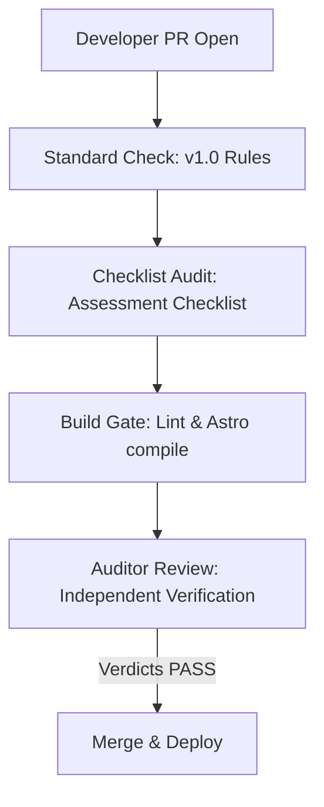

# BECC Public-Page Governance — Portfolio Rollout Readiness and Pilot 2 Plan

This document establishes the operationalization plan to rollout the BECC (BridGenta Engineering Communication Constitution) framework across all active portfolio project pages.

---

## 1. Portfolio Governance Model

Future public project pages are governed by the reusable standards extracted under `docs/becc/standards/`. The governance workflow integrates directly with repository pull requests:

---

## 2. Pilot 2 Selection: AeoCortex Assessment

* **Selected Project:** **AeoCortex** (`src/content/projects/aeocortex.md`)
* **Project Type:** Search Engine optimization for AI Search Engines (AEO & GEO).
* **Rationale for Selection:** AeoCortex contains complex technical concepts (such as Entity SEO, semantic graph mapping) and quantitative performance assertions. Because it represents a cutting-edge and highly metric-focused topic, it serves as the ideal testbed to validate the robustness of the BECC claim-bounding policy outside the BridGenta reconstruction reference case.

---

## 3. Tiered Assessment Paths

To balance governance quality with developer velocity, the 9-sprint reference lifecycle is adapted into two tiers:

### Tier 1: Complete Lifecycle (9 Sprints)
* **Target:** Complex, high-impact case studies containing major technical innovations or security boundaries (e.g. *AeoCortex*).
* **Execution:** Full execution of all 9 sprints sequentially.

### Tier 2: Fast-Track Path (4 Phases)
* **Target:** Standard project pages or marketing site updates (e.g. *Lumina Praxis*, *Rooted Reality Gardens*).
* **Execution:**
  - **Phase A (Editorial & Terminology):** Consolidates Sprints 1, 2, and 3. Aligns headings, corrects grammar, and optimizes cognitive load in a single change commit.
  - **Phase B (Integrity & Evidence Mapping):** Consolidates Sprints 4 and 5. Registers and bounds claims in the evidence map.
  - **Phase C (Verification & Deploy):** Consolidates Sprints 6 and 7. Runs lints, build gates, viewport audits, and controlled deploy.
  - **Phase D (Independent Audit & Sealing):** Consolidates Sprints 8 and 9. Verifies live URL and seals manifest.

---

## 4. Operational Prerequisites (Before Audit Inception)

Before any project page audit begins, the project owner must compile:
1. **Developer Ownership:** A designated engineer responsible for defending the case study in tech interviews.
2. **Development Maturity Proof:** Demonstration that the project has reached at least 50% development maturity (functional codebase or live environment).
3. **Evidence Log Draft:** A list of raw test logs, benchmark records, or repository links verifying every number planned for publication.
4. **Draft Copy:** The case study draft fully translated to professional CEFR B2–C1 German.

---

## 5. Flexibility vs. Consistency

BECC maintains high quality without constraining creative project-specific styles:
* **Structural Consistency:** All projects must adhere to standard high-level H2 headings (e.g. `Kurzfassung`, `Ergebnisse`, `Risiken`).
* **Terminology Policy:** Standard nouns (e.g., `Codegenerierung`) must use correct capitalization, while canonical English names (e.g., `Preservation Layers`) remain in English.
* **Wording Flexibility:** System-specific architecture components, subheadings (H3 and H4), and descriptive prose style can be customized freely by the project developer. Only absolute guarantees are prohibited.
