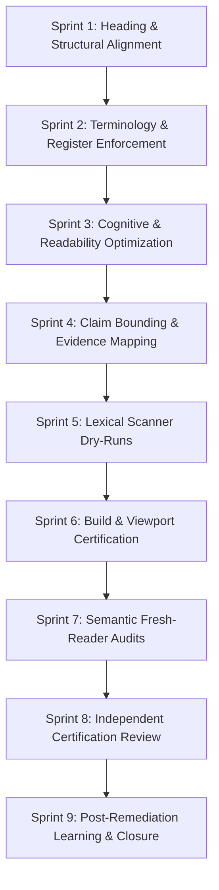

# BECC Public Page Rollout Guide v1.1
## Replicating Reference Maturity for Future Project Pages

*   **Status**: `PROPOSED — PENDING REVIEW`
*   **Version**: `1.1-Candidate`
*   **Release Gate**: Framework-Only Amendment Candidate
*   **Effective Date**: Pending Authorization

This guide outlines the rollout workflow to bring any public-facing engineering portfolio or project page to BECC reference maturity under the v1.1 standards.

---

## 1. Rollout Workflow Phasing

### Stage 1: Vocabulary & Register
* **Sprint 1 (Heading Alignment):** Map structural headings to standard German terminology maps. Ensure single `H1` layouts and sequential hierarchies.
* **Sprint 2 (Language & Terminology):** Enforce the terminology policy (proper nouns, code symbols, capitalization, first-use explanations).
* **Sprint 3 (Cognitive Load):** Optimize reading structure, split clauses, remove duplicate explanations, and target German B2–C1 register.

### Stage 2: Verification & Integrity
* **Sprint 4 (Claim Bounding):** Inventory all quantitative metrics, apply pilot environment bounds, and map claims to evidence hashes.
* **Sprint 5 (Lexical Scanning):** Set up the validator rules and execute matching on target files to resolve pattern findings.
* **Sprint 6 (Build & Viewport Certification):** Execute lint gates, compile assets, and inspect viewports (320px to 1440px, 200% zoom).

### Stage 3: Audit & Post-Remediation
* **Sprint 7 (Semantic Fresh-Reader Review):** Execute manual fresh-reading audits on built/staged pages. Disclose reviewer limitations.
* **Sprint 8 (Independent Certification Review):** Perform third-party evaluation, verify SHA-256 hashes, and issue formal certification verdict.
* **Sprint 9 (Post-Remediation Learning):** Review common defects, update the central registry for cross-project recurrence prevention, and archive the closed audit records.

---

## 2. Replication Rules & Recurrence Prevention
- **No Direct main Pushes**: All rollout work must reside on feature branches.
- **Evidence Preservation**: All findings, override justifications, and audit records must be preserved.
- **Cross-Project Recurrence Prevention**: If a new claim bounding issue or misleading term pattern is identified, it must be submitted to the registry to prevent recurrence across other project pages.
