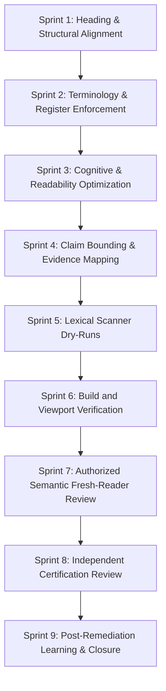

# BECC Public Page Rollout Guide v1.1
## Replicating Reference Maturity for Future Project Pages

*   **Status**: `PROPOSED — PENDING REVIEW`
*   **Version**: `1.1-Candidate`
*   **Release Gate**: Framework-Only Amendment Candidate
*   **Effective Date**: PENDING AUTHORIZATION

> [!IMPORTANT]
> **Shared Status & Separation Boundary**
> *   This guide candidate has no active enforcement, certification, publication, or supersession effect until formally approved.
> *   This candidate guide does not automatically reopen, downgrade, de-index, or reclassify an already-public project. Any retroactive application requires separate authority, scope, and lifecycle reconciliation.
>
> ```text
> Machine validation
> ≠ author or engineering self-review
> ≠ authorized semantic fresh-reader review
> ≠ independent certification review
> ≠ constitutional or designated approval
> ≠ merge authorization
> ≠ publication authorization
> ≠ activation
> ```

This guide outlines the rollout workflow to bring any public-facing engineering portfolio or project page to BECC reference maturity under the proposed v1.1 candidate workflow, if formally authorized.

---

## 1. Rollout Workflow Phasing

The nine-sprint rollout model below serves as a reference workflow; it is not automatically mandatory for every project.



### Stage 1: Vocabulary & Register (Tailorable Activities)
* **Sprint 1 (Heading Alignment):** Map structural headings to standard German terminology maps. Ensure single `H1` layouts and sequential hierarchies.
* **Sprint 2 (Language & Terminology):** Enforce the terminology policy (proper nouns, code symbols, capitalization, first-use explanations).
* **Sprint 3 (Cognitive Load):** Optimize reading structure, split clauses, remove duplicate explanations, and target German B2–C1 register.

### Stage 2: Verification & Integrity (Mandatory and Tailorable Gates)
* **Sprint 4 (Claim Bounding):** Inventory all quantitative metrics, apply pilot environment bounds, and map claims to evidence hashes. (Mandatory Gate)
* **Sprint 5 (Lexical Scanning):** Set up the validator rules and execute matching on target files to resolve pattern findings. (Tailorable Activity)
* **Sprint 6 (Build and Viewport Verification):** Execute lint gates, compile assets, and inspect viewports (320px to 1440px, 200% zoom). (Mandatory Gate)

### Stage 3: Audit & Post-Remediation (Mandatory Verification Gates)
* **Sprint 7 (Authorized Semantic Fresh-Reader Review):** Execute manual fresh-reading audits on built/staged pages. (Mandatory Gate)
  * Requires: reviewer identity, appointment reference, authorization scope, exact full SHA, exact rendered target, relationship disclosure, reviewer-controlled submission, and recorded limitations.
  * *Automated systems may prepare navigation material but may not perform or attest the human review.*
* **Sprint 8 (Independent Certification Review):** Perform third-party evaluation. (Mandatory Gate)
  * Requires: verified identity, appointment, independence disclosure, exact deployed SHA, exact rendered target, evidence-manifest reference, and reviewer-controlled verdict submission.
  * *Completion of Sprint 8 does not itself authorize amendment approval, publication, merge, or activation.*
* **Sprint 9 (Post-Remediation Learning):** Review common defects, update the central registry for cross-project recurrence prevention, and archive the closed audit records. (Tailorable Activity)

---

## 2. Replication Rules & Recurrence Prevention
- **No Direct main Pushes**: All rollout work must reside on feature branches.
- **Evidence Preservation**: All findings, override justifications, and audit records must be preserved.
- **Cross-Project Recurrence Prevention**: If a new claim bounding issue or misleading term pattern is identified, it must be submitted to the registry to prevent recurrence across other project pages.
- **Tailoring Scope**: Tailoring is permitted for local pipeline steps but must not remove a required human, evidence, assurance, approval, or publication gate.
