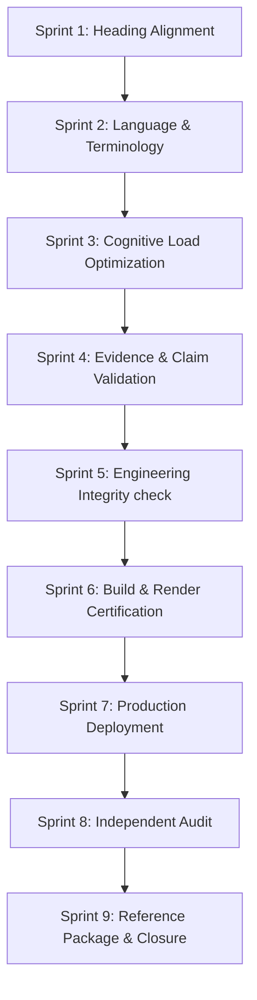

# BECC Public Page Rollout Guide
## Replicating Reference Maturity for Future Project Pages

This guide outlines the nine-sprint rollout workflow to bring any public-facing engineering portfolio or project page to BECC reference maturity.

---

## 1. Rollout Workflow Phasing

### Stage 1: Vocabulary & Register
* **Sprint 1 (Heading Alignment):** map structural headings to the standard German terminology map.
* **Sprint 2 (Language Cleanup):** correct grammar, spelling, compounds, and tone.
* **Sprint 3 (Cognitive Load):** optimize reading structure, split clauses, remove duplicate explanations.

### Stage 2: Verification & Integrity
* **Sprint 4 (Evidence Mapping):** inventory all quantitative claims and bind them to evidence logs.
* **Sprint 5 (Integrity Verification):** diff against baseline specifications to prevent technical drift.
* **Sprint 6 (Build & Render Certification):** execute lint gates, compile assets, and inspect viewports (320px to 1440px, 200% zoom).

### Stage 3: Deployment & Audit
* **Sprint 7 (Controlled Deployment):** squash-merge and trigger CI/CD page deployment. Verify fresh assets and update cache version.
* **Sprint 8 (Independent Audit):** perform third-party evaluation on live URLs, issuing a formal certification verdict.
* **Sprint 9 (Closure):** extract reusable assets and templates.

---

## 2. Best Practices for Replication
* **Do not push directly to main:** Keep all work package changes isolated on feature branches.
* **Preserve the audit trail:** Document defects, cache issues, and term mismatches in matrices instead of deleting them.
* **Maintain the terminology register:** Ensure the project vocabulary is registered and approved by the lead architect.
