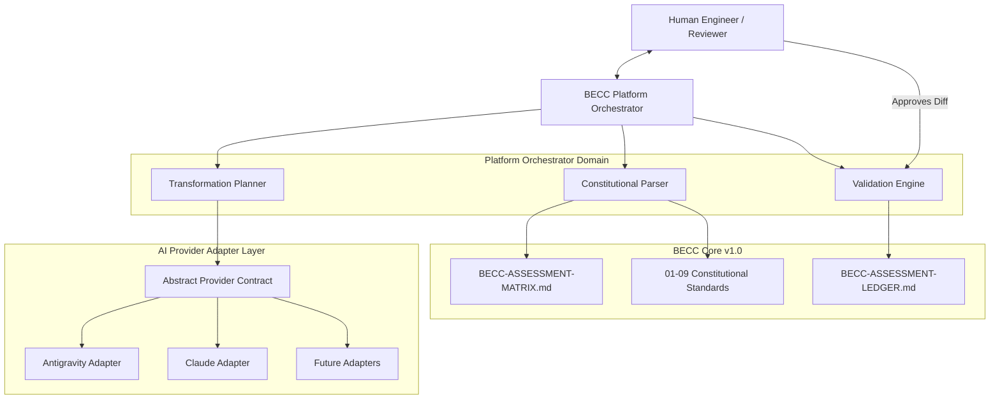

# BECC v2.0 — Architecture Proposal
## AI-Orchestrated Engineering Communication Platform

**Proposal Identifier:** BECC-PROP-201  
**Date:** 2026-07-12  
**Author:** Antigravity (Architectural Stewardship Agent)  
**Status:** Under Architectural Review  

---

## 1. Platform Vision

The BridGenta Engineering Communication Constitution (BECC) Version 1.0 established a rigorous, governed framework to evaluate and verify the compliance of technical documentation. Its core capability was **assessment**—answering the question: *"Is this engineering communication constitutionally compliant?"*

**BECC v2.0** shifts the focus from passive assessment to active, governed **engineering transformation**. It answers the next logical question: *"How can engineering communication be systematically improved using AI while remaining constitutionally governed?"*

The BECC v2.0 Platform is a modular, AI-orchestrated, provider-independent engineering platform. It automates the detection of communication weaknesses, drafts structured transformation plans, utilizes registered AI agents to suggest precise improvements, and enforces human-in-the-loop approval before publication. The platform serves as the software-defined orchestrator that closes the loop between raw technical content and the public portfolio.

---

## 2. Platform Architecture

The platform architecture is structured as a modular system that decouples the stable constitutional core of BECC v1.0 from volatile AI provider integrations and orchestration tooling.



---

## 3. Domain Decomposition

The platform is decomposed into six bounded contexts with clear responsibilities and interface contracts:

### 3.1 Constitutional Parsing Domain
* **Responsibility:** Parses raw markdown and YAML files of the BECC Core. Converts standard files (such as Sprints 0.1–1.0) and the matrix (`AQ-ES-001` through `AQ-AP-002`) into structured JSON templates used to seed AI prompts.
* **Boundary:** Read-only interface to [docs/engineering-communication/](./).

### 3.2 Assessment & Analysis Domain
* **Responsibility:** Executes static validation (linters/link checkers) and invokes the AI Provider to perform compliance auditing. Registers findings in a structured, machine-readable format.
* **Boundary:** Consumes target files in `/src/` and matches them against parsed matrix definitions.

### 3.3 Transformation Planning Domain
* **Responsibility:** Takes compliance findings and generates a `TransformationPlan`—a machine-readable checklist detailing what sections need revision, why, and which constitutional standards apply.
* **Boundary:** Connects compliance findings directly to prompt instructions.

### 3.4 AI Provider Brokerage Domain
* **Responsibility:** Dispatches execution requests to active AI adapters. Handles load balancing, context window optimizations, response parsing, and error fallback strategy.
* **Boundary:** Abstracts API keys and model specifics behind a provider-agnostic interface.

### 3.5 Validation Domain
* **Responsibility:** Runs automated post-transformation checks to verify syntax, relative link integrity, and diff bounds. Prevents "black-box" modifications or unauthorized text injection.
* **Boundary:** Read-write access to temporary workspaces.

### 3.6 Governance & Approval Domain
* **Responsibility:** Interacts with the human engineer. Renders side-by-side diffs, manages the approval state machine, updates the [BECC-ASSESSMENT-LEDGER.md](./stewardship/BECC-ASSESSMENT-LEDGER.md), and commits approved files.
* **Boundary:** Integrates with the Git CLI and local user interfaces.

---

## 4. AI Provider Architecture

The AI Provider Architecture is designed to guarantee complete **provider independence**. The platform interact with AI systems exclusively through an abstract adapter layer.

```text
+-------------------------------------------------------------+
|                     Abstract AI Provider                    |
+-------------------------------------------------------------+
                               |
       +-----------------------+-----------------------+
       |                       |                       |
       ▼                       ▼                       ▼
+--------------+        +--------------+        +--------------+
| Antigravity  |        |    Claude    |        | Future Agent |
|  (Reference) |        |   Adapter    |        |   Adapter    |
+--------------+        +--------------+        +--------------+
```

### 4.1 Abstract Provider Interface
Every AI Provider must implement a standard interface that exposes:
1. **Model Discovery:** Returns the list of supported models and context limits.
2. **Analysis Function:** Analyzes text against specific BECC standard rules.
3. **Transformation Function:** Executes controlled modifications on a text block under defined system prompts.

### 4.2 First Reference Implementation: Antigravity
The **Antigravity** agent acts as the primary reference implementation. Its adapter implements the abstract provider contract, validating:
* **Stateless Prompt Execution:** Ensuring that prompts are modular and do not leak workspace context.
* **Structured JSON Outputs:** Enforcing that responses contain both the transformed content and the reasoning rationale.
* **Rate-Limit Resilience:** Implementing exponential backoff via the unified HTTP client.

---

## 5. Communication Transformation Engine

The Transformation Engine is responsible for modifying technical documentation in a controlled, non-destructive manner. It executes updates using a **Three-Step Transformation Loop**:

```text
Step 1: Parse & Segment
  Break the target markdown file into logical AST (Abstract Syntax Tree) nodes (headings, code blocks, paragraphs).
           │
           ▼
Step 2: Controlled Prompting
  Send only the non-compliant node and its target BECC standard constraint to the AI Provider.
           │
           ▼
Step 3: AST Stitching
  Replace the non-compliant node with the enhanced output returned by the AI Provider, preserving formatting.
```

> [!IMPORTANT]
> **Scope Protection:** The engine is technically blocked from modifying out-of-scope sections. For instance, code blocks (` ```typescript `) are protected during stylistic text rewrites, preventing accidental syntax regressions.

---

## 6. Provider Contract

The interaction between the Platform Orchestrator and the AI Provider is defined by a strict schema:

### 6.1 Request Payload (YAML Schema)
```yaml
RequestHeader:
  TransactionId: "TX-BA-002-998"
  ProviderTarget: "Antigravity-Ref"
  Model: "gemini-3.5-flash"
TransformationParameters:
  TargetSection: "MAT-008"
  ConstitutionalStandard: "BECC-STD-WRITING-004"
  RuleConstraint: "Use active voice, avoid nominal style, maximum sentence length 25 words."
TargetContent:
  Metadata:
    Title: "BridGenta Reconstruction Platform"
  RawContent: "Die Implementierung des Systems wurde durch das Team vorgenommen. Es kam zur Durchführung von Tests."
```

### 6.2 Response Payload (YAML Schema)
```yaml
ResponseHeader:
  TransactionId: "TX-BA-002-998"
  ExecutionTimeMs: 1420
OutputData:
  TransformedContent: "Das Team implementierte das System und führte Tests durch."
  Rationale: "Nominalstil ('vorgenommen', 'Durchführung') wurde aufgelöst. Sätze wurden in aktive Stimme umformuliert."
  SelfScore:
    Compliant: true
    Reasoning: "Der Satz ist aktiv formuliert und enthält keine Nominalkonstruktionen."
```

---

## 7. Transformation Lifecycle

All document improvements follow a strict, state-controlled lifecycle:

```mermaid
stateDiagram-ID
    [*] --> Draft : Create Workspace
    Draft --> Assessed : Compliance Scan
    Assessed --> Planned : Plan Generated
    Planned --> Transforming : Request Dispatched
    Transforming --> Transformed : Response Received
    Transformed --> Validating : Run Linter/Linkcheck
    Validating --> Reviewing : Post-Scan Complete
    Reviewing --> Approved : Human Sign-Off
    Approved --> Published : Merge to Main
    
    Reviewing --> Transforming : Reject / Request Iteration
    Validating --> Planned : Auto-Validation Failure
```

---

## 8. Validation Architecture

To protect the codebase and portfolio from unauthorized or degraded AI changes, the platform executes a **four-stage automated validation gate** before presenting the output to a human:

```text
[Stage 1: Schema Check] ──► Verifies YAML frontmatter integrity
           │
           ▼
[Stage 2: Syntax Audit] ──► Runs local markdown linter (heading hierarchy)
           │
           ▼
[Stage 3: Link Audit]   ──► Runs local link checker (relative path validation)
           │
           ▼
[Stage 4: Semantic Diff]──► Checks that non-targeted chapters are 100% identical
```

Any validation failure automatically halts the lifecycle and returns the transaction to the `Planned` state for regeneration.

---

## 9. Human Review Workflow

Human governance is a mandatory principle of BECC v2.0. The review process is managed via an interactive git-backed workflow:

1. **Generation of Review Branch:** All transformations occur on a dedicated branch (e.g. `transformation/BA-002-improve-summary`).
2. **Review Dashboard:** The reviewer runs a local command (e.g., `npm run platform-review`) which displays:
   * A side-by-side Git diff.
   * The AI-generated change rationale.
   * The specific BECC standard that triggered the change.
3. **Decisions:** The reviewer can:
   * **Accept:** Merges the change.
   * **Reject:** Reverts the change.
   * **Refine:** Sends the node back with a custom hint (e.g. *"keep the original technical term"*).
4. **Sign-off:** Approved changes are committed with a structured commit message referencing the EDR and the transaction ID.

---

## 10. Repository Architecture

The platform directories are integrated into the existing workspace without polluting constitutional documents:

```text
bridgenta-portfolio/
├── docs/
│   └── engineering-communication/
│       ├── 00-foundation/ to 09-quality-assurance/  ◄── Unchanged (BECC Core)
│       └── BECC-v2.0-ARCHITECTURE-PROPOSAL.md        ◄── This proposal
│
├── platform/                                         ◄── [NEW] Platform Code
│   ├── src/
│   │   ├── orchestrator/                             ◄── State Machine & Planning
│   │   ├── validation/                               ◄── Syntax & Diff Checkers
│   │   └── providers/                                ◄── AI Adapters (Antigravity, etc.)
│   │
│   ├── contracts/                                    ◄── Schemas & Interface Definitions
│   └── tooling/                                      ◄── Unified CLI & Scripts
│
├── package.json                                      ◄── Updated dependencies
└── tsconfig.json                                     ◄── TypeScript configurations
```

---

## 11. Integration with BECC Core

BECC v2.0 consumes BECC v1.0 assets as the absolute source of truth:
* **Prompt Injection:** Standard guidelines (e.g. [07-writing/ENGINEERING_WRITING_STANDARD.md](./07-writing/ENGINEERING_WRITING_STANDARD.md)) are dynamically injected into prompt templates.
* **Matrix Validation:** Matrix question definitions are loaded directly from [stewardship/BECC-ASSESSMENT-MATRIX.md](./stewardship/BECC-ASSESSMENT-MATRIX.md) to check outputs.
* **Ledger Logging:** Completed transformations are written to [stewardship/BECC-ASSESSMENT-LEDGER.md](./stewardship/BECC-ASSESSMENT-LEDGER.md) as official operational records.

---

## 12. Extensibility Strategy

The platform is built to accommodate future evolution without requiring architectural restructuring:
* **Pluggable AI Adapters:** Adding a new AI model (e.g., Claude 3.5 Sonnet) only requires writing a single TypeScript class implementing the `AIProvider` contract.
* **Custom Verification Rules:** Additional validation rules (e.g., automated spelling checks or translation reviews) can be registered in the validation pipeline as pluggable middleware.

---

## 13. Risks

The following risks have been identified, along with their corresponding architectural mitigations:

| Risk Description | Severity | Mitigation Strategy |
| :--- | :---: | :--- |
| **Semantic Drift / Hallucination** | **High** | Decouple code blocks and technical constraints. Run semantic diff checks to ensure code integrity is unchanged. |
| **Black-box Communication Changes** | **Medium** | Enforce mandatory explainability in the provider contract. AI responses without rationales are rejected. |
| **Secret & Token Leakage** | **High** | Enforce a strict provider-adapter model. Secret keys are loaded dynamically from environment variables (`.env`) and never stored in files. |
| **Over-reliance on AI / Quality Decay** | **Medium** | Maintain human-in-the-loop governance as a mandatory blocker. The Git commit and merge actions are locked until signed off. |

---

## 14. Migration Strategy from BECC v1.0

The transition from v1.0 to v2.0 ensures complete backwards compatibility:
1. **Unmodified Ledger:** The existing entries in [BECC-ASSESSMENT-LEDGER.md](./stewardship/BECC-ASSESSMENT-LEDGER.md) remain valid.
2. **Backward-Compatible Workspaces:** Historical audit folders (like `BA-001` or Pilots) remain archived. The workspace specification is extended to support a `.becc/` metadata subdirectory for v2.0 runtimes.
3. **No Rules Disruption:** Existing standards files are read directly without modifications.

---

## 15. Initial Development Roadmap

The platform will be built incrementally across five planned implementation sprints:

```text
Sprint 2.1 — Platform Core & Contracts
  Establish the platform/ directory, compile contracts, and build the AST parser.
      │
      ▼
Sprint 2.2 — Antigravity Reference Adapter
  Build the reference AI provider wrapper and implement rate-limiting and retry logic.
      │
      ▼
Sprint 2.3 — Transformation Engine & Validation Gates
  Implement AST node-segmentation, prompt injection, and link-integrity diff gates.
      │
      ▼
Sprint 2.4 — Human Review Dashboard
  Create the side-by-side Git diff review interface and Git commit integration.
      │
      ▼
Sprint 2.5 — End-to-End Operational Trial
  Run a full transformation lifecycle on a target portfolio document (e.g., AEOcortex).
```
