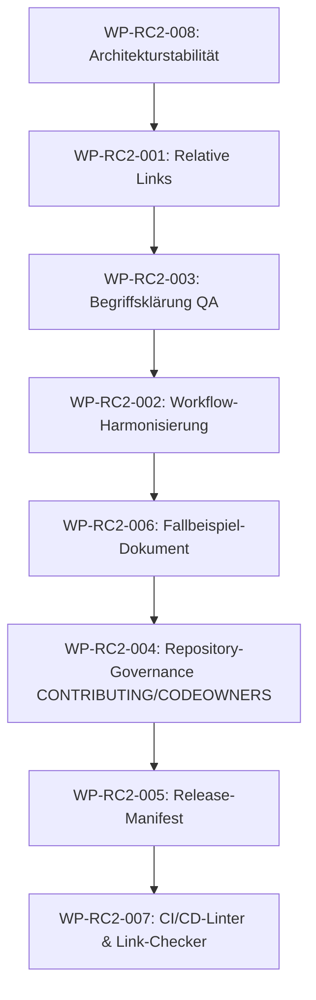

# Implementierungsplan (Implementation Plan) — BECC v1.0 Release Candidate 2 (RC2)

Dieses Dokument stellt den offiziellen **Implementierungsplan (Implementation Plan)** für den zweiten **Release Candidate (RC2)** der **BridGenta Engineering Communication Constitution (BECC)** dar. Es übersetzt die genehmigten Engineering-Entscheidungen in eine kontrollierte Ausführungsspezifikation.

---

## 1. Dokumentensteuerung (Document Control)

- **Dokumententitel**: BECC v1.0 RC2 Implementation Plan
- **Framework**: BridGenta Engineering Communication Constitution (BECC)
- **Release-Meilenstein**: Version 1.0 Release Candidate 2 (RC2)
- **Governance-Phase**: Phase 4 — Implementation Planning
- **Dokumentenstatus**: **Implementation Plan — Awaiting Project Owner Approval**
- **Version**: 1.0.0
- **Veröffentlichungsdatum**: 2026-07-10
- **Verfassende Rolle**: Framework Steward / Release Engineer (Antigravity)
- **Genehmigungsinstanz**: Constitutional Architect / Project Owner (BGA360)
- **Autoritative Eingangsdaten**:
  - [AUDIT_CONSOLIDATION_REGISTER.md](file:///c:/antigravity/statichtmlpro/fdrefs/docs/engineering-communication/RELEASES/AUDIT_CONSOLIDATION_REGISTER.md)
  - [BECC-v1.0-RC2-REMEDIATION-PLAN.md](file:///c:/antigravity/statichtmlpro/fdrefs/docs/engineering-communication/RELEASES/BECC-v1.0-RC2-REMEDIATION-PLAN.md)
  - [BECC-v1.0-RC2-ENGINEERING-DECISION-REVIEW.md](file:///c:/antigravity/statichtmlpro/fdrefs/docs/engineering-communication/RELEASES/BECC-v1.0-RC2-ENGINEERING-DECISION-REVIEW.md)
- **Nachfolgendes Artefakt**: RC2 Sprint 5 — RC2 Implementation (Ausführung)

---

## 2. Zweck (Purpose)

Der Zweck dieses Implementierungsplans besteht darin, eine präzise technische Spezifikation für die Umsetzung der akzeptierten Sanierungspunkte zu definieren.

### Warum dieser Plan existiert
Ein kontrollierter Übergang von der Governance zur Ausführung erfordert, dass vor dem Schreiben der ersten Zeile Code oder dem Ändern von Dokumenten die genauen betroffenen Dateien, die Ausführungsreihenfolge und die Verifikationsschritte feststehen. Dies minimiert Regressionsrisiken.

### Warum er dem Decision Review folgt
Der *Engineering Decision Review (EDR)* friert den inhaltlichen Umfang (Scope) ein. Dieser Plan nimmt den gefrorenen Scope auf und überführt ihn in ausführbare Arbeitspakete (Work Packages).

### Keine Reinterpretation von Governance-Entscheidungen
Die in dieser Phase erstellten Arbeitspakete dürfen die im EDR festgelegten Entscheidungen und Modifikationen weder verändern, erweitern noch einschränken. Die Governance-Beschlüsse sind endgültig und bindend.

### Autorisierungsstatus
Dieses Dokument autorisiert **keinerlei direkte Ausführungsarbeiten**, bis es vom Project Owner formell genehmigt wurde.

---

## 3. Eingefrorener Leistungsumfang für RC2 (Frozen RC2 Scope)

Der genehmigte Leistungsumfang für RC2 setzt sich laut EDR aus folgenden Beschlüssen zusammen:

| Entscheidungs-ID | Sanierungs-ID | Titel | Entscheidungstyp | Genehmigter Umfang |
| :--- | :--- | :--- | :--- | :--- |
| **EDR-RC2-001** | REM-RC2-001 | Umstellung absoluter Links | Accept | Ersetzung aller absoluten Links durch relative Markdown-Verknüpfungen. |
| **EDR-RC2-002** | REM-RC2-002 | Konsistenz der kanonischen Workflows | Accept with Modification | Verknüpfung der Workflow-Dateien und Entfernung von Redundanzen; Freigabeschranken bleiben unverändert. |
| **EDR-RC2-003** | REM-RC2-003 | Begriffsklärung der Governance-Ebenen | Accept | Einführung formaler Definitionen für Designed und Operational Governance in den QA-Standards. |
| **EDR-RC2-004** | REM-RC2-004 | Repository-Governance-Richtlinien | Accept | Erstellung von `CONTRIBUTING.md`, `CODEOWNERS` und `Maintainer Guide` in der Repository-Wurzel. |
| **EDR-RC2-005** | REM-RC2-005 | Maschinenlesbares Release-Manifest | Accept | Erstellung einer `release-manifest.json` für RC2 inklusive SHA-256-Hashes aller BECC-Dokumente. |
| **EDR-RC2-006** | REM-RC2-006 | Fallstudie zum Verfassungsverfahren | Accept with Modification | Erstellung eines simulierten Mock-Amendments in einer separaten Referenzdatei zur Anschauung. |
| **EDR-RC2-007** | REM-RC2-007 | Automatisierte Qualitätsprüfungen | Accept | Einbindung von markdownlint und Link-Checker-Infrastruktur in npm-Skripte und GitHub Actions. |
| **EDR-RC2-008** | REM-RC2-008 | Bewahrung des konstitutionellen Designs | Accept | Beibehaltung der Verzeichnishierarchie und Standards (Sprints 0.1 bis 1.0) der BECC ohne Redesign. |

---

## 4. Implementierungs-Prinzipien (Implementation Principles)

Sämtliche Arbeiten im nachfolgenden Implementierungslauf müssen folgenden Grundregeln folgen:
1. **Strenge Scope-Treue**: Es wird ausschließlich implementiert, was in den Arbeitspaketen definiert ist.
2. **Keine opportunistischen Verbesserungen**: Während der Ausführung werden keine unaufgeforderten Änderungen an Texten oder Code vorgenommen.
3. **Wahrung der Verfassungs-Integrität**: Keine Maßnahme darf die permanenten Prinzipien der BECC inhaltlich verändern.
4. **Lückenlose Rückverfolgbarkeit**: Jedes geänderte Repository-Asset und jeder Commit müssen auf ein Arbeitspaket und eine EDR-Entscheidung verweisen.
5. **Eins-zu-Eins-Zuordnung**: Jede Implementierungsmaßnahme entspricht genau einer genehmigten Governance-Entscheidung.

---

## 5. Implementierungs-Arbeitspakete (Implementation Work Packages)

### WP-RC2-001: Relative Markdown-Links
* **Arbeitspaket-ID**: WP-RC2-001
* **Entscheidungs-ID**: EDR-RC2-001
* **Sanierungs-ID**: REM-RC2-001
* **Titel**: Umstellung absoluter Links auf relative Pfade
* **Zielsetzung**: Bereinigung aller systemspezifischen absoluten Links, um die Dokumentation portabel zu gestalten.
* **Genehmigter Umfang**: Ersetzung aller absoluten Links, die das Protokoll `file:///` und absolute Pfade verwenden, durch relative Markdown-Verknüpfungen.
* **Betroffener Repository-Bereich**: `docs/engineering-communication/`
* **Erwartete Repository-Änderungen**: Keine neuen Dateien.
* **Erwartete Dokumenten-Änderungen**: Modifikation von `docs/engineering-communication/RELEASES/BECC-v1.0-RC1.md` und aller weiteren Markdown-Dateien unter `docs/`, die absolute Pfade enthalten.
* **Abhängigkeiten**: Keine.
* **Fertigstellungskriterien**: Keine Datei im Verzeichnis `docs/` enthält mehr die Zeichenkette `file:///c:/` oder absolute Windows-/Unix-Pfade.
* **Verifikations-Anforderungen**: Manuelle Prüfung (Git Diff) oder Ausführung eines temporären Regex-Suchskripts auf den modifizierten Dokumenten.
* **Rollback-Überlegungen**: Git-Revert des Commits.

---

### WP-RC2-002: Konsistenz der kanonischen Workflows
* **Arbeitspaket-ID**: WP-RC2-002
* **Entscheidungs-ID**: EDR-RC2-002
* **Sanierungs-ID**: REM-RC2-002
* **Titel**: Harmonisierung paralleler Prozessbeschreibungen
* **Zielsetzung**: Verknüpfung der Workflow-Dateien unter Vermeidung von Prozessredundanzen.
* **Genehmigter Umfang**: Gegenseitige Zuordnung und Verknüpfung der Beschreibungen in `workflow.md`, `publication-governance.md` und den BECC-QA-Richtlinien durch Querverweise. Die Kernregelungen der Freigabestufen und Veröffentlichungsschranken bleiben unberührt.
* **Betroffener Repository-Bereich**: `docs/` und `docs/engineering-communication/09-quality-assurance/`
* **Erwartete Repository-Änderungen**: Keine neuen Dateien.
* **Erwartete Dokumenten-Änderungen**: Modifikation von `docs/workflow.md`, `docs/publication-governance.md` und `docs/engineering-communication/09-quality-assurance/ENGINEERING_COMMUNICATION_QA_STANDARD.md`.
* **Abhängigkeiten**: WP-RC2-003 (Muss die dort definierten Governance-Begriffe verwenden).
* **Fertigstellungskriterien**: Redundante Beschreibungen sind entfernt. Alle drei Dokumente verweisen an den entsprechenden Stellen direkt aufeinander (Single Source of Truth).
* **Verifikations-Anforderungen**: Manuelle Leseprüfung auf Übereinstimmung der Freigabeprozesse und Verifikationsschranken.
* **Rollback-Überlegungen**: Git-Revert des Commits.

---

### WP-RC2-003: Präzisierung der Governance-Ebenen
* **Arbeitspaket-ID**: WP-RC2-003
* **Entscheidungs-ID**: EDR-RC2-003
* **Sanierungs-ID**: REM-RC2-003
* **Titel**: Begriffliche Abgrenzung von Designed und Operational Governance
* **Zielsetzung**: Saubere terminologische Trennung im Qualitätssicherungs-Standard.
* **Genehmigter Umfang**: Einfügen von formalen Definitionen für Designed Governance (Gestaltung der Regeln) und Operational Governance (operative Überprüfung) im QA-Standard.
* **Betroffener Repository-Bereich**: `docs/engineering-communication/09-quality-assurance/`
* **Erwartete Repository-Änderungen**: Keine neuen Dateien.
* **Erwartete Dokumenten-Änderungen**: Ergänzungen in `docs/engineering-communication/09-quality-assurance/ENGINEERING_COMMUNICATION_QA_STANDARD.md`.
* **Abhängigkeiten**: Keine.
* **Fertigstellungskriterien**: Der QA-Standard enthält einen dedizierten Abschnitt, der die beiden Begriffe definiert und deren Anwendung im Release-Lifecycle beschreibt.
* **Verifikations-Anforderungen**: Review des geänderten Textabschnitts auf logische Klarheit.
* **Rollback-Überlegungen**: Git-Revert des Commits.

---

### WP-RC2-004: Repository-Governance-Richtlinien
* **Arbeitspaket-ID**: WP-RC2-004
* **Entscheidungs-ID**: EDR-RC2-004
* **Sanierungs-ID**: REM-RC2-004
* **Titel**: Hinzufügen formaler Repository-Richtlinien
* **Zielsetzung**: Etablierung klarer Leitplanken für die Git-Kollaboration.
* **Genehmigter Umfang**: Erstellung und Platzierung von `CONTRIBUTING.md`, `CODEOWNERS` und einem `Maintainer Guide` in der Repository-Wurzel unter Beachtung des BGCF.
* **Betroffener Repository-Bereich**: Repository Root (`/`)
* **Erwartete Repository-Änderungen**: Neue Dateien `/CONTRIBUTING.md`, `/CODEOWNERS` und `/docs/engineering-communication/RELEASES/MAINTAINER_GUIDE.md` (oder an einem gleichwertigen Ort).
* **Erwartete Dokumenten-Änderungen**: Keine.
* **Abhängigkeiten**: WP-RC2-002 (Der Maintainer Guide muss mit den harmonisierten Workflows übereinstimmen).
* **Fertigstellungskriterien**: Die drei Dateien existieren und sind mit dem Git-Repository verknüpft (z. B. CODEOWNERS für die automatische Review-Zuweisung).
* **Verifikations-Anforderungen**: Überprüfung der Dateipfade und Testen der automatischen Reviewer-Zuweisung in einem Test-PR.
* **Rollback-Überlegungen**: Löschen der erstellten Dateien.

---

### WP-RC2-005: Maschinenlesbares Release-Manifest
* **Arbeitspaket-ID**: WP-RC2-005
* **Entscheidungs-ID**: EDR-RC2-005
* **Sanierungs-ID**: REM-RC2-005
* **Titel**: Implementierung eines Release-Manifests
* **Zielsetzung**: Automatisierte Absicherung der Release-Integrität.
* **Genehmigter Umfang**: Erstellung einer `release-manifest.json` für RC2, die alle BECC-Dateien und deren SHA-256-Prüfsummen erfasst.
* **Betroffener Repository-Bereich**: `docs/engineering-communication/RELEASES/`
* **Erwartete Repository-Änderungen**: Neue Datei `docs/engineering-communication/RELEASES/release-manifest.json`.
* **Erwartete Dokumenten-Änderungen**: Keine.
* **Abhängigkeiten**: WP-RC2-004 (Die Erstellungsschritte müssen im Maintainer Guide dokumentiert sein).
* **Fertigstellungskriterien**: Die JSON-Datei ist vorhanden, syntaktisch valide und enthält die korrekten Hashes aller aktiven Dokumente.
* **Verifikations-Anforderungen**: Ausführen eines einfachen Node.js-Skripts zur Generierung und Verifikation der SHA-256-Prüfsummen.
* **Rollback-Überlegungen**: Löschen der JSON-Datei.

---

### WP-RC2-006: Fallstudie zum Verfassungsänderungsverfahren
* **Arbeitspaket-ID**: WP-RC2-006
* **Entscheidungs-ID**: EDR-RC2-006
* **Sanierungs-ID**: REM-RC2-006
* **Titel**: Dokumentation eines simulierten Änderungsverfahrens (Mock-Amendment)
* **Zielsetzung**: Bereitstellung eines praktischen Anschauungsbeispiels für das formelle Änderungsverfahren.
* **Genehmigter Umfang**: Erstellung einer simulierten Fallstudie (Mock-Amendment) in einer eigenständigen Referenzdatei, die explizit als Simulation deklariert ist.
* **Betroffener Repository-Bereich**: `docs/engineering-communication/09-quality-assurance/`
* **Erwartete Repository-Änderungen**: Neue Datei `docs/engineering-communication/09-quality-assurance/MOCK_AMENDMENT_CASE_STUDY.md`.
* **Erwartete Dokumenten-Änderungen**: Verknüpfung der Datei im QA-Standard.
* **Abhängigkeiten**: WP-RC2-002, WP-RC2-003.
* **Fertigstellungskriterien**: Die Datei existiert, enthält eine Schritt-für-Schritt-Darstellung und ist unmissverständlich als simuliertes Fallbeispiel gekennzeichnet.
* **Verifikations-Anforderungen**: Leseprüfung zur Sicherstellung, dass das Dokument nicht als echter Verfassungszusatz missverstanden werden kann.
* **Rollback-Überlegungen**: Löschen der Datei und Entfernen der Verknüpfung.

---

### WP-RC2-007: Automatisierte Qualitätsprüfungen in der CI/CD
* **Arbeitspaket-ID**: WP-RC2-007
* **Entscheidungs-ID**: EDR-RC2-007
* **Sanierungs-ID**: REM-RC2-007
* **Titel**: Integration automatisierter Linter und Link-Checker
* **Zielsetzung**: Kontinuierliche Absicherung der Code- und Dokumentenqualität.
* **Genehmigter Umfang**: Konfiguration und Integration von Markdown-Linting- und Link-Checking-Infrastruktur in die lokalen npm-Skripte und die GitHub Actions Workflow-Pipeline.
* **Betroffener Repository-Bereich**: `/package.json`, `/.github/workflows/deploy.yml` (bzw. ein separater lint-Workflow), sowie Linter-Konfigurationsdateien.
* **Erwartete Repository-Änderungen**: Modifikation von `package.json` und GitHub Actions Workflows; Erstellung von Linter-Konfigurationsdateien in der Repository-Wurzel.
* **Erwartete Dokumenten-Änderungen**: Keine.
* **Abhängigkeiten**: WP-RC2-001 (Alle absoluten Links müssen vorab entfernt worden sein).
* **Fertigstellungskriterien**: Lokales Ausführen von `npm run lint` und `npm run check-links` läuft fehlerfrei durch. Die GitHub Actions CI führt diese Schritte bei jedem Pull Request erfolgreich aus.
* **Verifikations-Anforderungen**: Durchführung eines Test-Builds lokal und Überwachung der CI-Pipeline im PR.
* **Rollback-Überlegungen**: Zurücksetzen der Änderungen in `package.json` und den Actions-Dateien.

---

### WP-RC2-008: Bewahrung des konstitutionellen Designs
* **Arbeitspaket-ID**: WP-RC2-008
* **Entscheidungs-ID**: EDR-RC2-008
* **Sanierungs-ID**: REM-RC2-008
* **Titel**: Schutz der bestehenden Verfassungsstruktur
* **Zielsetzung**: Beibehaltung der stabilen Dokumentationsarchitektur der BECC.
* **Genehmigter Umfang**: Keine strukturellen Änderungen am Verzeichnislayout oder den Kernstandards (Sprints 0.1 bis 1.0) der BECC.
* **Betroffener Repository-Bereich**: `docs/engineering-communication/`
* **Erwartete Repository-Änderungen**: Keine.
* **Erwartete Dokumenten-Änderungen**: Keine.
* **Abhängigkeiten**: Keine.
* **Fertigstellungskriterien**: Die Ordnerhierarchie (00 bis 09 und RELEASES) bleibt identisch zum RC1-Stand.
* **Verifikations-Anforderungen**: Abgleich der Verzeichnisstruktur vor und nach dem Implementierungslauf.
* **Rollback-Überlegungen**: Nicht erforderlich.

---

## 6. Repository-Wirkungsanalyse (Repository Impact Analysis)

Um den Umfang der physischen Eingriffe im Repository zu begrenzen, werden die erwarteten Änderungen vorab klassifiziert:

### Erwartete Dateimodifikationen (Tracked Changes)
- `docs/engineering-communication/RELEASES/BECC-v1.0-RC1.md` (Linkbereinigung)
- `docs/workflow.md` (Workflow-Harmonisierung und relative Links)
- `docs/publication-governance.md` (Workflow-Harmonisierung)
- `docs/engineering-communication/09-quality-assurance/ENGINEERING_COMMUNICATION_QA_STANDARD.md` (Begriffsklärung & Fallbeispiel-Link)
- `package.json` (Integration von npm-Skripten für Linter und Link-Checker)
- `.github/workflows/deploy.yml` (Integration von CI-Prüfungen)

### Erwartete Dateineuerstellungen (New Files)
- `CONTRIBUTING.md` (Repository-Wurzel)
- `CODEOWNERS` (Repository-Wurzel)
- `docs/engineering-communication/RELEASES/MAINTAINER_GUIDE.md` (Release-Richtlinien)
- `docs/engineering-communication/RELEASES/release-manifest.json` (Kryptografisches Release-Manifest)
- `docs/engineering-communication/09-quality-assurance/MOCK_AMENDMENT_CASE_STUDY.md` (Simulierte Fallstudie)
- `.markdownlint.json` (Linter-Konfiguration in der Repository-Wurzel, falls erforderlich)

### Unveränderte Repository-Bereiche
- Alle Kerninhalte der verfassungsmäßigen Standards (Phasen 1 & 2 in `00-foundation` bis `08-review-feedback`) bleiben inhaltlich **vollständig unverändert**. Es erfolgen dort ausschließlich Linkbereinigungen (relative Links).
- Sämtlicher Astro-Quellcode (`src/`), Layouts, Komponenten und Styles bleiben vollständig unangetastet.

---

## 7. Implementierungsreihenfolge (Implementation Sequence)

Die Umsetzung muss in einer logisch begründeten Reihenfolge erfolgen, um Build-Fehler und CI-Blockaden zu vermeiden. Die Reihenfolge ist für die Ausführung bindend:

### Begründung der Reihenfolge
1. **WP-RC2-008 (Architekturstabilität)**: Setzt die Baseline-Bedingung für alle weiteren Schritte.
2. **WP-RC2-001 (Relative Links)**: Muss als erster physischer Schritt erfolgen, da nachgelagerte automatisierte Link-Prüfungen (WP-RC2-007) andernfalls sofort fehlschlagen würden.
3. **WP-RC2-003 (Begriffsklärung QA)**: Liefert die terminologische Basis für die darauffolgenden Prozessanpassungen.
4. **WP-RC2-002 (Workflow-Harmonisierung)**: Baut auf der begrifflichen Definition (WP-RC2-003) auf und harmonisiert die Prozessdokumente.
5. **WP-RC2-006 (Fallbeispiel-Dokument)**: Nutzt die harmonisierten Workflows, um das simulierte Fallbeispiel fehlerfrei zu beschreiben.
6. **WP-RC2-004 (Repository-Governance)**: Nutzt die harmonisierten Workflows zur Festlegung der Beiträge- und Review-Regeln im Repository.
7. **WP-RC2-005 (Release-Manifest)**: Setzt die Existenz der bereinigten Dateien und des Maintainer-Guides voraus, um das Manifest korrekt zu erzeugen und zu dokumentieren.
8. **WP-RC2-007 (CI/CD-Linter & Link-Checker)**: Wird als letztes integriert und aktiviert, um alle vorherigen Änderungen im fertigen PR automatisch zu validieren.

---

## 8. Abhängigkeitsmatrix (Dependency Matrix)

Die folgende Tabelle zeigt die Abhängigkeiten der Arbeitspakete untereinander auf:

| Arbeitspaket | Prämisse (Voraussetzung) | Unabhängig ausführbar? | Typ der Abhängigkeit |
| :--- | :--- | :---: | :--- |
| **WP-RC2-001** | Keine | Ja | — |
| **WP-RC2-002** | WP-RC2-003 | Nein | Inhaltliche Konsistenz der Terminologie |
| **WP-RC2-003** | Keine | Ja | — |
| **WP-RC2-004** | WP-RC2-002 | Nein | Prozessuale Ausrichtung an den Workflows |
| **WP-RC2-005** | WP-RC2-004 | Nein | Dokumentation der Schritte im Maintainer Guide |
| **WP-RC2-006** | WP-RC2-002, WP-RC2-003 | Nein | Logischer Bezug auf Workflows & Begriffe |
| **WP-RC2-007** | WP-RC2-001 | Nein | Technische Voraussetzung (relative Link-Integrität) |
| **WP-RC2-008** | Keine | Ja | Architektonische Randbedingung |

---

## 9. Verifikations-Anforderungen (Verification Requirements)

Für jedes Arbeitspaket ist ein objektiver und wiederholbarer Verifikationsnachweis zu erbringen:

- **WP-RC2-001 (Relative Links)**:
  - *Nachweis*: Lokaler grep-Befehl nach `file:///c:/` liefert 0 Treffer im Verzeichnis `docs/`.
- **WP-RC2-002 (Workflow-Harmonisierung)**:
  - *Nachweis*: Verweise in `workflow.md`, `publication-governance.md` und QA-Standard sind gegenseitig aufgelöst. Keine redundanten Textblöcke.
- **WP-RC2-003 (Begriffsklärung QA)**:
  - *Nachweis*: Vorhandensein der Definitionen von Designed/Operational Governance im QA-Standard.
- **WP-RC2-004 (Repository-Governance)**:
  - *Nachweis*: Physisches Vorhandensein der Dateien `CONTRIBUTING.md`, `CODEOWNERS` und `MAINTAINER_GUIDE.md`.
- **WP-RC2-005 (Release-Manifest)**:
  - *Nachweis*: Erfolgreiches Parsen der `release-manifest.json` und manueller stichprobenartiger Abgleich der SHA-256-Hashes ausgewählter Dateien.
- **WP-RC2-006 (Fallbeispiel-Dokument)**:
  - *Nachweis*: Existenz von `MOCK_AMENDMENT_CASE_STUDY.md` und Vorhandensein des Disclaimers zur Simulation.
- **WP-RC2-007 (CI/CD-Linter)**:
  - *Nachweis*: Lokale Ausführung von `npm run lint` und `npm run check-links` (oder vergleichbar) meldet Erfolg; die GitHub Actions Pipeline im PR läuft erfolgreich durch.
- **WP-RC2-008 (Architekturstabilität)**:
  - *Nachweis*: Dateibaum-Vergleich via Git zeigt keine veränderten oder gelöschten Ordnernamen im BECC-Bereich.

---

## 10. Abnahmekriterien (Acceptance Criteria)

Der gesamte RC2-Remediationsprozess gilt als erfolgreich abgeschlossen, wenn:
1. Alle Arbeitspakete (WP-RC2-001 bis WP-RC2-008) vollständig implementiert und verifiziert sind.
2. Keine absoluten Dateipfade mehr im gesamten `docs/`-Ordner existieren.
3. Der lokale Build-Vorgang (`npm run build`) fehlerfrei durchläuft.
4. Alle automatisierten Qualitätsprüfungen (Linter, Link-Checker) lokal und in der GitHub Actions CI-Pipeline ohne Fehler durchlaufen.
5. Die lückenlose Rückverfolgbarkeit zu den EDR-Entscheidungen in allen Commits dokumentiert ist.
6. Ein formeller Review durch die Audit-Agenten stattgefunden hat.

---

## 11. Rollback-Strategie (Rollback Strategy)

Sollte es während des Implementierungslaufs zu schwerwiegenden Fehlern, CI-Blockaden oder unerwarteten Regressionen kommen, gilt folgende Rollback-Strategie:
- **Fehler im isolierten Arbeitspaket**: Die Änderungen des entsprechenden Commits werden mittels `git revert <commit-id>` zurückgesetzt. Die lückenlose Traceability im Commit-Verlauf muss durch eine entsprechende Begründung gewahrt bleiben.
- **Systemweiter Fehler / Instabiler Build**: Bei unvorhergesehenen Seiteneffekten, die den Astro-Build blockieren und sich nicht kurzfristig beheben lassen, wird der gesamte Feature-Branch auf den Zustand des letzten stabilen Commits zurückgesetzt (`git reset --hard <stable-commit-id>`).
- **Traceability bei Rollbacks**: Jedes Rollback-Ereignis muss im Git-Commit-Verlauf mit Verweis auf das betroffene Arbeitspaket und die Ursache dokumentiert werden.

---

## 12. Risikobewertung und Mitigationsstrategien (Risk Assessment)

- **Risiko 1: CI-Blockade durch unvollständige Linkbereinigung (Wahrscheinlichkeit: Medium / Auswirkung: Hoch)**:
  - *Mitigaton*: WP-RC2-001 (relative Links) wird zwingend als erster Schritt vor der Aktivierung der CI-Automatisierung (WP-RC2-007) vollständig abgeschlossen und lokal geprüft.
- **Risiko 2: Konzeptuelle Aufweichung der eingefrorenen Verfassung bei der Workflow-Harmonisierung (Wahrscheinlichkeit: Niedrig / Auswirkung: Hoch)**:
  - *Mitigaton*: Strenge Beschränkung der Arbeitsschritte in WP-RC2-002 auf Querverweise und Beseitigung rein redaktioneller Redundanzen. Keine inhaltlichen Änderungen an den Freigabeprozessen.
- **Risiko 3: Fehlende Synchronisation mit dem Hauptzweig (Main) (Wahrscheinlichkeit: Niedrig / Auswirkung: Medium)**:
  - *Mitigaton*: Vor Beginn der Implementierungsarbeiten wird der Feature-Branch frisch vom neuesten `main` abgezweigt.

---

## 13. Rückverfolgbarkeitsmatrix (Traceability Matrix)

| EDR-Entscheidung | Arbeitspaket | Betroffene Repository-Dateien | Verifikationsmethode | Erwarteter Nachweis (Evidence) |
| :--- | :--- | :--- | :--- | :--- |
| **EDR-RC2-001** | **WP-RC2-001** | `docs/engineering-communication/RELEASES/BECC-v1.0-RC1.md`, etc. | Regex-Suche nach `file:///` | 0 Treffer im `docs/`-Ordner |
| **EDR-RC2-002** | **WP-RC2-002** | `docs/workflow.md`, `docs/publication-governance.md`, `docs/.../ENGINEERING_COMMUNICATION_QA_STANDARD.md` | Manuelle Leseprüfung | Lückenlose gegenseitige Verweise |
| **EDR-RC2-003** | **WP-RC2-003** | `docs/.../ENGINEERING_COMMUNICATION_QA_STANDARD.md` | Manuelle Leseprüfung | Vorhandensein der Governance-Definitionen |
| **EDR-RC2-004** | **WP-RC2-004** | `/CONTRIBUTING.md`, `/CODEOWNERS`, `/docs/.../MAINTAINER_GUIDE.md` | Dateipfad-Prüfung | Physisches Vorhandensein der 3 Dateien |
| **EDR-RC2-005** | **WP-RC2-005** | `/docs/engineering-communication/RELEASES/release-manifest.json` | JSON-Parsing und Hash-Abgleich | Valides Release-Manifest |
| **EDR-RC2-006** | **WP-RC2-006** | `/docs/.../MOCK_AMENDMENT_CASE_STUDY.md` | Manuelle Leseprüfung | Referenzdokument mit Simulations-Disclaimer |
| **EDR-RC2-007** | **WP-RC2-007** | `/package.json`, `/.github/workflows/deploy.yml` | Lokales npm-Skript & GitHub Actions CI | Fehlerfreier Durchlauf der Linter-Skripte |
| **EDR-RC2-008** | **WP-RC2-008** | Verzeichnis `docs/engineering-communication/` | Dateibaum-Vergleich | Unverändertes Ordner-Layout |

---

## 14. Ausgegrenzte Punkte (Out-of-Scope Statement)

Folgende Aspekte sind explizit **ausgeschlossen** und dürfen während der Implementierung von RC2 unter keinen Umständen bearbeitet oder hinzugefügt werden:
- Alle im EDR als zurückgestellt (Deferred) deklarierten langfristigen Ideen (vollautomatisierte Manifestprüfung in CI, multilinguale Wörterbücher, Aufteilung in zwei Repositories).
- Jede inhaltliche Änderung der verfassungsmäßigen Standards der BECC (Phasen 1 & 2).
- Jegliche Änderungen am Astro-Frontend, an Styles oder Seitentemplates.
- Alle nicht im Sanierungsplan registrierten Funktionswünsche oder Verbesserungen.

---

## 15. Übergabe (Handover)

Dieser Implementierungsplan bildet die einzige, verbindliche technische Ausführungsspezifikation für:

**RC2 Sprint 5 — RC2 Implementation (Ausführung)**

### Restriktionen für die Implementierung:
1. Keine Programmier- oder Schreibarbeiten dürfen außerhalb der in diesem Plan definierten Arbeitspakete stattfinden.
2. Jede geänderte Datei und jeder Git-Commit müssen zwingend auf die entsprechende Entscheidungs-ID (EDR-RC2-###) und Arbeitspaket-ID (WP-RC2-###) verweisen.
3. Die Implementierungsphase darf erst eingeleitet werden, nachdem dieser Plan vom Project Owner (BGA360) formell genehmigt und in den Hauptzweig (`main`) integriert wurde.
