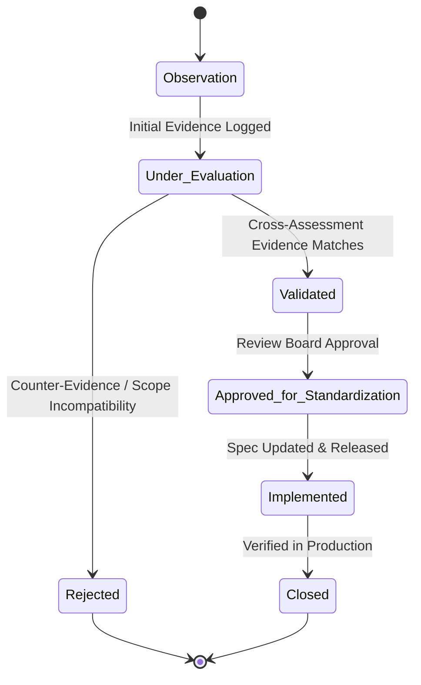

# BECC v2.0 — Portfolio Improvement Candidate Register

This register serves as the official, living governance backlog for the evolution of the BridGenta Engineering Communication Constitution (BECC) authoring standards. It operates under strict evidence-based criteria to ensure that any future modifications to the Portfolio Authoring Standard are driven by operational data rather than individual assessment outcomes.

> [!IMPORTANT]
> **CONSTITUTIONAL-GOVERNANCE-RULE**: No Portfolio Authoring Standard shall be modified directly from an individual assessment. All future standard changes must originate from a **Validated** or **Approved for Standardization** candidate recorded in this register, supported by independent operational evidence.

---

## 1. Candidate Lifecycle

Every improvement candidate registered must progress through the following lifecycle states. State transitions require documented evidence and approval from the Operational Review Board.

### State Definitions
*   **Observation**: A potential gap has been observed in a single assessment, or a recurring pattern is hypothesized.
*   **Under Evaluation**: The candidate is actively monitored across active assessments to gather comparative data.
*   **Validated**: The gap has been proven to exist as a systemic issue across multiple independent projects with verified root causes.
*   **Approved for Standardization**: The Operational Review Board formally recommends updating the Portfolio Authoring Standard based on this candidate.
*   **Implemented**: The new standards, templates, and onboarding guides have been updated and committed to the repository.
*   **Closed**: The new standards are active, and subsequent audits verify that the recurring gap has been eliminated.
*   **Rejected**: Evidence proves the gap is project-specific rather than a template or portfolio-wide issue.

---

## 2. Confidence Model

Confidence in a candidate increases solely through independent operational evidence from completed assessments. It is classified as follows:

*   **Low**: Candidate is supported by 1 or 2 assessments. Initial hypothesis is established.
*   **Moderate**: Candidate is supported by 3 assessments. Consistent root cause is verified.
*   **High**: Candidate is supported by 4 or more assessments. No contradictory evidence has been observed.
*   **Very High**: Candidate has been validated across all eligible active portfolio projects.

---

## 3. Standardization Threshold Criteria

A candidate is eligible to be proposed for a Portfolio Authoring Standard modification only when it satisfies all of the following conditions:

1.  **Multiple Independent Assessments**: Supported by at least 4 completed assessments (e.g. AC-001, AC-002, AC-003, AC-004).
2.  **Validated Root Cause**: The primary driver of the gap is confirmed as a template deficiency or onboarding guidelines gap rather than individual author error.
3.  **No Contradictory Evidence**: No project within the pilot scope has successfully passed the audited criteria without remediation.
4.  **Board Recommendation**: The Operational Review Board recommends the change in a formal pilot review.

---

## 4. Relationship Mapping Rules

To function as the central knowledge hub, every candidate entry must maintain a traceability map containing relative markdown links to:
*   Supporting Assessments (`COMPLIANCE-ASSESSMENT.md`, `FINDINGS-REGISTER.md`)
*   Related Reassessments (`POST-IMPLEMENTATION-COMPLIANCE-ASSESSMENT.md`)
*   Engineering Decisions (`ENGINEERING-DECISION-REVIEW.md`)
*   Human Review Decisions (`HUMAN-REVIEW-DECISION.md`)
*   Cross-Assessment Analyses (`BECC-v2-CROSS-ASSESSMENT-PATTERN-ANALYSIS.md`)

---

## 5. Registered Candidates Backlog

### 5.1. CAN-001: Missing Validation Chapter

*   **Candidate ID**: CAN-001
*   **Observation**: The required `## Validation` chapter is missing from portfolio case studies.
*   **Proposed Improvement**: Update the core case study template to include a mandatory `## Validation` section detailing calculator tests, ranking audits, and test parameters.
*   **Root Cause**: Legacy case study template did not contain a placeholder or instructions for validation tests.
*   **Initial Confidence**: Low
*   **Current Confidence**: Moderate
*   **Current Status**: **Under Evaluation**
*   **Evidence History**:
    1.  *Assessment ID*: [AC-001](./operations/AC-001/ASSESSMENT-COMPLETED.md)
        *   *Project*: AEOcortex
        *   *Finding ID*: [FIN-AC-001](./operations/AC-001/FINDINGS-REGISTER.md)
        *   *Date*: 2026-07-13
        *   *Summary*: Sektion fehlt vollständig. Behebung RM-001 freigegeben.
    2.  *Assessment ID*: [AC-002](./operations/AC-002/ASSESSMENT-COMPLETED.md)
        *   *Project*: Lumina Praxis
        *   *Finding ID*: [FIN-AC-002-001](./operations/AC-002/FINDINGS-REGISTER.md)
        *   *Date*: 2026-07-13
        *   *Summary*: Sektion fehlt. Provisorisch in CRS-AC-002 aufgenommen.
    3.  *Assessment ID*: [AC-003](./operations/AC-003/ASSESSMENT-COMPLETED.md)
        *   *Project*: StarCleaners
        *   *Finding ID*: [FIN-AC-003-001](./operations/AC-003/FINDINGS-REGISTER.md)
        *   *Date*: 2026-07-13
        *   *Summary*: Sektion fehlt. Provisorisch in CRS-AC-003 aufgenommen.
    4.  *Assessment ID*: [AC-004](./operations/AC-004/ASSESSMENT-COMPLETED.md)
        *   *Project*: BridGenta
        *   *Finding ID*: None (Compliant)
        *   *Date*: 2026-07-13
        *   *Summary*: Sektion ist vorhanden. Gegenbeweis erbracht, dass Standard erfüllbar ist.

---

### 5.2. CAN-002: Missing Risks Chapter

*   **Candidate ID**: CAN-002
*   **Observation**: The required `## Risks` chapter is missing from portfolio case studies.
*   **Proposed Improvement**: Update the case study template to include a mandatory `## Risks` section with a predefined risk mitigation table layout.
*   **Root Cause**: Legacy template deficiency; absence of structured risks layout in authoring guides.
*   **Initial Confidence**: Low
*   **Current Confidence**: Moderate
*   **Current Status**: **Under Evaluation**
*   **Evidence History**:
    1.  *Assessment ID*: [AC-001](./operations/AC-001/ASSESSMENT-COMPLETED.md)
        *   *Project*: AEOcortex
        *   *Finding ID*: [FIN-AC-002](./operations/AC-001/FINDINGS-REGISTER.md)
        *   *Date*: 2026-07-13
        *   *Summary*: Sektion fehlt. Behebung RM-001 freigegeben.
    2.  *Assessment ID*: [AC-002](./operations/AC-002/ASSESSMENT-COMPLETED.md)
        *   *Project*: Lumina Praxis
        *   *Finding ID*: [FIN-AC-002-002](./operations/AC-002/FINDINGS-REGISTER.md)
        *   *Date*: 2026-07-13
        *   *Summary*: Sektion fehlt. Provisorisch in CRS-AC-002 aufgenommen.
    3.  *Assessment ID*: [AC-003](./operations/AC-003/ASSESSMENT-COMPLETED.md)
        *   *Project*: StarCleaners
        *   *Finding ID*: [FIN-AC-003-002](./operations/AC-003/FINDINGS-REGISTER.md)
        *   *Date*: 2026-07-13
        *   *Summary*: Sektion fehlt. Provisorisch in CRS-AC-003 aufgenommen.
    4.  *Assessment ID*: [AC-004](./operations/AC-004/ASSESSMENT-COMPLETED.md)
        *   *Project*: BridGenta
        *   *Finding ID*: None (Compliant)
        *   *Date*: 2026-07-13
        *   *Summary*: Sektion ist vorhanden. Gegenbeweis erbracht, dass Standard erfüllbar ist.

---

### 5.3. CAN-003: Missing References Chapter

*   **Candidate ID**: CAN-003
*   **Observation**: The required `## References` chapter is missing from portfolio case studies.
*   **Proposed Improvement**: Update the case study template to include a mandatory `## References` section with a link format standard (recommending absolute GitHub links for internal docs to prevent Astro build failures).
*   **Root Cause**: Authoring pattern treating case studies as marketing copy rather than specifications.
*   **Initial Confidence**: Low
*   **Current Confidence**: Moderate
*   **Current Status**: **Under Evaluation**
*   **Evidence History**:
    1.  *Assessment ID*: [AC-001](./operations/AC-001/ASSESSMENT-COMPLETED.md)
        *   *Project*: AEOcortex
        *   *Finding ID*: [FIN-AC-003](./operations/AC-001/FINDINGS-REGISTER.md)
        *   *Date*: 2026-07-13
        *   *Summary*: Sektion fehlt. Behebung RM-001 freigegeben.
    2.  *Assessment ID*: [AC-002](./operations/AC-002/ASSESSMENT-COMPLETED.md)
        *   *Project*: Lumina Praxis
        *   *Finding ID*: [FIN-AC-002-003](./operations/AC-002/FINDINGS-REGISTER.md)
        *   *Date*: 2026-07-13
        *   *Summary*: Sektion fehlt. Provisorisch in CRS-AC-002 aufgenommen.
    3.  *Assessment ID*: [AC-003](./operations/AC-003/ASSESSMENT-COMPLETED.md)
        *   *Project*: StarCleaners
        *   *Finding ID*: [FIN-AC-003-003](./operations/AC-003/FINDINGS-REGISTER.md)
        *   *Date*: 2026-07-13
        *   *Summary*: Sektion fehlt. Provisorisch in CRS-AC-003 aufgenommen.
    4.  *Assessment ID*: [AC-004](./operations/AC-004/ASSESSMENT-COMPLETED.md)
        *   *Project*: BridGenta
        *   *Finding ID*: None (Compliant)
        *   *Date*: 2026-07-13
        *   *Summary*: Sektion ist vorhanden. Gegenbeweis erbracht, dass Standard erfüllbar ist.
