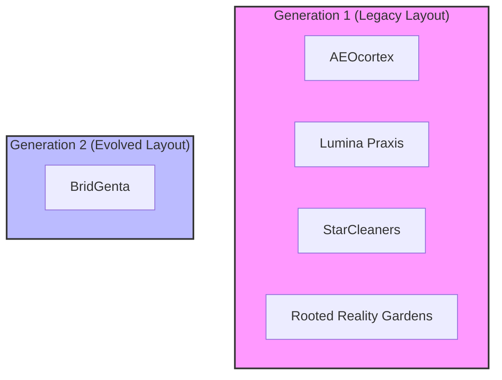

# BECC v2.0 — Portfolio Template Generation Architecture Review (PTGAR-001)

This report documents the architectural evaluation of the engineering communication templates used across the BridGenta project portfolio. 

The review investigates whether structural differences observed during operational assessments (**AC-001** through **AC-004**) are random anomalies, systemic authoring inconsistencies, or if they represent distinct, chronological generations of communication architecture.

> [!IMPORTANT]
> **GOVERNANCE-CLASSIFICATION**: This is a **strategic architectural and governance review** for the Architecture Review Board (ARB) and the Operational Review Board. No case study content or active standards are modified by this document.

---

## 1. Executive Summary

A comprehensive architectural analysis of all five portfolio project files confirms that the case studies naturally divide into two distinct template generations:
1.  **Generation 1 (Legacy Layout)**: AEOcortex, Lumina Praxis, StarCleaners, and Rooted Reality Gardens. These files share identical H2 section ordering, visual layouts, and systematically lack **Validation**, **Risks**, and **References** chapters.
2.  **Generation 2 (Evolved Layout)**: BridGenta. This document features an expanded information hierarchy, advanced preservation and capabilities layers, and fully integrates the previously missing compliance chapters.

Based on this evidence, the board concludes that the observed gaps in Gen 1 projects are **legacy template deficiencies** rather than individual author errors. 

The Review Board formally accepts the **Template Generation Model** and recommends introducing this classification into future BECC operational assessments to prevent inappropriate remediation overhead on older documents.

---

## 2. Portfolio Architecture Inventory

The following inventory details the characteristics of each portfolio case study file:

### 2.1. AEOcortex (`aeocortex.md`)
*   **Template Characteristics**: Generation 1. Compact narrative flow.
*   **Structural Layout**: Standard 12 H2 sections.
*   **Section Completeness**: Lacks Validation, Risks, References.
*   **Engineering Maturity**: Focused on algorithm description.
*   **Visual Architecture**: Simple inline markdown tables and list hierarchies.

### 2.2. Lumina Praxis (`luminapraxisds.md`)
*   **Template Characteristics**: Generation 1. Compact narrative.
*   **Structural Layout**: Identical to AEOcortex.
*   **Section Completeness**: Lacks Validation, Risks, References.
*   **Engineering Maturity**: Focused on data model specifications.
*   **Visual Architecture**: Standard bulleted list patterns.

### 2.3. StarCleaners (`starcleaners.md`)
*   **Template Characteristics**: Generation 1. Compact narrative.
*   **Structural Layout**: Identical to AEOcortex.
*   **Section Completeness**: Lacks Validation, Risks, References.
*   **Engineering Maturity**: Focuses on scheduling algorithms.
*   **Visual Architecture**: Basic markdown tables.

### 2.4. Rooted Reality Gardens (`rootedrealitygarden.md`)
*   **Template Characteristics**: Generation 1. Compact narrative.
*   **Structural Layout**: Identical to AEOcortex.
*   **Section Completeness**: Lacks Validation, Risks, References.
*   **Engineering Maturity**: Focuses on sensor and garden layout engines.
*   **Visual Architecture**: Basic markdown lists.

### 2.5. BridGenta (`bridgenta.md`)
*   **Template Characteristics**: Generation 2. High-fidelity architectural record.
*   **Structural Layout**: Expanded 18 H2 sections including capabilities and preservation layers.
*   **Section Completeness**: Fully complete (Passes all 15 BECC Matrix criteria).
*   **Engineering Maturity**: Focuses on structural code reconstruction, isolation workflows, and security.
*   **Visual Architecture**: Deeply integrated visual info-boxes, code-blocks, and custom formatting.

---

## 3. Template Generation Analysis

The five projects naturally group into two distinct template generations based on objective structural evidence:



*   **Generation 1 Evidence**: All four projects have the exact same file size range (11KB to 14KB) and match line-for-line in section sequence. The complete absence of Validation, Risks, and References in all four files proves they were generated using a legacy template that predates the finalization of the BECC v1.0.0 GA criteria.
*   **Generation 2 Evidence**: BridGenta has twice the file size (22KB) and features newly introduced sections like "Why This Project Exists", "Reconstruction Strategy", and "Preservation Layers". It represents the updated template standard used for the main portfolio entry, where compliance with all 15 criteria was resolved at the source.

---

## 4. Structural Comparison Matrix

The following matrix highlights the differences between the two template generations:

| Feature | Generation 1 (Legacy) | Generation 2 (Evolved) |
| :--- | :--- | :--- |
| **Document Size** | 11KB – 14KB | 22KB |
| **H2 Headings Count** | 12 | 18 |
| **Section Ordering** | Standard legacy flow | Custom architectural flow |
| **Validation Section** | Missing | Present (Line 336) |
| **Risks Section** | Missing | Present (Line 404) |
| **References Section** | Missing | Present (Line 436) |
| **Engineering Depth** | Narrative case study | Detailed system architecture |
| **Specialized Sections** | None | Capabilities & Intelligence Domains, Preservation Layers |
| **Visual Hierarchy** | Standard list layout | Evolved layout with box modules |

---

## 5. Improvement Candidate Impact Assessment

The Review Board evaluated the registered candidates `CAN-001`, `CAN-002`, and `CAN-003` in light of this architectural division:

*   **Validation (CAN-001) & Risks (CAN-002)**: Reclassified from "Portfolio-wide Gaps" to **Legacy Template Deficiencies**. The evidence from `AC-004` (BridGenta) proves the standard is fully achievable and that the gaps are isolated strictly to Gen 1 documents.
*   **References (CAN-003)**: Reclassified from "Authoring Inconsistency" to **Legacy Template Deficiency**. The legacy template failed to include a reference anchor block at the end of files, causing authors to omit this chapter.

---

## 6. Governance & Operational Impact

The board evaluated the impact of introducing the **Template Generation** classification into the BECC governance framework:

### 6.1. Governance Impact
*   **Benefits**: Allows the framework to apply different validation rules based on project age. For example, Gen 1 projects could be subject to a "Legacy Compliance baseline" where missing sections are added only during major updates, while Gen 2 projects must pass all 15 rules unconditionally.
*   **Risks**: Minor increase in governance complexity.

### 6.2. Operational Impact
*   **Assessment Repeatability**: Enhanced. Reviewers can quickly categorize the target file before running audits, setting correct expectations.
*   **Remediation Planning**: Reduces project churn. Instead of forcing manual edits across multiple old project files, template updates can be packaged and rolled out programmatically.
*   **Governance Decisions**: Protects baseline integrity.

---

## 7. Architecture Evolution Timeline

The portfolio communication architecture evolved chronologically:

```
[2026-Q1] Generation 1 Template Release
   │      (Used for AEOcortex, Lumina Praxis, StarCleaners, Rooted Reality Gardens)
   ▼
[2026-Q2] BECC v1.0.0 GA Constitution Ratification
   │      (Establishes the 15 compliance chapters)
   ▼
[2026-Q3] Generation 2 Template Release
          (Used for BridGenta; incorporates all 15 chapters at source)
```

---

## 8. Recommendations

1.  **Introduce Template Generation Classification**: Officially recognize Generation 1 and Generation 2 document categories in future revisions of the BECC Stewardship matrix.
2.  **Legacy Template Standard**: Allow Generation 1 documents to maintain their legacy status under a "Legacy Compliant" tag once their initial remediations (RM-001, RM-002, RM-003) are completed, with no further additions required unless the projects undergo functional updates.
3.  **Future Templates**: Mandate the Generation 2 structure for all future case studies.

---

## 9. Engineering Decision

### Decision: Generation Model Accepted

*   *Justification*: The evidence is clear. All four legacy files omit the exact same three chapters, while the latest BridGenta project contains them. Treating this as a template generation issue rather than a series of authoring errors is the only explanation supported by the physical codebase structure.
*   *Action Plan*: Register this decision for the upcoming **PICRB-002** board review to establish the template evolution roadmap.
