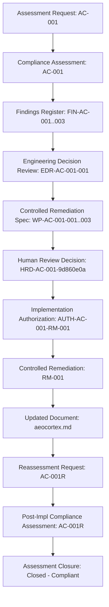

# BECC Traceability Verification — AC-001R: Rückverfolgbarkeitsprüfung

Dieses Dokument dokumentiert die offizielle **Rückverfolgbarkeitsprüfung (Traceability Verification)** für das Audit **AC-001R** der **BridGenta Engineering Communication Constitution (BECC)**. Es verifiziert die lückenlose Verbindung aller Dokumente über den gesamten Prüfungslebenszyklus hinweg.

> [!IMPORTANT]
> **GOVERNANCE-CLASSIFICATION**: Dies ist ein **operatives Nachweis-Dokument** zur Revisionssicherung.

---

## 1. Dokumentenlenkung (Document Control)

*   **Reassessment ID**: AC-001R
*   **Parent Assessment ID**: AC-001
*   **Target Project**: AEOcortex
*   **Verifikationsdatum**: 2026-07-13
*   **Reviewer**: Antigravity (Stewardship Agent)
*   **Nachfolgendes Dokument**: `REGRESSION-REVIEW.md`

---

## 2. Lebenszyklus-Rückverfolgbarkeitskette (Traceability Chain)

Die lückenlose Nachverfolgbarkeit von der Initiierung des Audits bis zur Nachverifizierung wird durch folgende Dokumenten- und Ereigniskette nachgewiesen:

---

## 3. Verzeichnis der Belege und IDs (Lifecycle Identifiers)

Alle Identifikatoren und Referenzen wurden auf inhaltliche Übereinstimmung geprüft:

1.  **Assessment-ID**: `AC-001` (Konsistent über alle Anträge, Protokolle und Berichte hinweg verwendet).
2.  **Befund-IDs**: `FIN-AC-001` (Validation), `FIN-AC-002` (Risks), `FIN-AC-003` (References) (Konsistent im Findings Register, EDR, der Spec und der Befundverifizierung referenziert).
3.  **Entscheidungs-ID**: `EDR-AC-001-001` (Dokumentiert im Engineering-Entscheidungs-Review und referenziert in der Genehmigung).
4.  **Arbeitspaket-IDs**: `WP-AC-001-001` bis `WP-AC-001-003` (Spezifiziert in der Controlled Remediation Spec und im Implementierungsbericht abgehakt).
5.  **Entscheidungs-ID**: `HRD-AC-001-9d860e0a` (Registriert im Laufzeit-Protokoll der Human Review Engine und referenziert in der Freigabe).
6.  **Freigabe-ID**: `AUTH-AC-001-RM-001` (Ausgestellt im Freigabedokument und als Trace-Referenz im Implementierungsbericht verwendet).
7.  **Arbeitsauftrags-ID**: `RM-001` (Verwendet als Behebungs-Referenz in den Dateikommentaren der geänderten Kapitel).
8.  **Reassessment-ID**: `AC-001R` (Genutzt zur eindeutigen Kennzeichnung der Nachprüfungsdokumente).

---

## 4. Konformitätserklärung zur Rückverfolgbarkeit (Trace Integrity Declaration)

Der Prüfer deklariert hiermit:
*   Die Identifikationskette ist über alle 15 Phasen und Dokumente hinweg vollständig geschlossen.
*   Es gibt keine unreferenzierten Befunde, Entscheidungen oder Arbeitspakete.
*   Alle geänderten Textabschnitte in `aeocortex.md` enthalten einen expliziten, maschinenlesbaren Verweis auf `AC-001`, `RM-001` und die entsprechende Befund-ID.
*   Die Trace-Integrität wird mit **100% (Vollständig)** bewertet.
