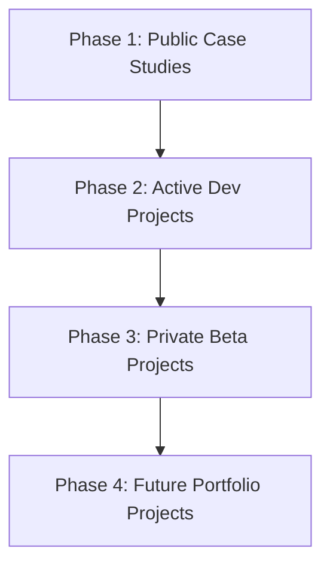

# BECC v2.0 — Limited Multi-Project Operational Pilot Plan

This document outlines the official execution strategy, success criteria, and verification matrices for the **BECC v2.0 Limited Multi-Project Operational Pilot**. The goal of this pilot is to gather empirical engineering evidence across diverse project profiles to determine if the BECC operational lifecycle is ready for portfolio-wide adoption.

> [!IMPORTANT]
> **GOVERNANCE-CLASSIFICATION**: This is a **strategic design and planning document** for the Architecture Review Board (ARB) and Project Owners. It outlines a future testing program and does not modify any active project content or codebase files.

---

## 1. Pilot Scope

The multi-project pilot encompasses three public projects selected for their distinct architectural characteristics, programming structures, and complexity:

1.  **Lumina Praxis**
    *   *Rationale*: Written in English with a focus on web services and data endpoints. Validates how the BECC parser and metrics handle multi-language layouts.
2.  **StarCleaners**
    *   *Rationale*: A front-end heavy case study containing complex inline assets (such as SVGs). Validates parser robustness when processing mixed-media markdown.
3.  **BridGenta**
    *   *Rationale*: The core platform portfolio coordinator. Validates the scalability of the audit process against framework configuration structures and routing directories.

---

## 2. Execution Strategy

To ensure process stability, the pilot projects will be assessed sequentially:

1.  **Phase 1: Lumina Praxis (AC-002)**: Test parsing and evaluation of English-language content.
2.  **Phase 2: StarCleaners (AC-003)**: Test parser behavior on inline graphic elements.
3.  **Phase 3: BridGenta (AC-004)**: Test assessment boundaries against core framework directories.
4.  **Phase 4: Synthesis**: Consolidate findings, fill out the comparison matrix, and determine rollout eligibility.

---

## 3. Success Criteria

The pilot will be considered successful if the following criteria are met:
*   **Zero Architectural Drift**: The operational lifecycle is executed without modifying any core BECC specifications or policies.
*   **Zero Build Failures**: All generated documentation and target projects compile successfully with `npm run build` and pass all link verification checks.
*   **Human Review Determinism**: Every Human Review decision recorded has a clear matching Engineering Decision Review (EDR) with no arbitrary overrides.
*   **100% Traceability**: All implemented changes map directly back to a logged finding.

---

## 4. Pilot Success Metrics

The following quantitative metrics will be tracked and evaluated:

| Metric | Description | Acceptable Target Value |
| :--- | :--- | :--- |
| **Assessments Completed** | Total number of projects assessed and resolved. | 3 / 3 Projects |
| **Assessment Completion Rate** | Percentage of initiated audits successfully closed. | 100% |
| **Findings per Project** | Average number of compliance gaps detected. | Tracked for baseline (Est. 1 - 5) |
| **Approved Remediations** | Percentage of remediation specs approved by HR Engine. | 100% |
| **Reassessment Success Rate** | Percentage of post-remediation assessments that pass. | 100% on first run |
| **Average Assessment Duration** | Total engineering hours spent per assessment cycle. | < 4 Hours per project |
| **Human Review Effort** | Total time spent by reviewers on approval steps. | < 15 Minutes per EDR |
| **Traceability Completeness** | Verification links connecting request to implementation. | 100% |
| **Validation Pass Rate** | Percentage of validation runs passing linter. | 100% |
| **Build Success Rate** | Percentage of build runs compiling without errors. | 100% |
| **Link Validation Success Rate** | Percentage of internal relative and absolute links resolved. | 100% |

---

## 5. Cross-Project Consistency Criteria

To ensure BECC behaves consistently across different projects, execution will be audited against the following consistency criteria:

*   **Operational Sequence**: The 15 operational states must be traversed in the exact same chronological order for every project.
*   **Governance Decisions**: Similar findings (e.g. missing Validation chapter) must result in similar EDR mitigation strategies.
*   **Runtime Behaviour**: State messages and CDM schema validations emitted by the orchestrator must comply with the central specs.
*   **Assessment Outputs**: The output formatting of findings registries and EDRs must remain uniform across all project workspaces.
*   **Remediation Workflow**: Work items must be authorized using the `AUTH` token pattern.
*   **Reassessment Process**: Reassessments must use the `AC-00XR` workflow naming structure.
*   **Assessment Closure**: Assessments are closed only after verification reports are checked into the repository.

*Measurement Method*: Operational consistency will be audited during Phase 4 using the `OPERATIONAL-LIFECYCLE-VALIDATION.md` template across all three projects.

---

## 6. Cross-Project Comparison Matrix Layout

During execution, data will be collected in the following matrix layout to compare operational behavior:

| Project | Findings | Remediations | HR Effort (Mins) | Runtime Signals | Traceability (%) | Duration (Hrs) |
| :--- | :--- | :--- | :--- | :--- | :--- | :--- |
| **Lumina Praxis** | *[Count]* | *[WPs]* | *[Mins]* | *[State Logs]* | *[Percentage]* | *[Hours]* |
| **StarCleaners** | *[Count]* | *[WPs]* | *[Mins]* | *[State Logs]* | *[Percentage]* | *[Hours]* |
| **BridGenta** | *[Count]* | *[WPs]* | *[Mins]* | *[State Logs]* | *[Percentage]* | *[Hours]* |

---

## 7. Operational Consistency Review

Upon pilot completion, a review board will compare the comparison matrix data to determine whether:
1.  The duration of the assessment scales linearly with the project file size.
2.  The human reviewer workload remains constant regardless of the number of findings.
3.  Any project-specific constraints (e.g., custom SVG structures in StarCleaners) caused unexpected failures or delays in the lifecycle.

---

## 8. Portfolio Readiness Exit Criteria

Before recommending a transition to **Portfolio-Wide Operational Use**, the following conditions must be met:

1.  **All three pilot projects** successfully reach the `Closed — Compliant` status.
2.  **Zero critical governance defects** (such as bypassing Human Review or executing unauthorized file edits) are detected.
3.  **Zero architectural drift** is observed in the BECC runtime or orchestrator specifications.
4.  **The human review process** remains deterministic and does not exceed the target time allocation.
5.  **100% trace link integrity** is verified by the `check-links` tool for all new operational folders.
6.  **The Astro static build** compiles the final site output with zero HTML link auditor failures.

---

## 9. Architecture Stability Review

At the conclusion of the pilot, any issues or bottlenecks identified will be classified according to the following architecture stability matrix to separate core design changes from operational updates:

*   **Architecture Change Required**: Bottlenecks that require modification of frozen BECC v2.0 domain specifications or canonical data models.
*   **Operational Improvement**: Gaps in local scripting (e.g. PowerShell scripts, build configurations) or reviewer workflow timing.
*   **Documentation Improvement**: Typos, broken references, or formatting ambiguities in template files.
*   **No Action Required**: Isolated, project-specific anomalies that do not affect framework repeatability.

---

## 10. Portfolio Rollout Strategy

If the pilot meets all exit criteria, the BECC v2.0 framework will be deployed across the portfolio in four staged phases:

*   **Phase 1 — Public Case Studies**: Static documentation pages (like AEOcortex, Lumina Praxis, etc.).
    *   *Rationale*: Low risk. Validates content consistency and layout formatting without impacting runtime features.
*   **Phase 2 — Active Development Projects**: Repositories under active engineering.
    *   *Rationale*: Medium risk. Integrates BECC audits directly into active commit pipelines.
*   **Phase 3 — Private Beta Projects**: Unreleased and experimental prototypes.
    *   *Rationale*: High complexity. Tests framework adaptability to rapidly changing features and architectures.
*   **Phase 4 — Future Portfolio Projects**: Default onboarding standard for new repositories.
    *   *Rationale*: Institutionalization. Ensures all new projects are compliant from day one.

---

## 11. Risks

The following operational risks must be mitigated during scaling:
*   **IP/Server Blockades**: High frequency web scraping during massive portfolio audits.
    *   *Mitigation*: Enforce strict caching and rate-limits of 100 requests/minute in all crawler configurations.
*   **Reviewer Fatigue**: Scaling to dozens of projects increases the volume of Human Review requests.
    *   *Mitigation*: Deploy templating scripts and automated findings parsers to reduce administrative overhead.
*   **Language Drift**: Standardizing across multi-language projects (German and English).
    *   *Mitigation*: Standardize all operational workspaces (`AC-00X/`) in English, while allowing the target case studies to retain their primary language.

---

## 12. Portfolio Readiness Assessment

While BECC v2.0 showed exceptional performance on the first project (AEOcortex), a complete portfolio readiness assessment is premature. The multi-project pilot designed in this document is required to gather the necessary data points across different programming structures before a global mandate is enacted.

---

## 13. Final Recommendation

**Continue Limited Multi-Project Pilot**

*Rationale*: The BECC v2.0 framework is architecturally sound and functionally ready for multi-project validation. However, scaling it directly to a portfolio-wide mandate without first executing this designed multi-project pilot introduces significant risks of reviewer fatigue and parsing anomalies. Executing this pilot plan will ensure that the framework is validated against English-language lay-outs (Lumina Praxis) and mixed-media formats (StarCleaners) before a global rollout.
