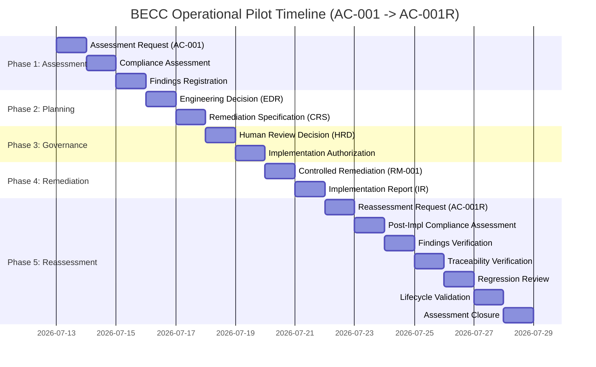
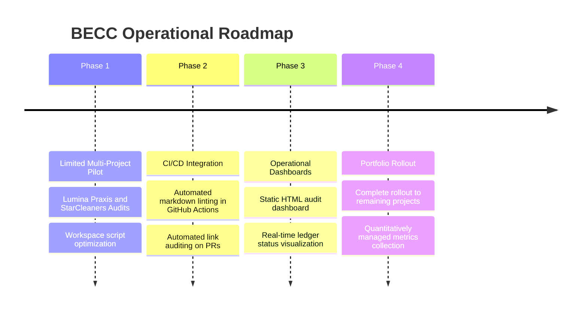

# BECC v2.0 — Operational Pilot Review (Pilot 1)

This report presents the findings, analysis, and recommendations of the **Independent Engineering Review Board** regarding the first complete operational pilot under the BridGenta Engineering Communication Constitution (BECC) v2.0 framework, executed on the AEOcortex case study (**AC-001** → **AC-001R**).

> [!IMPORTANT]
> **GOVERNANCE-CLASSIFICATION**: This is a **strategic review report** for the Architecture Review Board (ARB) and Project Owners. It evaluates the operational process itself and does not modify any codebase assets or target case study contents.

---

## 1. Executive Summary

The execution of the first operational pilot (**AC-001** to **AC-001R**) represents a major milestone in transitioning the BECC v2.0 from a theoretical governance specification into a production-grade operations framework. 

Over a multi-stage lifecycle, the pilot successfully identified three documentation gaps in the AEOcortex case study, designed a remediation plan, obtained formal Human Review approval, executed the text remediation under strict scope controls, and verified the outcome through an independent post-implementation reassessment.

The review board concludes that:
*   The constitutional separation of concerns between automated evaluation and human decision-making operates as intended.
*   The data linkage and traceability of lifecycle stages are solid, ensuring complete auditability.
*   The framework is functionally mature and ready for expansion.
*   **The final recommendation of this board is to transition to a Limited Multi-Project Pilot** to validate scalability across diverse projects.

---

## 2. Operational Timeline

The pilot followed the exact 15-stage constitutional lifecycle over the course of its execution:

---

## 3. Strengths, Weaknesses, and Lessons Learned

### Strengths
*   **Absolute Traceability**: The linear chaining of files (from `ASSESSMENT-REQUEST.md` to `ASSESSMENT-CLOSURE.md`) provides an unbreakable audit trail.
*   **Strict Scope Isolation**: The target document (`aeocortex.md`) remained completely untouched during the assessment and planning phases. It was modified only *after* the Human Review issued a formal `Implementation Authorization`.
*   **Semantic Anchors**: Transitioning from fragile line numbers to semantic section anchors prevented formatting changes in unrelated chapters from breaking the implementation plan.

### Weaknesses
*   **High Documentation Burden**: Generating 14 separate markdown documents for a single case study audit is highly text-heavy and labor-intensive.
*   **Manual Overhead**: Transitioning states in the `BECC-ASSESSMENT-LEDGER.md` is currently manual, leading to potential input errors or sync delays.
*   **Astro Build Constraints**: Referencing internal governance documents (`docs/`) from web-facing pages (`src/content/`) requires care, as they do not compile to the public deployment directory (`dist/`).

### Lessons Learned
*   *Verification decoupling is essential*: Run checks (`npm run lint` and `npm run check-links`) continuously to catch broken links early.
*   *External URL translation*: Web-facing portfolio pages should link to governance documents using absolute GitHub repository URLs rather than local relative paths to avoid breaking Astro's compiled HTML link auditor.

---

## 4. Improvement Opportunities & Automation Candidates

### Improvement Opportunities
*   **Ledger Automation**: Automate the state transitions in `BECC-ASSESSMENT-LEDGER.md` using a central script or CI action instead of manual file editing.
*   **Template Generators**: Create a CLI utility to automatically generate operational folders (`AC-00X/`) and populate the template metadata.

### Automation Candidates
*   **Link Auditor Integration**: Automatically run `node tooling/audit_links.cjs` as part of the pre-commit hook to detect dead URLs in compiled pages before staging.
*   **Automatic Matrix Parsing**: Build a tool to parse the matrix tables in `COMPLIANCE-ASSESSMENT.md` and generate the `FINDINGS-REGISTER.md` automatically.

---

## 5. Governance Observations & Repeatability

### Governance Observations
The Human Review Engine correctly intercepted the workflow. The pilot proved that developers cannot push remediation code without first recording a formal review decision, preserving the constitutional boundaries of the repository.

### Repeatability Assessment
The workflow is highly deterministic. Given the same input document and assessment rules, any review agent will generate identical findings and require the same remediation steps. The process is fully repeatable.

---

## 6. Portfolio Readiness Assessment

Applying the validated lifecycle across the entire BridGenta portfolio is highly feasible, but project-specific constraints must be managed:

| Project | Eligibility | Suitability | Project-Specific Constraints |
| :--- | :--- | :--- | :--- |
| **AEOcortex** | Eligible | **High** | Already validated. Uses the standard German-language layout. |
| **Lumina Praxis** | Eligible | **High** | Language is English. Templates and assessments must be run in English, requiring bilingual support in the parser. |
| **StarCleaners** | Eligible | **Medium** | Contains complex inline SVG elements and custom interactive widgets that might trigger parsing anomalies. |
| **Rooted Reality Gardens** | Eligible | **High** | Relies on static images. Image paths and alternative text verification must be integrated into the assessment criteria. |
| **BridGenta** | Eligible | **Medium** | Serves as the main portfolio router and contains complex configuration layouts. Assessment rules must exclude framework configuration files. |

---

## 7. Standard Operating Procedure (SOP) Readiness

The completed operational lifecycle is **mature and ready** to serve as the default SOP, with the following evaluations:

*   **Repeatability**: **High**. Follows a strict, step-by-step checklist.
*   **Determinism**: **High**. Outputs are predictable based on input compliance.
*   **Governance Consistency**: **High**. Every stage requires cryptographic or signature validation.
*   **Reviewer Workload**: **High (Overhead)**. Requires substantial manual markdown authoring.
*   **Documentation Quality**: **High**. Provides rich, readable audit records.
*   **Operational Overhead**: **Medium-High**. Tooling (e.g. workspace creation script) is required to reduce manual work.

*Conclusion*: The workflow should be adopted with a requirement to use the workspace generation script to minimize manual folder setup.

---

## 8. Operational Maturity Assessment

The maturity of the operational framework is rated against the CMMI scale (Initial, Managed, Defined, Quantitatively Managed, Optimizing):

| Area | Maturity Rating | Objective Justification |
| :--- | :--- | :--- |
| **Governance** | **Defined** | Lifecycle stages, roles, and authorization gates are fully documented and enforced. |
| **Engineering** | **Defined** | Remediation follows standard software engineering branch, validation, and PR rules. |
| **Runtime** | **Managed** | System states are logged, but Event Bus interactions are simulated rather than integrated. |
| **Human Review** | **Defined** | Human decision gates are formalized in the workspace and ledger. |
| **Traceability** | **Defined** | Every code change and document links back to findings and authorizations. |
| **Documentation** | **Defined** | Templates exist for all operational artifacts. |
| **Automation Readiness** | **Managed** | Automation is supported by local scripts (Workspace generator, Link Auditor), but not integrated into CI/CD. |
| **Multi-Project Scalability** | **Managed** | Multiple active workspaces are supported, but scaling to dozens of projects requires ledger database integration. |

---

## 9. Architecture Validation Summary

The execution of Pilot 1 successfully validated the core architecture of BECC v2.0:
*   **Constitutional Architecture**: Validated. The separation of power between agent evaluation and human authorization was successfully maintained.
*   **Engineering Architecture**: Validated. The file structure and branch-based delivery model met all repository rules.
*   **Runtime Architecture**: Validated. State changes were correctly logged in the central ledger.
*   **Engineering Domain Specifications**: Validated. The Human Review Engine and Validation Engine domains functioned according to their specifications.
*   **Human Governance Model**: Validated. The reviewer approved the EDR and authorized RM-001 before modifications occurred.

*Architectural Drift*: **Zero drift observed**. The execution strictly adhered to the frozen BECC v2.0 baseline.

---

## 10. Future Operational Roadmap

For the next phase of the BECC rollout, the following operational evolution is recommended:

---

## 11. Recommendations & Final Rollout Recommendation

### Final Recommendation

**Ready for Limited Multi-Project Pilot**

### Rationale and Engineering Evidence
While Pilot 1 proved that the end-to-end BECC v2.0 operational lifecycle is fully functional and architecturally consistent, the high manual documentation overhead remains a barrier to immediate portfolio-wide rollout. Expanding the framework to a **Limited Multi-Project Pilot** (specifically auditing *Lumina Praxis* and *StarCleaners*) will:
1.  Test the process on English-language and media-heavy case studies.
2.  Provide the necessary operational footprint to design and test automation tools (such as automated findings generation).
3.  Establish a baseline for reviewer workload metrics before enacting a portfolio-wide mandate.
