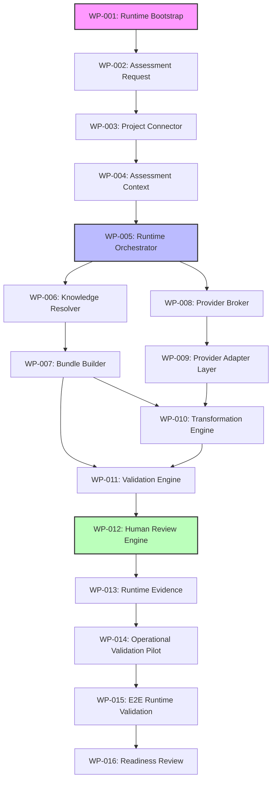

# BECC v2.0 — Implementation Work Package Specification (WPS v1.0)

An authoritative engineering document converting the BECC v2.0 implementation architecture into an ordered, dependency-aware work backlog of sixteen defined Work Packages (WPs).

---

## 1. Executive Summary

The purpose of this **Implementation Work Package Specification** is to translate the approved BECC v2.0 runtime and implementation architectures into a structured, executable engineering backlog. 

This document defines the exact scope, boundaries, inputs, outputs, dependencies, and completion criteria for each of the sixteen work packages (WP-001 through WP-016) required to build the BECC v2.0 software platform. It enforces a strict, bottom-up implementation order that guarantees provider-independence and maintains the integrity of constitutional boundaries without requiring further architectural interpretation.

---

## 2. Work Package Philosophy

To avoid code churn, coordinate parallel work streams, and maintain architectural conformance, the BECC v2.0 implementation backlog is decomposed into isolated Work Packages (WPs). The work package strategy is governed by five core principles:

1. **Isolation & Modularity**: Each WP represents an independent piece of engineering work matching a specific repository module boundary.
2. **Traceability**: Every WP maps back to a specific domain specification and forwards to a validation gate.
3. **Incremental Delivery**: Core capabilities are built, tested, and validated in layers before downstream consumers are initiated.
4. **Constitutional Safety**: Critical gates (such as validation engines and human approval dashboards) are prioritized to ensure the security boundaries are established before any document transformation is executed.
5. **Engineering Validation**: Transitioning to subsequent work packages requires passing preceding testing criteria.

---

## 3. Engineering Sequencing Principles

Implementation sequencing follows a disciplined bottom-up model:

- **Dependency-First**: Utility structures, data models, and lower-level adapters must be implemented and tested before the central orchestrator is compiled.
- **Provider-Independence**: CDM abstractions and provider broker modules must be completed before any concrete LLM adapter packages are integrated.
- **Constitutional Boundaries Last**: The user interface dashboards and write gates are implemented after the automated validation check suites are fully operational.

---

## 4. Complete Work Package Register

| WP ID | Work Package Name | Associated Domain / Module | Priority | Complexity | Primary Dependency | Validation Required |
| :--- | :--- | :--- | :--- | :--- | :--- | :--- |
| **WP-001** | Runtime Bootstrap | CLI Entry / `bin/` | High | Low | None | Schema verification |
| **WP-002** | Assessment Request | Data Layer / `shared/` | High | Low | WP-001 | Parser unit tests |
| **WP-003** | Project Connector | Connector / `connector/` | High | Medium | WP-002 | Git parser tests |
| **WP-004** | Assessment Context | Data Layer / `shared/` | High | Low | WP-003 | Schema validation |
| **WP-005** | Runtime Orchestrator | Runtime Core / `runtime/` | High | High | WP-004 | Event flow tests |
| **WP-006** | Knowledge Resolver | Resolver / `resolver/` | Medium | Medium | WP-005 | Traversal & Override tests |
| **WP-007** | Knowledge Bundle Builder | Bundle Builder / `bundle-builder/` | Medium | Medium | WP-006 | Bundle hash audits |
| **WP-008** | Provider Broker | Broker Core / `broker/` | Medium | Medium | WP-005 | Routing logic tests |
| **WP-009** | Provider Adapter Layer | Adapters / `adapters/` | Medium | Medium | WP-008 | Mock API responses |
| **WP-010** | Communication Transformation Engine | Transformation / `transformation/` | Medium | High | WP-007, WP-009 | Diff output checks |
| **WP-011** | Validation Engine | Validation / `validation/` | High | High | WP-007, WP-010 | AST check validation |
| **WP-012** | Human Review Engine | Review / `review/` | High | High | WP-011 | Auth & UI validation |
| **WP-013** | Runtime Evidence | Evidence / `evidence/` | Medium | Medium | WP-012 | Ledger write audits |
| **WP-014** | Operational Validation Pilot | Pilot Runner | High | Medium | WP-013 | Pilot-1 replication test |
| **WP-015** | End-to-End Runtime Validation | System Integration | High | Medium | WP-014 | CLI E2E dry-runs |
| **WP-016** | Implementation Readiness Review | Audit sign-off | High | Low | WP-015 | Final board audit |

---

## 5. Work Package Specifications

### WP-001: Runtime Bootstrap
- **Identity**: WP-001 | Runtime Bootstrap | Core Runtime Team
- **Purpose**: Establishes the CLI and process entry points for the BECC v2.0 runtime.
- **Scope**: Command-line flag parsing, environment configuration loading, and dependency registration configurations.
- **Explicit Non-Scope**: Domain orchestration logic or file read/write operations.
- **Engineering Inputs**: CLI parameters, `package.json` scripts list.
- **Engineering Outputs**: `becc-cli` executable environment and registered process handles.
- **Dependencies**: None.
- **Acceptance Criteria**: Running `becc --help` returns version details and usage descriptions.
- **Validation Requirements**: CLI parameter type verification tests.
- **Risks**: OS environmental path mismatches (Mitigation: Use relative paths in startup routines).
- **Completion Definition**: Binary compiles and registers on the local command line.

---

### WP-002: Assessment Request
- **Identity**: WP-002 | Assessment Request | Data Schema Team
- **Purpose**: Realizes the canonical `AssessmentRequest` data object in software.
- **Scope**: Schema validation, timestamp generators, and assessment ID validation logic.
- **Explicit Non-Scope**: Repository filesystem check or metadata discovery.
- **Engineering Inputs**: CDM v1.0 specifications.
- **Engineering Outputs**: TypeScript interfaces and JSON/YAML validation models for `AssessmentRequest`.
- **Dependencies**: WP-001.
- **Acceptance Criteria**: Raw request payloads are validated, and invalid structures are rejected with schemas validation errors.
- **Validation Requirements**: Unit tests with malformed request payloads.
- **Risks**: YAML schema parser vulnerabilities (Mitigation: Use sandboxed, strict YAML libraries).
- **Completion Definition**: Schema module tests pass.

---

### WP-003: Project Connector
- **Identity**: WP-003 | Project Connector | Workspace Integration Team
- **Purpose**: Connects external repositories and matches files with configurations.
- **Scope**: Repository scanning for root markers, executing local git checks, and reading project configurations.
- **Explicit Non-Scope**: Parsing rule content or generating prompts.
- **Engineering Inputs**: Project Connector Domain Specification, git binary.
- **Engineering Outputs**: `ProjectConnectorService` class.
- **Dependencies**: WP-002.
- **Acceptance Criteria**: Successfully extracts the HEAD commit SHA and branch name of the target repository.
- **Validation Requirements**: Git command exception handling checks.
- **Risks**: Detached HEAD states (Mitigation: Fallback to active commit SHA instead of branch names).
- **Completion Definition**: Integration tests target a test workspace and succeed.

---

### WP-004: Assessment Context
- **Identity**: WP-004 | Assessment Context | Data Schema Team
- **Purpose**: Implements the immutable `AssessmentContext` structure.
- **Scope**: Frozen payload creation, property schema matching, and UUID v4 transaction bindings.
- **Explicit Non-Scope**: Business logic; data class structure only.
- **Engineering Inputs**: CDM v1.0 specifications.
- **Engineering Outputs**: CDM context interfaces.
- **Dependencies**: WP-003.
- **Acceptance Criteria**: Context properties match CDM structures; objects are frozen and immutable post-creation.
- **Validation Requirements**: Object freeze tests (verifying mutations throw errors).
- **Risks**: Runtime memory overhead (Mitigation: Limit trace size).
- **Completion Definition**: Test suite confirms context immutability.

---

### WP-005: Runtime Orchestrator
- **Identity**: WP-005 | Runtime Orchestrator | Core Runtime Team
- **Purpose**: Establishes the central workflow orchestrator and Event Bus interfaces.
- **Scope**: State machine execution, global Event Bus event dispatch, timeout timers, and cancel handlers.
- **Explicit Non-Scope**: Domain-specific logic (e.g. LLM integration or AST parsing).
- **Engineering Inputs**: Runtime Orchestrator Domain Specification.
- **Engineering Outputs**: Event Bus handlers, `RuntimeOrchestrator` state machine.
- **Dependencies**: WP-004.
- **Acceptance Criteria**: States change sequentially; timeout exceptions trigger clean cancellation and process teardowns.
- **Validation Requirements**: Event bus deadlock checks under load.
- **Risks**: Infinite loops on Event Bus conflicts (Mitigation: Enforce acyclic event flows and strict execution time limits).
- **Completion Definition**: Mock pipeline transitions from Initializing to Completed.

---

### WP-006: Knowledge Resolver
- **Identity**: WP-006 | Knowledge Resolver | Knowledge Engineering Team
- **Purpose**: Traverses folders and resolves precedence rules.
- **Scope**: Markdown folder crawling, YAML header metadata parsing, and priority override mapping.
- **Explicit Non-Scope**: Compiling rules into a JSON payload.
- **Engineering Inputs**: Knowledge Resolver Domain Specification, target specifications files.
- **Engineering Outputs**: `KnowledgeResolver` crawler.
- **Dependencies**: WP-005.
- **Acceptance Criteria**: Crawling lists resolved rules, filtering out examples and archived markdown files.
- **Validation Requirements**: Path traversal security checks.
- **Risks**: Infinite relative link recursion (Mitigation: Prevent directory cycle traversals).
- **Completion Definition**: Override tests prioritize Canon files over spec files.

---

### WP-007: Knowledge Bundle Builder
- **Identity**: WP-007 | Knowledge Bundle Builder | Knowledge Engineering Team
- **Purpose**: Packages resolved rules into an immutable bundle.
- **Scope**: Concatenating rule files, parsing glossary lists, and calculating the SHA-256 integrity hash of the bundle.
- **Explicit Non-Scope**: API dispatch or prompt assembly.
- **Engineering Inputs**: Bundle Builder Specification, CDM definitions.
- **Engineering Outputs**: Signed `KnowledgeBundle` artifact.
- **Dependencies**: WP-006.
- **Acceptance Criteria**: Generates a unified JSON bundle containing all rules, marked with a unique SHA-256 hash.
- **Validation Requirements**: Hash collision and bundle integrity validation tests.
- **Risks**: Rule token count overflows (Mitigation: Implement size limits on loaded files).
- **Completion Definition**: Integrity audits pass.

---

### WP-008: Provider Broker
- **Identity**: WP-008 | Provider Broker | Provider Layer Team
- **Purpose**: Coordinates routing and capability evaluations.
- **Scope**: Querying the registered adapter database and routing payloads based on capability markers.
- **Explicit Non-Scope**: Hardcoding API calls or model parameters.
- **Engineering Inputs**: Provider Broker Specification.
- **Engineering Outputs**: `ProviderBroker` interface.
- **Dependencies**: WP-005.
- **Acceptance Criteria**: Routes requests to the appropriate adapter; triggers fallback models when errors are encountered.
- **Validation Requirements**: Failover routing tests under simulated outages.
- **Risks**: Broker configuration drift (Mitigation: Dynamic schema validations on startup).
- **Completion Definition**: Fallback routing passes unit testing.

---

### WP-009: Provider Adapter Layer
- **Identity**: WP-009 | Provider Adapter Layer | Provider Layer Team
- **Purpose**: Realizes model-specific adapters.
- **Scope**: Integrating vendor SDK modules, parsing API returns, and mapping to provider-neutral schemas.
- **Explicit Non-Scope**: Business logic or prompt engineering.
- **Engineering Inputs**: Adapter Architecture Specification.
- **Engineering Outputs**: `GeminiAdapter`, `ClaudeAdapter` classes.
- **Dependencies**: WP-008.
- **Acceptance Criteria**: Adapters encapsulate vendor libraries and match CDM input/output signatures.
- **Validation Requirements**: API timeout mock validations.
- **Risks**: External API changes (Mitigation: Strict version pinning on client dependencies).
- **Completion Definition**: Mocked execution tests pass.

---

### WP-010: Communication Transformation Engine
- **Identity**: WP-010 | Transformation Engine | Core Transformation Team
- **Purpose**: Assembles inputs and handles LLM output reconstruction.
- **Scope**: Wrapping rule bundles in XML tags, prompt formatting, and parsing returned changes.
- **Explicit Non-Scope**: Deciding model choice or validating code syntax.
- **Engineering Inputs**: Transformation Domain Specification.
- **Engineering Outputs**: `TransformationEngine` prompts assembler and diff compiler.
- **Dependencies**: WP-007, WP-009.
- **Acceptance Criteria**: Compiles prompts and resolves return strings into file diff segments.
- **Validation Requirements**: Malformed LLM response reconstruction tests.
- **Risks**: XML tag leakage (Mitigation: Implement strict validation on text structures).
- **Completion Definition**: Diff extraction executes successfully.

---

### WP-011: Validation Engine
- **Identity**: WP-011 | Validation Engine | Quality Assurance Team
- **Purpose**: Audits generated diffs.
- **Scope**: Compiling AST parsers, executing link checking, and matching sentences against vocabulary rules.
- **Explicit Non-Scope**: Modifying workspace files or triggering git commits.
- **Engineering Inputs**: Validation Domain Specification.
- **Engineering Outputs**: `ValidationEngine` checker, validation report generator.
- **Dependencies**: WP-007, WP-010.
- **Acceptance Criteria**: Correctly flags links, syntax issues, and vocabulary deviations.
- **Validation Requirements**: Check links and markdown linters validations.
- **Risks**: Parse exception crashes on invalid diffs (Mitigation: Wrap parsing in robust try-catch blocks).
- **Completion Definition**: Validations return a signed status report.

---

### WP-012: Human Review Engine
- **Identity**: WP-012 | Human Review Engine | Review & Publication Board
- **Purpose**: Provides the final human validation interface.
- **Scope**: Displaying diffs, verifying reviewer authorization tokens, and capturing approval inputs.
- **Explicit Non-Scope**: Generating or modifying drafts.
- **Engineering Inputs**: Human Review Specification.
- **Engineering Outputs**: CLI/UI approval prompt component, token signing utility.
- **Dependencies**: WP-011.
- **Acceptance Criteria**: Restricts git writing until approval input is entered and signature keys match parameters.
- **Validation Requirements**: Authorization validation checks.
- **Risks**: Key forgery (Mitigation: Use secure cryptographic signing standards).
- **Completion Definition**: Approval gate successfully accepts/rejects transformations.

---

### WP-013: Runtime Evidence
- **Identity**: WP-013 | Runtime Evidence | Workspace Integration Team
- **Purpose**: Records immutable execution history.
- **Scope**: Appending records to ledger files, writing JSON telemetry, and saving SHA-256 trace evidence.
- **Explicit Non-Scope**: Running compliance validation checks.
- **Engineering Inputs**: Evidence Specification.
- **Engineering Outputs**: `EvidenceEngine` ledger writer.
- **Dependencies**: WP-012.
- **Acceptance Criteria**: Appends the completed run details to the repository history ledger without changing original parameters.
- **Validation Requirements**: Concurrency conflicts tests.
- **Risks**: Concurrency collisions in the ledger (Mitigation: File locking during ledger write operations).
- **Completion Definition**: History ledger entries are written and verified.

---

### WP-014: Operational Validation Pilot
- **Identity**: WP-014 | Operational Validation Pilot | Quality Assurance Team
- **Purpose**: Replicates historical validation pilot scenarios.
- **Scope**: Setting up baseline commits, running validations, and comparing results with Pilot 1.
- **Explicit Non-Scope**: Modifying repository target files.
- **Engineering Inputs**: Pilot-1 definitions and charter.
- **Engineering Outputs**: Validation comparison report.
- **Dependencies**: WP-013.
- **Acceptance Criteria**: Verification matches the results of the initial Pilot 1 run (+6 compliant chapters, 0 regressions).
- **Validation Requirements**: Structural comparison analysis.
- **Risks**: Drift in historical baselines (Mitigation: Lock target test repository commit SHA).
- **Completion Definition**: Pilot runs match targets.

---

### WP-015: End-to-End Runtime Validation
- **Identity**: WP-015 | End-to-End Runtime Validation | Core Runtime Team
- **Purpose**: Performs integration runs of the complete platform.
- **Scope**: Executing E2E dry-runs, measuring telemetry latency, and auditing error logs.
- **Explicit Non-Scope**: Backlog planning.
- **Engineering Inputs**: All preceding work packages.
- **Engineering Outputs**: Platform integration report.
- **Dependencies**: WP-014.
- **Acceptance Criteria**: Automated stages run under target timeouts (excluding LLM time) and Event Bus is clean.
- **Validation Requirements**: CLI performance audits.
- **Risks**: Environmental drift on CI runners (Mitigation: Containerize the test environment).
- **Completion Definition**: E2E test runs successfully pass.

---

### WP-016: Implementation Readiness Review
- **Identity**: WP-016 | Implementation Readiness Review | Review & Publication Board
- **Purpose**: Final architectural review.
- **Scope**: Reviewing codebase structure, auditing test coverages, and checking CDM consistency.
- **Explicit Non-Scope**: Coding new features.
- **Engineering Inputs**: Complete platform code.
- **Engineering Outputs**: Final sign-off.
- **Dependencies**: WP-015.
- **Acceptance Criteria**: Board approves codebase compliance.
- **Validation Requirements**: Code review checks.
- **Risks**: Out-of-date documentation (Mitigation: Strict code-spec synchronization checks).
- **Completion Definition**: Sign-off token issued.

---

## 6. Dependency Graph

The dependencies between the work packages are acyclic. The implementation sequence is structured bottom-up, ensuring that foundation packages are built before orchestrating modules:

---

## 7. Milestone Definition

The sixteen work packages are grouped into seven consecutive milestones. Each milestone represents a major functional layer of the BECC v2.0 platform:

### Milestone 1: Runtime Foundation
- **Included Packages**: WP-001, WP-002, WP-003, WP-004, WP-005
- **Exit Condition**: CLI boots, captures request parameters, detects external git targets, and initializes the orchestrator state machine.

### Milestone 2: Knowledge Acquisition
- **Included Packages**: WP-006, WP-007
- **Exit Condition**: Crawler resolves files, applies priorities, and packages resolved rules into a signed rule bundle.

### Milestone 3: AI Provider Layer
- **Included Packages**: WP-008, WP-009
- **Exit Condition**: Provider Broker routes calls based on model capability requirements and captures adapter responses.

### Milestone 4: Communication Pipeline
- **Included Packages**: WP-010
- **Exit Condition**: Rule bundles are wrapped into prompts, and output diffs are reconstructed successfully.

### Milestone 5: Governance & Human Authority
- **Included Packages**: WP-011, WP-012, WP-013
- **Exit Condition**: Generated diffs are parsed and checked against link and vocabulary rules; the human review dashboard gating functions properly, and ledger writes are recorded.

### Milestone 6: Operational Validation
- **Included Packages**: WP-014, WP-015
- **Exit Condition**: The system successfully runs the Pilot 1 scenario and handles integration E2E dry-runs without errors.

### Milestone 7: Implementation Readiness
- **Included Packages**: WP-016
- **Exit Condition**: Code coverage metrics targets are met and the review board formally signs off.

---

## 8. Engineering Validation Gates

To transition between milestones, the software must pass mandatory Validation Gates:

- **Gate 1 (Foundation -> Acquisition)**: Schema conformance verification. The compiled context matches CDM schemas.
- **Gate 2 (Acquisition -> Provider)**: Bundle integrity check. Rule bundle generation produces valid SHA-256 hashes.
- **Gate 3 (Provider -> Pipeline)**: Provider-neutral verification. Adapter interfaces decouple vendor packages from core engines.
- **Gate 4 (Pipeline -> Governance)**: Content transformation verification. Diff generation produces valid markdown syntax.
- **Gate 5 (Governance -> Pilot)**: Constitutional boundary validation. The write gate remains blocked until human reviewer approval token is verified.
- **Gate 6 (Pilot -> Readiness)**: Telemetry completeness test. Telemetry capture registers 100% of event entries.

---

## 9. Testing Strategy Mapping

Every work package is mapped to specific testing tiers to ensure operational quality:

- **Unit Testing**: Targets WP-001, WP-002, WP-004, WP-008, and WP-013. Mocks are used to verify inputs and data mappings.
- **Integration Testing**: Focuses on WP-003, WP-005, WP-006, WP-007, and WP-009. Assesses domain transitions, crawler functions, and Event Bus signals.
- **Constitutional Testing**: Focuses on WP-010, WP-011, and WP-012. Validates AST parsing accuracy and review dashboards.
- **Operational Pilot Testing**: Focuses on WP-014 and WP-015. Replicates real-world workspace scenarios and measures E2E performance.

---

## 10. Risk Register

| Risk ID | Risk Description | Severity | Work Package | Mitigation Strategy |
| :--- | :--- | :--- | :--- | :--- |
| **RSK-WP-001** | Process lock on Event Bus deadlocks. | **Critical** | WP-005 | Implement domain-level timeouts; abort loop on time budget exhaustion. |
| **RSK-WP-002** | Path traversal security escape. | **High** | WP-003 | Resolve file targets using absolute canonical paths. |
| **RSK-WP-003** | Broken links in bundle resolution. | **Medium** | WP-006 | Skip missing optional directories; raise errors on missing core folders. |
| **RSK-WP-004** | API timeout on provider adapters. | **High** | WP-009 | Set connection timeouts to 10s; implement exponential retry policies. |
| **RSK-WP-005** | Diff parser crashes on malformed code. | **High** | WP-010 | Wrap AST creation in robust catch-all try-catch structures. |
| **RSK-WP-006** | Accidental publication (Write gate leak). | **Critical** | WP-012 | Implement read-only defaults; require cryptographically signed approval token. |

---

## 11. Traceability Matrix

| Engineering Domain | Work Package ID | Implementation Module | Validation Strategy | Operational Validation Target |
| :--- | :--- | :--- | :--- | :--- |
| **Project Connector** | WP-003 | `connector/` | Git branch parse tests | Discovers test repositories |
| **Knowledge Resolver** | WP-006 | `resolver/` | Crawler traversal tests | Parses rules in snapshot |
| **Bundle Builder** | WP-007 | `bundle-builder/` | SHA-256 integrity audits | Generates valid JSON bundle |
| **Provider Broker** | WP-008 | `broker/` | Fallback routing checks | Matches model preferences |
| **Transformation Engine**| WP-010 | `transformation/` | Prompt compilation checks | Performs target diff edits |
| **Validation Engine** | WP-011 | `validation/` | AST & link linter checks | Detects non-conformities |
| **Human Review Engine** | WP-012 | `review/` | Approval signature checks | Governs the write gate |
| **Evidence Engine** | WP-013 | `evidence/` | Ledger write validation | Persists execution traces |
| **Runtime Orchestrator** | WP-005 | `runtime/` | Event bus state tests | Coordinates pipelines |

---

## 12. Engineering Readiness Assessment

### Completeness Criteria
- 16 work packages defined with Identity and Scope: **Pass**
- Acyclic dependency graph generated: **Pass**
- Milestones mapped: **Pass**
- Testing and Risk registers updated: **Pass**
- Zero TODOs or placeholder comments: **Pass**

**Backlog Readiness Score:** 100/100

---

## 13. Final Engineering Recommendation

### Recommendation: READY FOR IMPLEMENTATION

**Justification**:
- The Work Package Specification contains the required sixteen work packages.
- Dependencies are acyclic and bottom-up.
- The backlog provides a deterministic implementation sequence that avoids architectural drift.
- No code has been implemented, conforming to phase rules.

The engineering team is authorized to initiate development on **WP-001 (Runtime Bootstrap)**.
