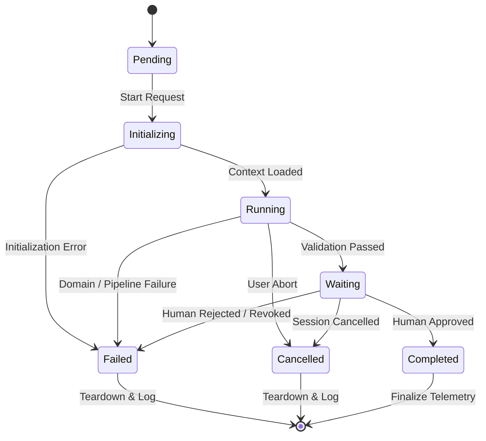

# BECC v2.0 — Runtime Orchestrator Engineering Domain Specification

An authoritative engineering domain specification defining the identity, purpose, responsibilities, inputs, outputs, lifecycle, state machine, event models, interactions, failure handling, validation, security, metrics, risks, and readiness assessment for the Runtime Orchestrator in BECC v2.0.

---

## 1. Engineering Identity

- **Domain Name**: Runtime Orchestrator Domain
- **Version**: 1.0.0
- **Status**: Active
- **Owner**: Core Runtime & Orchestration Team
- **Scope**: Lifecycle coordination, execution flow control, event sequencing, state machine transitions, retry/timeout/cancellation policies, and end-to-end evidence aggregation.

---

## 2. Purpose

The Runtime Orchestrator is the central coordinator of the BECC v2.0 platform. Its primary purpose is to transform independent, decoupled engineering domains into a deterministic and auditable end-to-end execution pipeline.

Orchestration is required because:
1. **Decoupling**: Domains must remain isolated from each other (e.g., the [Knowledge Resolver](./KNOWLEDGE-RESOLVER-ENGINEERING-DOMAIN-SPECIFICATION.md) should not have compile-time or runtime knowledge of the [Provider Broker](./PROVIDER-BROKER-ENGINEERING-DOMAIN-SPECIFICATION.md)).
2. **Deterministic Flow**: The system must enforce a structured, predictable flow from intent ingestion to publication approval.
3. **Observability**: A single coordinator provides a unified vantage point for execution telemetry, timing metrics, and runtime traces.

To preserve strict domain boundaries, orchestration must remain independent of domain logic. The orchestrator acts strictly as a traffic director; it manages state transitions, events, timeouts, and errors without reading, modifying, or interpreting the content of the target document, the rules in the bundle, or the AI provider outputs.

---

## 3. Responsibilities

The Runtime Orchestrator owns the following nine functional capabilities:

1. **Runtime Startup**: Receives raw triggers, boots the execution session, allocates a unique assessment transaction UUID, and initializes telemetry.
2. **Job Coordination**: Instantiates and tracks domain jobs, managing the passing of data buffers.
3. **Event Sequencing**: Emits progress signals and schedules downstream tasks upon receiving success triggers from active domains.
4. **State Transitions**: Drives the global runtime state machine, validating that all state changes conform to legal pathways.
5. **Retry Coordination**: Evaluates policies for retrying transient domain failures (e.g. provider network drops) with exponential backoff.
6. **Timeout Coordination**: Enforces execution time limits per domain and globally, terminating tasks that exceed their duration allocations.
7. **Cancellation Handling**: Captures SIGINT/SIGTERM or user abort signals and propagates cancellation to all active domains, ensuring clean resource teardown.
8. **Runtime Completion**: Aggregates execution telemetry, formats the final audit report, and executes the handoff to the Review Engine.
9. **Runtime Shutdown**: Cleans up temporary in-memory contexts, persists logs, and terminates the session cleanly.

---

## 4. Explicit Non-Responsibilities

To maintain clear boundary lines, the Runtime Orchestrator shall never:

1. **Rewrite Communication**: Never edits, summarizes, formats, or translates target documentation markdown text.
2. **Resolve Constitutional Knowledge**: Never crawls files, evaluates rule overrides, or maps rule hierarchies.
3. **Validate Documents**: Never performs AST analysis, link validation, or terminology checks.
4. **Publish Content**: Never performs git commits, pushes, or direct deployment operations.
5. **Make Engineering Decisions**: Never resolves audit findings, approves content amendments, or authorizes publication.

---

## 5. Inputs

The Runtime Orchestrator consumes the following Canonical Data Model (CDM) objects:

- **Assessment Request**: The raw entry payload containing:
  - `Assessment ID`: Cryptographically traceable identifier.
  - `Project`: Target project name.
  - `Target`: Absolute or relative path to target document.
  - `Timestamp`: ISO 8601 creation timestamp.
  - `Provider Preference`: User-configured model preference.
- **Assessment Context**: Generated by the Project Connector, detailing repository git SHA, active branch, and applicable frameworks.
- **Runtime Configuration**: Global configurations defining max retries, execution timeouts, and path boundaries.
- **Provider Registry**: Metadata regarding active models, capabilities, and health statuses.
- **Job Metadata**: Dynamic markers and active session data.

---

## 6. Outputs

The Runtime Orchestrator produces the following CDM-compliant objects:

- **Runtime Events**: Progress, warning, and transition signals dispatched to the Event Bus.
- **Execution Status**: The current global state of the runtime session.
- **Runtime Evidence**: The compiled execution trace containing timestamps, durations, domain metrics, and bundle hashes.
- **Failure Reports**: Structured error envelopes wrapping domain exceptions, stack traces, and failure severity classifications.
- **Completion Events**: Signals indicating that the pipeline has successfully finalized automated tasks and is awaiting human sign-off.

---

## 7. Runtime Behaviour

The Runtime Orchestrator directs execution along a deterministic 12-stage pipeline:

```text
[Assessment Request]
         │
         ▼
 1. Initialize Runtime (Orchestrator)
         │
         ▼
 2. Project Connector (Discovery)
         │
         ▼
 3. Knowledge Resolver (Discovery)
         │
         ▼
 4. Bundle Builder (Compilation)
         │
         ▼
 5. Provider Broker (Selection)
         │
         ▼
 6. Provider Adapter (Execution)
         │
         ▼
 7. Transformation Engine (Drafting)
         │
         ▼
 8. Validation Engine (Auditing)
         │
         ▼
 9. Human Review Engine (Gating)
         │
         ▼
10. Runtime Evidence (Tracing)
         │
         ▼
11. Complete
```

### Step-by-Step Execution Sequence

1. **Initialization**: The orchestrator receives the raw request, generates a unique job UUID, starts a global execution timer, and transitions to the `Initializing` state.
2. **Context Resolution**: The orchestrator emits `UserRequestSubmitted`, invoking the Project Connector to discover repository details.
3. **Knowledge Discovery**: Upon receiving `ContextReady`, the orchestrator invokes the Knowledge Resolver, which returns pointers to active rules.
4. **Bundle Compilation**: The orchestrator triggers the Knowledge Bundle Builder, which packages rule texts and vocabulary mappings into an immutable, SHA-256 signed JSON bundle.
5. **Provider Routing**: The orchestrator directs the Provider Broker to select the target model matching constraints.
6. **API Invocation**: The orchestrator triggers the selected Provider Adapter to transmit context and capture raw responses.
7. **Transformation**: The orchestrator passes the response to the Transformation Engine to perform document diff generation.
8. **Compliance Validation**: The orchestrator routes the diff and the Knowledge Bundle to the Validation Engine to check AST structures, links, and term compliance.
9. **Human Review Gate**: Upon successful validation, the orchestrator transitions to the `Waiting` state, freezing downstream triggers and rendering the comparison dashboard.
10. **Evidence Compilation**: Once approved, the orchestrator passes logs to the Runtime Evidence Engine, updates the ledger, and transitions to `Completed`.

---

## 8. State Management

The Runtime Orchestrator operates as a strict finite state machine:



### State Transitions

- **Pending**: Job registered, awaiting execution startup.
- **Initializing**: Project Connector resolving repository state and mapping target structures.
- **Running**: Automated pipeline domains executing sequentially.
- **Waiting**: Automated pipeline finished; execution paused at the Human Review Gate.
- **Completed**: Cryptographic approval token verified, ledger updated, resources freed.
- **Cancelled**: Cancellation requested; background child processes killed.
- **Failed**: Critical exception encountered; workspace rollback executed.

---

## 9. Events

All domain coordination utilizes the Event Bus. The orchestrator produces and consumes the following:

### Produced Events
- `RuntimeStarted`: Emitted immediately after session initialization.
- `HumanReviewRequested`: Dispatched when automated validation succeeds, notifying dashboard listeners.
- `RuntimeCompleted`: Emitted upon successful finalization and evidence persistence.
- `RuntimeFailed`: Emitted upon fatal errors, containing the error envelope.

### Consumed Events
- `ContextReady`: Emitted by Project Connector; triggers Knowledge Resolver.
- `KnowledgeResolved`: Emitted by Knowledge Resolver; triggers Bundle Builder.
- `BundleCompiled`: Emitted by Bundle Builder; triggers Provider Broker.
- `ProviderSelected`: Emitted by Provider Broker; triggers Provider Adapter.
- `TransformationCompleted`: Emitted by Transformation Engine; triggers Validation Engine.
- `ValidationCompleted`: Emitted by Validation Engine; triggers Human Review requested state.
- `HumanApproved`: Emitted by Human Review Engine; triggers evidence signing and completion.
- `HumanRejected`: Emitted by Human Review Engine; triggers cleanup and fails the job.

---

## 10. Dependencies

To maintain maximum architectural modularity, the orchestrator depends strictly on interfaces:

- **CDM Schema (v1.0)**: Type definitions for Assessment Context, Bundle, and Evidence.
- **Event Bus Interface**: Abstract publish/subscribe system.
- **Domain Interfaces**: API entry points for the seven core domains. The orchestrator is prohibited from importing concrete domain packages or third-party parsing/LLM dependencies directly.

---

## 11. Interactions

The orchestrator interfaces with all runtime components:

| Target Domain | Call Type | Event Trigger | Purpose |
| :--- | :--- | :--- | :--- |
| **Project Connector** | Sync Invoke | `RuntimeStarted` | Initialize repository metadata context. |
| **Knowledge Resolver** | Sync Invoke | `ContextReady` | Traverse and parse markdown rules directories. |
| **Bundle Builder** | Sync Invoke | `KnowledgeResolved` | Compile rules and terminologies into a bundle. |
| **Provider Broker** | Sync Invoke | `BundleCompiled` | Match provider capabilities and route the call. |
| **Transformation Engine** | Sync Invoke | `ProviderSelected` | Run LLM generation and diff parsing. |
| **Validation Engine** | Sync Invoke | `TransformationCompleted` | Audit generated diff against rules and vocabulary. |
| **Human Review Engine** | Async Wait | `ValidationCompleted` | Pauses pipeline execution awaiting human sign-off. |
| **Runtime Evidence Engine** | Async Dispatch | `HumanApproved` / `Failed` | Save logs, update ledger, register transaction. |

---

## 12. Failure Handling

The orchestrator enforces strict failure boundaries to prevent inconsistent system states:

- **Retry Policy**: Transient failures (e.g., Provider Broker connection drops, model timeouts) are retried up to 3 times using exponential backoff:
  $$\text{Delay} = \text{Initial Delay (500ms)} \times 2^{\text{attempt}} \pm \text{Jitter (100ms)}$$
- **Timeout Limits**: A global timeout is set at 30 seconds. Domain execution timers are enforced as follows:
  - Project Connector: 2s
  - Knowledge Resolver: 3s
  - Bundle Builder: 2s
  - Provider Broker: 5s
  - Provider Adapter: 10s
  - Transformation Engine: 10s
  - Validation Engine: 5s
  - Evidence Engine: 2s
- **Rollback and Cleanup**: Upon a `Failed` or `Cancelled` transition, the orchestrator executes atomic rollback procedures:
  - Clears partial markdown files.
  - Executes git checkout/reset to return the workspace to the baseline commit.
  - Purges partial data bundles from memory.

---

## 13. Validation

Verification criteria for the Runtime Orchestrator Domain:

### Unit Tests
- Verify that the orchestrator transitions to `Failed` when any domain throws a fatal exception.
- Verify that a `SIGINT` trigger successfully terminates active domain tasks and moves state to `Cancelled`.
- Test that individual domain timeouts are tracked and correctly raise execution exceptions.

### Integration Tests
- Execute the full pipeline using mock domains to verify correct event sequencing.
- Validate that the aggregated trace evidence matches the schemas defined in the Canonical Data Model.

---

## 14. Security

The orchestrator enforces the following security boundaries:

- **Credential Isolation**: The orchestrator never reads, stores, or transmits API keys, tokens, or credentials. These reside exclusively within provider environments and adapters.
- **Immutable Job Identifiers**: Job UUIDs are generated using cryptographically secure algorithms and cannot be mutated post-initialization.
- **Append-Only Logging**: Telemetry and event logs are written to an append-only file handler, preventing tampering of historical execution details.
- **State Segregation**: Automated execution states (`Running`) cannot bypass validation steps to enter the `Waiting` state.

---

## 15. Runtime Metrics

Target KPIs for orchestration performance:

- **Orchestration Overhead Latency**: Target < 15ms (time spent by the coordinator scheduling tasks).
- **State Transition Latency**: Target < 1ms.
- **Total Pipeline Execution Latency (Automated)**: Target < 3s (excluding network LLM generation latency).
- **Telemetry Completeness**: Percentage of events successfully captured in the trace (Target 100%).
- **Event Dispatch Latency**: Target < 2ms.

---

## 16. Future Evolution

The Orchestrator is designed to support the following upgrades:

- **Parallel Execution DAGs**: Running validation pipelines and evidence aggregation tasks in parallel thread groups where dependencies allow.
- **Distributed Event Queueing**: Interfacing with AMQP/Kafka systems for high-throughput enterprise deployments.
- **Dynamic DAG Scheduling**: Parsing custom pipeline configurations to support dynamic step sequencing for experimental pilots.

---

## 17. Risks

| Risk | Impact | Mitigation |
| :--- | :--- | :--- |
| **Pipeline Deadlocks** | Infinite execution stalls | Enforce global and domain-specific timeouts; terminate jobs exceeding time allocations. |
| **Orphaned Processes** | Memory/CPU exhaustion | Force-kill child tasks when the orchestrator transitions to `Failed` or `Cancelled`. |
| **Event Loss** | State machine stall | Implement message buffering and status verification polling on the Event Bus. |
| **Inconsistent Workspace State** | Repo contamination | Enforce atomic git cleanups and checkouts on pipeline failures. |
| **Duplicate Execution** | Resource wastage | Implement job lock keys based on the target document path and HEAD hash. |

---

## 18. Readiness

### Classification: Ready

**Justification**:
- The specification conforms fully to the [Engineering Domain Specification Standard (EDS v1.0)](../standards/ENGINEERING-DOMAIN-SPECIFICATION-STANDARD-v1.0.md).
- The inputs, outputs, lifecycle stages, state machine, and events are aligned with the [Canonical Data Model](../BECC-v2-ENGINEERING-CANONICAL-DATA-MODEL.md) and [System Architecture](../BECC-v2-ENGINEERING-SYSTEM-ARCHITECTURE.md).
- The domain boundary is strictly limited to orchestration, leaving domain responsibilities to their respective specifications.
- Zero TODOs or placeholder comments remain in the document.
- Local validation passes, and no implementation coding has been introduced.

Transition to implementation planning for the Runtime Orchestrator software is authorized.
