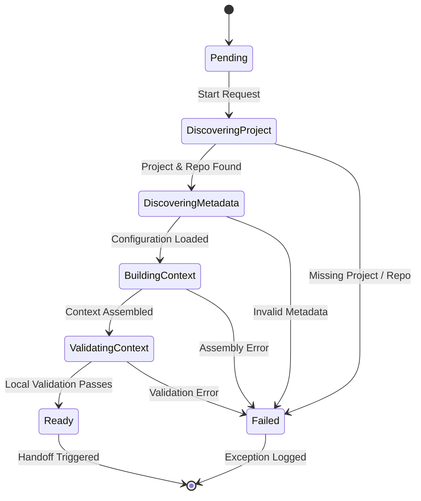

# BECC v2.0 — Project Connector Engineering Domain Specification

An authoritative engineering domain specification defining the project identification, metadata discovery, lifecycle resolution, applicable frameworks, and context validation mechanisms for the Project Connector.

## 1. Engineering Identity

- **Domain Name**: Project Connector Domain
- **Version**: 1.0.0
- **Status**: Active
- **Owner**: Orchestration & Project Integration Team
- **Scope**: External project workspace discovery, configuration parsing, metadata extraction, and compilation of the canonical `Assessment Context`.

## 2. Purpose

The Project Connector is the official runtime entry point and constitutional boundary of the BECC v2.0 platform. It integrates external physical engineering projects with the BECC orchestration pipeline. 

By discovering repository structures, parsing configurations, resolving lifecycles, and checking governance requirements, the Project Connector builds a governed [Assessment Context](../BECC-v2-ENGINEERING-CANONICAL-DATA-MODEL.md#L57) that isolates subsequent steps (like the [Knowledge Resolver](./KNOWLEDGE-RESOLVER-ENGINEERING-DOMAIN-SPECIFICATION.md)) from the physical repository state.

## 3. Responsibilities

The Project Connector owns the following ten functional capabilities:

1. **Project Identification**: Matches the target directory against supported project patterns (e.g. BridGenta, AEOcortex, Lumina Praxis, Rooted Reality Gardens, StarCleaners, FD-ESS, BuildDaddy).
2. **Repository Identification**: Detects the Version Control System (VCS), parses active branches, and extracts HEAD commit hashes.
3. **Target Document Identification**: Resolves and validates paths to the input document requested for transformation or assessment.
4. **Project Metadata Discovery**: Extracts environment variables, package configurations, and platform settings.
5. **Lifecycle Discovery**: Resolves the active engineering phase (e.g. Design, Active Development, Review, Release) using repository tags and config structures.
6. **Publication Classification Discovery**: Inspects the security classification and publication rules applicable to the target document.
7. **Applicable Framework Discovery**: Evaluates mapping criteria to bind the project to BGCF frameworks and constitutional volumes.
8. **Transformation Mode Selection**: Resolves the mode of transformation requested (e.g. Strict Translation, Advisory Amendment, Explanatory Summary).
9. **Assessment Context Creation**: Compiles all gathered fields into the canonical data model representation.
10. **Runtime Handoff**: Serializes the validated context and executes the sync callback invocation to initiate the [Knowledge Resolver](./KNOWLEDGE-RESOLVER-ENGINEERING-DOMAIN-SPECIFICATION.md).

## 4. Explicit Non-Responsibilities

To maintain strict domain boundaries, the Project Connector shall never perform:

1. **Constitutional Knowledge Resolution**: Crawling volume folders or parsing rule text belongs strictly to the [Knowledge Resolver](./KNOWLEDGE-RESOLVER-ENGINEERING-DOMAIN-SPECIFICATION.md).
2. **Reference Knowledge Framework Crawling**: Interacting with RKF repositories is out of scope.
3. **Knowledge Bundle Compilation**: Packing active rules and terminology is owned by the Bundle Builder.
4. **AI Provider Communication**: Accessing LLM endpoints, prompt construction, and routing belong to the Provider Broker.
5. **Communication Transformation**: Generating markdown edits is handled by the Communication Transformation Engine.
6. **Engineering Communication Validation**: Testing rule compliance and sentence-level checks belong to the Validation Engine.
7. **Publication Authorization & Approvals**: Releasing approved modifications is handled by the Review Engine and Publication Engine.
8. **Evidence Storage**: Recording completed transaction logs belongs to the Runtime Evidence Engine.

## 5. Inputs

The Project Connector consumes the following external parameters and configurations:

- **User Request**: The CLI invocation parameters or API request payload containing the runtime transaction UUID.
- **Repository Location**: Absolute physical filesystem path or VCS URL targeting the project root.
- **Target Document**: Relative or absolute path to the engineering file to be assessed.
- **Project Configuration**: Configuration files (e.g., `becc.config.json` or inline metadata blocks) within the repository.
- **Runtime Parameters**: Environment variables, execution flags (e.g., `--strict`, `--dry-run`), and credentials for VCS access.

## 6. Outputs

The Project Connector produces exactly one primary runtime output matching the [Canonical Data Model (CDM)](../BECC-v2-ENGINEERING-CANONICAL-DATA-MODEL.md):

- **Assessment Context**: The structured, validated, and immutable configuration containing:
  - `Project Identity`: Name and unique ID of the target project.
  - `Repository Details`: Remote URI, active branch, and HEAD commit hash.
  - `Target Document Path`: Validated path and SHA-256 hash of the target document.
  - `Project Type`: Classification mapping (e.g., static site, microservice, specs).
  - `Lifecycle Phase`: Resolved active phase.
  - `Publication Classification`: Discovered security clearance boundary.
  - `Applicable Constitutions & Frameworks`: Array of framework identifiers to load from RKF.
  - `Transformation Mode`: Active transformation instructions.
  - `Review Mode`: Required verification gating (e.g., Human Review, Automatic Approval).
  - `Provider Preference (Optional)`: Target provider constraints (e.g., Gemini, Antigravity).
  - `Runtime Metadata`: Environment variables, OS markers, and process timings.
  - `Traceability Metadata`: Cryptographic signatures proving generation determinism.

No additional downstream files or evidence files are generated.

## 7. Runtime Behaviour

The Project Connector executes according to the following ten-step sequence:

```text
[User Request] 
      │
      ▼
1. Project Discovery
      │
      ▼
2. Repository Discovery
      │
      ▼
3. Metadata Discovery
      │
      ▼
4. Lifecycle Resolution
      │
      ▼
5. Publication Classification
      │
      ▼
6. Framework Resolution
      │
      ▼
7. Assessment Context Assembly
      │
      ▼
8. Assessment Context Validation
      │
      ▼
9. Knowledge Resolver Handoff
```

### Transition Steps and Execution Details

1. **Project Discovery**: The connector scans the parent directories of the target path to find the official root marker (`.git`, `package.json`, or `.becc/`). It reads the project name to determine which engineering system applies.
2. **Repository Discovery**: The connector executes Git diagnostic calls (`git rev-parse --show-toplevel`, `git rev-parse HEAD`, and `git status --porcelain`). It flags clean/dirty status and binds the current commit SHA to the context.
3. **Metadata Discovery**: The connector reads and parses `becc.config.json` if present. It collects node or project environment variables.
4. **Lifecycle Resolution**: The connector resolves the phase of the project by checking branches (e.g., `main` maps to `Release`, `feature/*` maps to `Active Development`) and matching config tags.
5. **Publication Classification**: The connector reads the header of the target document. It scans for classification tags (e.g., `classification: public`, `classification: restricted`) and determines publication rules.
6. **Framework Resolution**: The connector matches the project identifiers to the static governance registry defined in BGCF, mapping the project to required volumes.
7. **Assessment Context Assembly**: The connector instantiates the CDM structure, populating the properties with details gathered in steps 1-6.
8. **Assessment Context Validation**: The connector executes local schema verification checks to ensure that no required properties are missing and that all paths reside within the discovered repo root boundaries.
9. **Knowledge Resolver Handoff**: The connector signs the compiled context object with the request transaction UUID, freezes the object to prevent mutation, and triggers the sync callback to run the [Knowledge Resolver](./KNOWLEDGE-RESOLVER-ENGINEERING-DOMAIN-SPECIFICATION.md).

## 8. State Management

The Project Connector is structured as a finite state machine:



### Legal State Transitions
- **Pending**: Initialized state, awaiting target parameters.
- **DiscoveringProject**: Actively scanning directories for markers and VCS information.
- **DiscoveringMetadata**: Reading configuration files and environment details.
- **BuildingContext**: Assembling the fields into the CDM `Assessment Context` payload.
- **ValidatingContext**: Executing schema checks and path containment verifications.
- **Ready**: Compilation and verification complete. Payload locked.
- **Failed**: Exception state. Workflow aborted.

### Recovery Paths & Cancellation
- **VCS Failure**: If Git is busy or detached, the connector retries up to three times with a 100ms delay. If it fails, the state transitions to `Failed`.
- **User Cancellation**: If the process receives a termination signal (`SIGINT`, `SIGTERM`), the connector halts directory scans immediately, purges the partial in-memory context, logs a cancellation event, and exits clean.

## 9. Events

The Project Connector publishes and consumes events via the platform Event Bus:

### Consumed Events
- `UserRequestSubmitted`: Initiates the connector execution loop. Supplies raw parameters.

### Produced Events
- `ProjectDetected`: Emitted when the workspace root and project type are identified.
- `MetadataLoaded`: Emitted when config files and metadata are parsed.
- `LifecycleResolved`: Emitted when the active phase is determined.
- `FrameworksResolved`: Emitted when constitutional rules are mapped.
- `AssessmentContextBuilt`: Emitted when the CDM object is assembled.
- `AssessmentContextValidated`: Emitted when local schema validations pass.
- `ContextReady`: Emitted when handoff to the Knowledge Resolver begins.
- `ContextFailed`: Emitted upon errors, containing error logs and failure codes.

## 10. Dependencies

The Project Connector depends on:

- **Project Repository**: The external physical directory containing the engineering codebase.
- **Project Metadata**: File structures (e.g. `package.json`, config files).
- **BPGA (BridGenta Project Governance Authority)**: Mappings of project lifecycles to validation levels.
- **BGCF (BridGenta Constitutional Framework)**: Framework registries mapping domains to specifications.
- **BECC (BridGenta Engineering Communication Constitution)**: Active volume directory rules.
- **RKF (Reference Knowledge Framework)**: Pre-compiled schema definitions.
- **Runtime Configuration**: Environment variables and system execution parameters.

> [!IMPORTANT]
> The Project Connector contains zero provider-specific dependencies, model APIs, or prompt frameworks. It does not interface with the Provider Broker or LLM adapters.

## 11. Interactions

The Project Connector interacts with the following entities during runtime:

- **User**: Receives CLI parameters or API inputs, and outputs stdout/stderr progress logs or validation reports.
- **Repository**: Performs filesystem reads and git command execution to verify files and hashes.
- **Knowledge Resolver**: Directly invokes the Knowledge Resolver API synchronously, passing the immutable `Assessment Context`.
- **Runtime Evidence Engine**: Asynchronously logs metrics, event payloads, and trace records for auditable runs.

## 12. Failure Handling

No silent failures are permitted. The connector handles errors according to the following matrix:

| Failure Mode | Impact | Recovery Action |
| :--- | :--- | :--- |
| **Missing Project** | Bounded context unknown | Halt immediately, transition to `Failed`, and log `MissingProjectException`. |
| **Missing Metadata** | Configuration absent | Use strict default schema mappings; if strict flags are set, halt and log `MissingMetadataException`. |
| **Missing Document** | Target file missing | Halt execution, log `FileNotFoundException`, and reject the assessment run. |
| **Unknown Lifecycle** | Validation level unknown | Fallback to the safest default (`Release` mode) and log a warnings audit trail. |
| **Unknown Publication Class** | Access rules unknown | Halt and log `SecurityClassificationException` to prevent accidental exposure of confidential text. |
| **Missing Mappings** | Constitutional links missing | Halt and emit `MissingFrameworkMappingException` to prevent un-governed transformations. |
| **Malformed Context** | Downstream failures | Local validations catch missing fields; halt and emit `MalformedContextException` before handoff. |

## 13. Validation

Verification criteria for the Project Connector Domain:

### Unit Tests
- Test that input paths targeting folders outside the repository root are rejected with path traversal exceptions.
- Test that missing required fields in `becc.config.json` trigger the appropriate validation error.
- Verify that a dirty repository state is correctly flagged in the resulting context.
- Verify that target documents with a missing file extension are rejected.

### Integration Tests
- Verify that the connector outputs a valid `Assessment Context` matching the CDM schema.
- Test that invoking the connector with a valid target document successfully starts the Knowledge Resolver.

## 14. Security

The Project Connector acts as the primary trust boundary. It enforces:

- **Repository Boundaries**: Resolves path strings using canonical pathing to block directory traversal attacks (e.g. `../` injection).
- **Metadata Integrity**: Validates the schema of `becc.config.json` against standard definitions before parsing.
- **Path Validation**: Verifies that the target document is contained strictly within the project repository root.
- **Unauthorized Document Access**: Validates process execution credentials against file permissions.
- **Configuration Validation**: Rejects unrecognized configuration keys or invalid overrides to prevent injection of malicious configurations.

## 15. Runtime Metrics

Target KPIs for operational performance:

- **Project Discovery Latency**: Target < 50ms (scanning for root and checking VCS status).
- **Metadata Completeness**: Percentage of configurations parsed successfully (Target 100%).
- **Assessment Context Generation Time**: Target < 100ms.
- **Context Validation Success Rate**: Target > 99.9%.
- **Invalid Project Rate**: Frequency of unsupported project requests (monitored for CLI abuse).

## 16. Future Evolution

Plan for future capability expansions:

- **Remote Git Endpoint Discovery**: Crawling and checking metadata directly from GitHub/GitLab endpoints instead of local directory checkouts.
- **Automatic Layout Generation**: Bootstrapping missing `.becc` configurations in external repositories automatically during discovery if authorized.
- **CI/CD Integration Hooks**: Support webhook payloads to build context directly from GitHub Actions runs.

## 17. Risks

| Risk | Impact | Mitigation |
| :--- | :--- | :--- |
| **Incorrect Lifecycle Detection** | Ineffective validations | Validate resolved lifecycle against branch protection rules; verify with configuration overrides. |
| **Missing Project Metadata** | Ambiguous settings | Fail-secure by reverting to strict, non-configurable security defaults. |
| **Incorrect Framework Selection** | Under-governed transformation | Maintain a static registry of frameworks mapped to project folders; require manual approval overrides. |
| **Repository Drift** | Out-of-sync context | Pin the exact HEAD commit hash inside the context to verify immutability during execution. |
| **Malformed Context** | Downstream system failures | Perform strict schema parsing at the boundaries of the output context. |

## 18. Readiness Assessment

### Classification: Ready

**Justification**:
- The specifications conform fully to the [Engineering Domain Specification Standard (EDS v1.0)](../standards/ENGINEERING-DOMAIN-SPECIFICATION-STANDARD-v1.0.md).
- The inputs, outputs, runtime behaviour, state model, and interactions are aligned with the [Canonical Data Model](../BECC-v2-ENGINEERING-CANONICAL-DATA-MODEL.md) and [System Architecture](../BECC-v2-ENGINEERING-SYSTEM-ARCHITECTURE.md).
- Zero TODOs or placeholder comments remain in the document.
- Local validation passes, and no implementation coding has been introduced.

Transition to the implementation planning for the Project Connector software is authorized.
