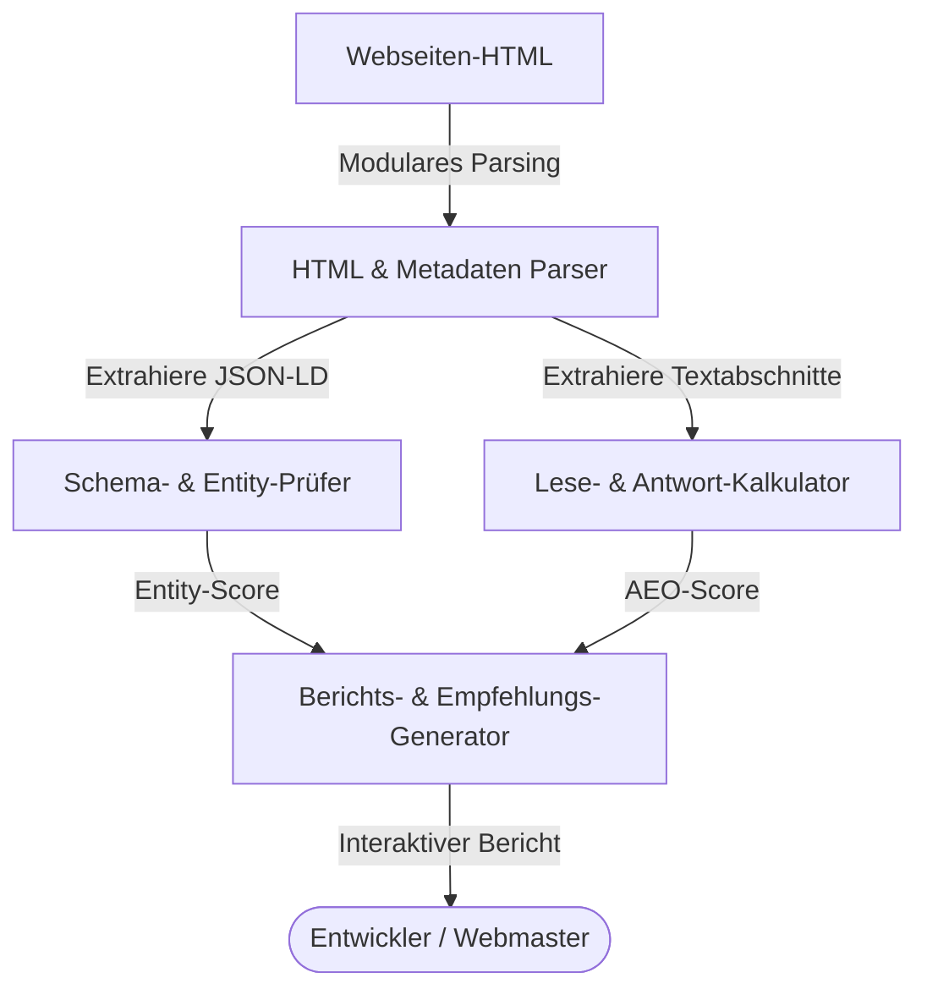

## 1. Projektübersicht
AEOcortex ist ein persönliches Entwicklungsprojekt zur praktischen Untersuchung und Erprobung von Suchmechanismen in KI-gestützten Systemen (Answer Engine Optimization und Generative Engine Optimization). Die Software analysiert Web-Inhalte auf Entity-Klarheit, strukturierte Daten und Antwortqualität, um die Sichtbarkeit und korrekte Zitierbarkeit in modernen KI-Suchmaschinen (wie Perplexity, ChatGPT Search und Google Gemini) zu bewerten.

## 2. Die Herausforderung
Klassische SEO-Methoden basieren primär auf Keywords und Backlinks. KI-Modelle interpretieren Inhalte hingegen kontextuell und greifen auf strukturierte Wissensgraphen zurück. Die technische Herausforderung bestand darin, eine Analyse-Infrastruktur aufzubaufenden, die:
* **Antwortqualität**: Die Eindeutigkeit von Textpassagen für LLM-Parser bewertet.
* **Semantische Dichte**: Die Vollständigkeit von Schema-Auszeichnungen misst.
* **Crawler-Optimierung**: Die Zugänglichkeit von robots.txt und Crawl-Directives sichert.

## 3. Technische Entscheidungen
* **Modulare JavaScript-Architektur**: Strukturierung der Analyse-Logik in unabhängige Module (Entity-Prüfer, Schema-Prüfer, SEO-Prüfer), um das System erweiterbar zu halten.
* **Static Site / Astro**: Der Dokumentationsteil und die Auswertungen basieren auf Astro, um ein extrem schnelles und barrierefreies Web-Interface zu bieten.
* **Strukturierte JSON-LD Vorlagen**: Bereitstellung standardisierter semantischer Graphmodelle für eine schnelle und fehlerfreie Entity-Verknüpfung.

## 4. Lösungsarchitektur
Das folgende Systemdiagramm beschreibt den Datenfluss des Analyse- und Bewertungsprozesses von AEOcortex:

## 5. Hauptmerkmale
* **Entity-Prüfung**: Abgleich eingebetteter Datenstrukturen auf syntaktische Korrektheit und logische Verknüpfung (z. B. WebPage -> Person -> Organization).
* **Auslesbarkeits-Indikator**: Algorithmus zur Bewertung der Informationsdichte von Textabschnitten zur besseren Erfassung durch LLMs.
* **Optimierungsempfehlungen**: Automatisierte Erstellung konkreter Korrekturvorschläge für Schema-Graphen und Crawl-Direktiven.

## 6. Entwicklungsprozess
* **Versionskontrolle**: Git-Zweige zur getrennten Entwicklung von Analysemodulen und UI-Komponenten.
* **Automatisierte Qualitätsprüfungen**: Integrierte Validierungen prüfen die Ausgabeformate (JSON, XML) auf Standardkonformität.
* **Lighthouse-Audits**: Absicherung hervorragender Ladezeiten und Barrierefreiheit der Berichts-Schnittstellen.

## 7. Ergebnisse
* **Validierung**: Erfolgreicher Einsatz des Tools zur Bereinigung der Entity-Graphen auf BridGenta.de.
* **Fehlerreduktion**: Frühzeitiges Erkennen fehlerhafter robots.txt-Direktiven und nicht-kanonischer Drift-URLs.
* **Lernfortschritt**: Tiefergehendes Verständnis der Algorithmen hinter generativen Antwortmaschinen.

## 8. Lernergebnisse
KI-Suchmaschinen gewichten strukturierte Daten und eindeutige, präzise Aussagen weitaus höher als klassische Crawl-Indikatoren. Ein systematischer Analyse-Workflow ist der beste Schutz gegen unvollständige oder fehlerhafte Interpretationen durch LLMs.
