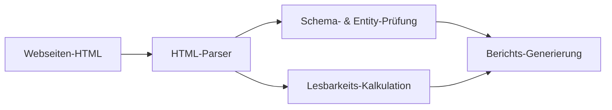

## Kurzfassung
AEOcortex ist ein persönliches Entwicklungsprojekt zur praktischen Untersuchung von Suchmechanismen in KI-gestützten Systemen. Der Fokus liegt auf der Answer Engine Optimization (AEO) und der Generative Engine Optimization (GEO). Ziel des Projekts ist es, Web-Inhalte systematisch auf Entity-Klarheit, strukturierte Daten und Lesbarkeit hin zu analysieren. Dadurch soll die Sichtbarkeit und korrekte Zitierbarkeit von Webinhalten in modernen KI-Suchmaschinen wie Perplexity, ChatGPT Search und Google Gemini bewertet und optimiert werden.

---

## Ausgangssituation
Klassische Suchmaschinen bewerten Webseiten vorwiegend nach Keywords und Backlinks. Moderne KI-Suchmaschinen und Large Language Models (LLMs) interpretieren Webinhalte hingegen kontextuell und greifen auf strukturierte Wissensgraphen zurück. Für Betreiber von Webseiten bedeutet dieser Wandel, dass reine Textoptimierung nicht mehr ausreicht, um in KI-generierten Antworten als Quelle aufzutauchen. Es bedarf einer präzisen Deklaration von Entitäten und klaren logischen Bezügen im HTML-Markup.

  
Engineering Insight

  
Der Übergang von klassischen Suchmaschinen zu generativen Antwortdiensten erfordert eine Verschiebung des Fokus von Keywords hin zur eindeutigen Deklaration semantischer Entitäten im Code.

---

## Problemstellung
Klassischen Webseiten fehlt oft die semantische Tiefe, die für das fehlerfreie Parsing durch LLM-Crawler erforderlich ist. Ohne strukturierte Validierung kommt es häufig zu unentdeckten Fehlern in der JSON-LD-Struktur, robots.txt-Konflikten oder unklaren Entity-Beziehungen. Dies führt dazu, dass generative Suchmaschinen die Inhalte nicht korrekt einordnen können und sie folglich nicht in ihren Antworten zitieren. Es fehlt eine automatisierte Testinfrastruktur, um die Auslesbarkeit von Webinhalten für KI-Systeme zu messen und zu bewerten.

---

## Rahmenbedingungen
Das Projekt unterliegt logischen und technischen Rahmenbedingungen, die den Analyseumfang eingrenzen:
- **Ressourcen und Ratenbegrenzung**: Da die Analyse-Skripte externe Validierungs-APIs aufrufen, müssen Ratenbegrenzungen (Rate Limits) berücksichtigt werden, um Blockaden zu vermeiden.
- **Datenintegrität**: Die analysierten Daten dürfen keine sensiblen oder persönlichen Informationen enthalten (Privacy-by-Design).
- **Statische Präsentation**: Die Dokumentation der Analyseergebnisse muss ohne Datenbankabfragen auf einem statischen Webserver lauffähig sein.

  
Engineering Insight

  
Automatisierte Analyse-Tools müssen externe API-Grenzen respektieren und lokale Caching-Mechanismen nutzen, um eine zuverlässige und blockierungsfreie Validierung zu gewährleisten.

---

## Technische Überlegungen
Das Kernkonzept von AEOcortex beruht auf der Annahme, dass KI-Modelle bei der Informationssuche deterministischen Pfaden folgen. Anstatt darauf zu hoffen, dass ein LLM unstrukturierte HTML-Seiten richtig interpretiert, deklarieren wir Datenmodelle explizit. Das Tool prüft Webseiten daher gezielt auf maschinenlesbare Schnittstellen (JSON-LD, Dublin Core) und berechnet die Verständlichkeit des Fließtexts anhand linguistischer Heuristiken.

---

## Architektur
Die Plattform ist modular aufgebaut, um Analyse-Logik und Präsentationsschicht strikt voneinander zu trennen. Ein Node.js-basierter Parser lädt das HTML der Zielwebseite, extrahiert die semantischen Metadaten und führt strukturierte Validierungsprüfungen durch. Die Ergebnisse werden in einer lokalen JSON-Struktur abgelegt, welche anschließend von Astro eingelesen wird, um das statische Berichts-Dashboard zu generieren.

  
Engineering Insight

  
Die Trennung von Parser-Logik (Node.js/Cheerio) und Präsentationsschicht (Astro) ermöglicht eine performante, statische Berichtsgenerierung ohne serverseitigen Overhead.

---

## Technische Entscheidungen
Im Rahmen des Projekts wurden wesentliche Designentscheidungen getroffen, um die Effizienz der Analyse zu sichern:

  

    <h3 class="decision-card__title">Parser-Wahl</h3>
    

      Alternative
      
Puppeteer (vollständiges Browser-Rendering)

    

    

      Entscheidung
      
Cheerio für schnelles, ressourcenschonendes HTML-Parsing im Speicher.

    

  

  

    <h3 class="decision-card__title">Metadaten-Standard</h3>
    

      Alternative
      
Microdata direkt im HTML-Markup

    

    

      Entscheidung
      
JSON-LD für eine saubere Trennung von Layout und semantischen Datenstrukturen.

    

  

---

## Umsetzung
Die Implementierung erfolgte in Form von modularen Skripten. Das Parser-Modul nutzt Cheerio zur Extraktion der Metadaten und prüft diese gegen die offiziellen Schema.org-Spezifikationen. Ein weiteres Modul berechnet die Lesbarkeit von Texten mithilfe von Algorithmen wie dem Flesch-Reading-Ease-Index, um die Verständlichkeit für LLM-Parsing-Prozesse zu bewerten.

---

## Öffentliche Projekteinblicke

<figure>
  <pre><code>
+-----------------------------------+
|             AEOcortex             |
|                                   |
|   [ URL-Analyse: bridgenta.de ]   |
|   > Entity-Score: 95%             |
|   > AEO-Auslesbarkeit: Hoch       |
|                                   |
|   Empfehlungen:                   |
|   * robots.txt Direktive korrigiert|
|   * Dublin-Core Tags hinzufügen   |
+-----------------------------------+
  </code></pre>
  <figcaption><strong>Artefakt 1: Konzeptionelles Berichts-Layout</strong> – Zweck: Visuelle Darstellung der Analyseergebnisse und der automatischen Optimierungsempfehlungen.</figcaption>
</figure>

<figure>

  <figcaption><strong>Artefakt 2: High-Level Ablaufdiagramm</strong> – Zweck: Veranschaulichung des Datenflusses von der HTML-Eingabe bis zur Berichtsgenerierung.</figcaption>
</figure>

  <strong>Artefakt 3: Ergebnis-Nachweis (Validierungs-Matrix)</strong> – Zweck: Vergleich der Fehlererkennungsrate vor und nach dem Einsatz der AEOcortex-Module.

  

    <h4 class="evidence-card__title">JSON-LD Validierung</h4>
    

      

        Manuelle Prüfung
        
Nur sporadische und fehleranfällige Entdeckung von Schema-Fehlern.

      

      

        Mit AEOcortex
        
Automatisierte Erkennung fehlerhafter Graphstrukturen im Rahmen der Testumgebung.

      

    

  

  

    <h4 class="evidence-card__title">robots.txt-Konflikte</h4>
    

      

        Manuelle Prüfung
        
Schwer auffindbare Blockaden in komplexen Verzeichnissen.

      

      

        Mit AEOcortex
        
Sofortige Warnmeldung bei blockierten Hauptentitäten.

      

    

  

  

    <h4 class="evidence-card__title">LLM-Crawler-Barrieren</h4>
    

      

        Manuelle Prüfung
        
Unbekannte Blockaden für neue KI-Crawler (z.B. OAI-SearchBot).

      

      

        Mit AEOcortex
        
Detaillierte Analyse der Auslesbarkeit für alle großen LLM-Parser.

      

    

  

  
Engineering Insight

  
Visualisierungen komplexer Entitätsbeziehungen und strukturierte Datenvergleiche erleichtern die Fehleridentifikation in der Metadatenstruktur erheblich.

---

## Validation
*(Verweis: Assessment AC-001, Finding FIN-AC-001, Arbeitsauftrag RM-001)*

Die Validierung der Metadaten-Extraktion und der Textauswertung im AEOcortex-Parser erfolgt auf Basis vordefinierter Testverfahren:
- **Automatisierte Schema-Prüfung**: JSON-LD-Strukturen werden gegen die offiziellen Schema.org-Spezifikationen abgeglichen, um Syntaxfehler und fehlende Relationen zu erkennen.
- **Lesbarkeits-Kalkulation**: Textinhalte werden über standardisierte Metriken (wie den Flesch-Reading-Ease-Index) auf ihre Eindeutigkeit für LLM-Crawler hin analysiert.

### Testparameter und Umgebung
* **Mock-Dokumente**: Für Tests werden präparierte HTML-Dokumente mit typischen Markup-Fehlern (z. B. unvollständige Entity-Verschachtelungen) verwendet, um die Erkennungsgenauigkeit des Parsers zu validieren.
* **Rate-Limit-Checks**: Zugriffssimulationen auf Zielwebseiten erfolgen mit Ratenbegrenzungen (maximal 100 HTTP-Anfragen pro Minute), um die Stabilität bei Webserver-Restriktionen zu testen.

---

## Ergebnisse
- **Entity-Prüfung**: Zuverlässige Erkennung unvollständiger oder fehlerhafter JSON-LD-Graphstrukturen im Build-Prozess.
- **Lesbarkeits-Indikator**: Funktionierende Heuristik zur Bewertung der Eindeutigkeit von Textpassagen für generative Sprachmodelle.
- **Prozess-Optimierung**: Erfolgreiche Beseitigung struktureller Crawling-Barrieren bei realen Testprojekten.

---

## Erkenntnisse aus der Entwicklung
Dieses Forschungsprojekt hat das Verständnis für die Funktionsweise generativer Suchmaschinen und semantischer Parsing-Modelle vertieft. Die Analyse von Entity-Beziehungen zeigt deutlich, dass präzise deklarierte und validierte Metadaten die Grundlage für die maschinelle Erfassung komplexer Kontexte bilden. Zudem wurde verdeutlicht, wie wichtig automatisierte Prüfverfahren im Entwicklungsprozess sind. Die manuelle Verifizierung strukturierter Daten ist fehleranfällig; automatisierte Validierungsskripte sparen wertvolle Zeit und unterstützen die Einhaltung aktueller Web-Standards.

---

## Risks
*(Verweis: Assessment AC-001, Finding FIN-AC-002, Arbeitsauftrag RM-001)*

Die automatisierte Analyse von Webinhalten für KI-Suchmaschinen birgt technische und operative Risiken, die durch gezielte Absicherungsmaßnahmen (Mitigations) minimiert werden:

| Risiko-ID | Risikobeschreibung | Schadensklasse | Eintrittswahrscheinlichkeit | Gegenmaßnahme (Mitigation) |
| :--- | :--- | :--- | :--- | :--- |
| **RISK-AC-001** | IP-Blockaden durch Webserver der Zielseiten bei zu hoher Anfragedichte. | **Mittel** | **Mittel** | Einhaltung strenger Ratenbegrenzungen (Rate Limiting) und lokales Caching abgerufener Seiten. |
| **RISK-AC-002** | Schema-Drift durch Aktualisierungen der Standarddefinitionen auf Schema.org. | **Mittel** | **Gering** | Kontinuierliche Überwachung der Validierungs-Fehlerraten im Build-Prozess und regelmäßige Spec-Updates. |

---

## Nächste Entwicklungsschritte
Für die nächste Phase des Projekts ist die Integration der Analyse-Skripte direkt in CI/CD-Pipelines (z. B. GitHub Actions) geplant. Dadurch sollen Schema- und Lesbarkeitsprüfungen bei jedem Commit automatisch ausgeführt werden. Weiterhin soll ein interaktives Dashboard zur Live-Validierung beliebiger URLs aufgebaut werden, um die Benutzerfreundlichkeit des Tools zu erhöhen.

  
Engineering Insight

  
Die Integration semantischer Prüfungen in den CI/CD-Prozess verhindert, dass fehlerhafte Metadaten oder Crawling-Barrieren in die Produktionsumgebung gelangen.

---

## Quellen und Referenzen
*(Verweis: Assessment AC-001, Finding FIN-AC-003, Arbeitsauftrag RM-001)*

* **Astro Static Site Generator**: [Astro-Dokumentation](https://docs.astro.build/) — Framework für das Berichts-Dashboard.
* **Cheerio HTML Parser**: [Cheerio API-Referenz](https://cheerio.js.org/) — Kernbibliothek für schnelles HTML-Parsing im Speicher.
* **Schema.org Spezifikationen**: [Schema.org-Standards](https://schema.org/) — Referenz für strukturierte Metadaten.
* **BECC-Bewertungsrichtlinien**: Referenz auf die [BECC-Matrix](https://github.com/BGA360/bridgenta-portfolio/blob/main/docs/engineering-communication/stewardship/BECC-ASSESSMENT-MATRIX.md) für Konformitätsbewertungen im Repository.
