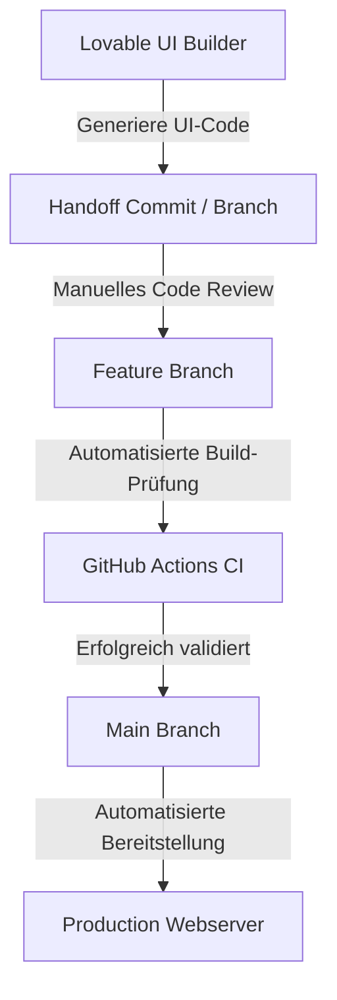

## 1. Projektübersicht
BridGenta ist ein Softwareprojekt zur praktischen Evaluierung moderner KI-gestützter Entwicklungswerkzeuge (AI Builder). Im Mittelpunkt steht die Fragestellung, wie sich die Frontend-Generierung durch KI-Assistenten (wie Lovable) effizient steuern und in einen professionellen Softwareentwicklungs-Workflow mit Git-Versionskontrolle, automatisierten Qualitätsprüfungen und Branch-Protection integrieren lässt. Die Produktfunktionen des zugrundeliegenden Portals befinden sich derzeit in einer geschützten privaten Testphase.

## 2. Die Herausforderung
KI-Entwicklungswerkzeuge ermöglichen eine extrem hohe Entwicklungsgeschwindigkeit, neigen jedoch ohne architektonischen Rahmen zu ungeplanten Designänderungen (Scope Creep) und Code-Duplikationen (Code Bloat). Die technische Herausforderung bestand darin, einen Prozess zu definieren, der:
* **Entwicklungsgeschwindigkeit**: Der KI-Modelle optimal ausnutzt.
* **Architektonische Kontrolle**: Über Datenstrukturen, Routing und Systemgrenzen vollständig aufrechterhält.
* **Sicherheit & Datenschutz**: Sensible API-Schlüssel und Benutzerdaten strikt von den KI-Generierungskontexten isoliert.

## 3. Technische Entscheidungen
* **Git-basierte Handoff-Grenze**: Alle von Lovable generierten UI-Codebasen werden über dedizierte GitHub-Commits eingespielt. Der Code wird danach manuell reviewt und in das produktive Feature-Branch-Modell überführt.
* **Statische Entkopplung (Astro)**: Die Benutzeroberfläche des Portfolios ist vollständig statisch aufgebaut. Dies schließt Sicherheitsrisiken der privaten Produkt-API aus und garantiert minimale Ladezeiten (FCP < 0.6s).
* **Automatisierte Validierung**: Einbindung einer CI-Pipeline (GitHub Actions), die jeden Pull Request auf Code-Konformität und fehlerfreie Kompilierung prüft, bevor dieser gemergt werden kann.

## 4. Lösungsarchitektur
Das folgende Architekturdiagramm veranschaulicht die strikte Systemgrenze zwischen dem KI-gestützten Frontend-Generator und dem qualitätsgesicherten Feature-Repository:

## 5. Hauptmerkmale
* **Kontrollierter Handoff-Prozess**: Klarer Entwicklungsablauf, der das unkontrollierte Überschreiben produktiver Codeteile durch KI-Assistenten verhindert.
* **Git-basierte Governance**: Schutz des produktiven Zweigs vor direktem Code-Commit. Jede Codeänderung erfordert einen validierten Pull Request.
* **Umfassende Dokumentation**: Schritt-für-Schritt-Protokollierung aller Schnittstellenentscheidungen zur Nachvollziehbarkeit für zukünftige Entwicklerteams.

## 6. Entwicklungsprozess
* **Versionskontrolle**: Git-Branching-Modell mit getrennten Feature-Zweigen zur Isolierung neuer Funktionen.
* **Automatisierte Qualitätsprüfungen**: Skripte prüfen die JSON-Strukturen und HTML-Ausgaben auf syntaktische Korrektheit, bevor Code für Releases freigegeben wird.
* **Controlled Beta Tests**: Die Bereitstellung erfolgt schrittweise für ausgewählte Testgruppen, um das System unter realen Bedingungen zu validieren.

## 7. Ergebnisse
* **Entwicklungsgeschwindigkeit**: Reduzierung der Frontend-Layout-Erstellungszeiten durch den gezielten Einsatz des KI-Builders.
* **Sicherheit**: Keine Sicherheitsvorfälle oder Geheimnis-Leaks während der gesamten Beta-Phase durch strikte Handoff-Regeln.
* **Wartbarkeit**: Erhalt einer sauberen, modularen Code-Struktur trotz des Einsatzes automatisierter Layout-Generatoren.

## 8. Lernergebnisse
KI-Entwicklungswerkzeuge entfalten ihr volles Potenzial erst, wenn sie in einen disziplinierten, menschlich kontrollierten Release-Prozess eingebettet sind. Ohne klare Handoff-Grenzen und automatisierte Build-Prüfungen führt automatisierte Codegenerierung schnell to instabilen Systemen.
