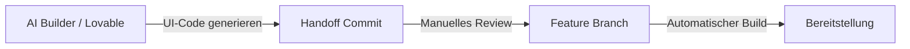

## 1. Projektübersicht
BridGenta ist ein experimentelles Softwareprojekt zur praktischen Evaluierung moderner KI-gestützter Entwicklungswerkzeuge (AI Builder). Im Mittelpunkt steht die Fragestellung, wie sich die Frontend-Generierung durch KI-Assistenten (wie Lovable) steuern und in einen professionellen Softwareentwicklungs-Workflow mit Git-Versionskontrolle, automatisierten Qualitätsprüfungen und Branch-Protection integrieren lässt.

Die Produktfunktionen des zugrundeliegenden Portals befinden sich derzeit in einer geschützten privaten Testphase.

## 2. Die Herausforderung
KI-Entwicklungswerkzeuge ermöglichen eine hohe Entwicklungsgeschwindigkeit, neigen jedoch ohne architektonischen Rahmen zu ungeplanten Designänderungen (Scope Creep) und Code-Duplikationen (Code Bloat). Die technische Herausforderung bestand darin, einen Prozess zu definieren, der die Entwicklungsgeschwindigkeit von KI-Modellen optimal nutzt, die architektonische Kontrolle über Datenstrukturen und Routing aufrechterhält sowie sensible API-Schlüssel und Benutzerdaten strikt von den KI-Generierungskontexten isoliert.

## 3. Meine Rolle & Beitrag
Ich bin für die technische Konzeption, das Workflow-Design und die Qualitätssicherung verantwortlich:
* **Workflow-Design**: Definition der Schnittstelle (Handoff-Grenze) zwischen KI-generiertem Code und produktivem Repository.
* **Qualitätssicherung**: Implementierung automatisierter Qualitätsprüfungen (CI/CD via GitHub Actions).
* **Architektur-Kontrolle**: Gewährleistung der Trennung zwischen statischem Frontend (Astro) und dynamischer Produkt-API.
* **Prozess-Governance**: Etablierung restriktiver Branch-Protection-Regeln und Codeowner-Reviews zur Erhöhung der Betriebssicherheit.

## 4. Technologie-Stack
* **Entwicklungswerkzeuge**: Lovable AI Builder (für Frontend-Layout-Iterationen).
* **Framework**: Astro (zur statischen Entkopplung des öffentlichen Portfolios).
* **Versionskontrolle & CI**: Git, GitHub, GitHub Actions.

## 5. Ergebnisse
* **Handoff-Stabilität**: Erfolgreiche Vermeidung unkontrollierter Code-Überschreibungen durch klar definierte Git-Handoff-Zweige.
* **Sicherheit**: Keine unbeabsichtigten Leaks von API-Schlüsseln oder Zugangsdaten durch strikte Filterregeln.
* **Wartbarkeit**: Erhalt einer sauberen, modularen Code-Struktur durch manuelle Qualitätskontrollen nach der KI-Generierung.

## 6. Projektdokumentation (Artefakte)

### Artefakt 1: Projekt-Visualisierung
*(Hinweis: Zum Schutz des unveröffentlichten Beta-Produkts zeigt diese Skizze die Handoff-Pipeline.)*

```
+-----------------------------------+
|        BridGenta Pipeline         |
|                                   |
|   [ Lovable UI ]                  |
|         |                         |
|         v                         |
|   [ Handoff Branch ]              |
|         |  (Review)               |
|         v                         |
|   [ Feature Branch ]              |
|         |  (CI-Build Pass)        |
|         v                         |
|   [ Production ]                  |
+-----------------------------------+
```

### Artefakt 2: High-Level Ablaufdiagramm
Das folgende Diagramm veranschaulicht die strikte Systemgrenze zwischen dem KI-gestützten Frontend-Generator und dem qualitätsgesicherten Feature-Repository:



### Artefakt 3: Ergebnis-Nachweis
Vergleich der Fehlerprävention bei unstrukturiertem vs. strukturiertem KI-Einsatz:

| Risiko | Unstrukturierter KI-Einsatz | Strukturierter KI-Einsatz (BPS) |
| :--- | :--- | :--- |
| Code-Duplikate | Sehr hoch (Code Bloat) | Gering (Manuelles Review & Refactoring) |
| Geheimnis-Leaks | Hoch (Schlüssel im Code) | Ausgeschlossen (Isolierte Kontexte) |
| Systemstabilität | Unvorhersehbar | Garantiert durch automatisierte Build-Prüfung |
