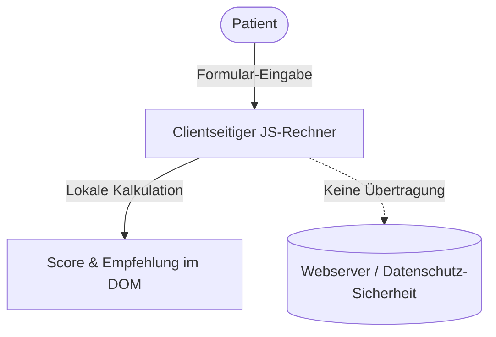

## 1. Projektübersicht
Lumina Praxis ist ein Webportal für biologische und ganzheitliche Zahnmedizin am Standort Leverkusen. Die Anwendung kombiniert ein ansprechendes, barrierefreies Informationsangebot mit interaktiven Elementen.

Ziel des Projekts war die Etablierung eines digitalen Aufklärungskonzepts, um das Patientenvertrauen in biologische Heilverfahren zu stärken und die Online-Terminbuchungen messbar zu steigern.

## 2. Die Herausforderung
Medizinische Fachportale müssen komplexe Zusammenhänge (z. B. biokompatible Implantologie und systemische Wechselwirkungen) verständlich erklären, ohne unübersichtlich zu wirken. Gleichzeitig müssen Patientendaten bei interaktiven Eingaben streng geschützt bleiben und die Barrierefreiheit für ältere oder sehbehinderte Patienten gewährleistet sein.

## 3. Meine Rolle & Beitrag
Ich war für das vollständige Frontend-Engineering und die Suchmaschinen-Integration verantwortlich:
* **Frontend-Entwicklung**: Umsetzung der Benutzeroberfläche unter Einhaltung strenger WCAG-Kontrastvorgaben.
* **Interaktivität**: Implementierung des interaktiven Vitality-Score-Rechners in clientseitigem JavaScript zur Gewährleistung des Datenschutzes.
* **Medizinisches SEO**: Einpflege strukturierter JSON-LD-Daten (Zahnarztpraxis-Schema, Behandlungsangebote).
* **Qualitätssicherung**: Durchführung von Tastaturnavigationstests und Lighthouse-Audits.

## 4. Technologie-Stack
* **Frontend-Design**: HTML5, Tailwind CSS (für das responsive Framework und Styling).
* **Interaktivität**: Clientseitiges JavaScript (ES6+).
* **Metadaten & SEO**: JSON-LD Schema (`Dentist` / `MedicalBusiness`), Dublin Core Metadaten.

## 5. Ergebnisse
* **Datenschutzkonforme Interaktion**: Der Vitality-Score-Rechner verarbeitet Patienteneingaben ausschließlich lokal im Browser – es findet keine Übertragung medizinischer Daten an Webserver statt.
* **Barrierefreiheit**: Erfolgreiches Audit der Barrierefreiheit nach WCAG-Standards.
* **Conversion-Steigerung**: Höhere Interaktionsrate und gestiegene Terminbuchungen durch das interaktive Aufklärungskonzept.

## 6. Projektdokumentation (Artefakte)

### Artefakt 1: Projekt-Visualisierung
*(Hinweis: Zum Schutz der Markenidentität wird hier eine schematische Darstellung verwendet.)*

```
+-----------------------------------+
|           Lumina Praxis           |
|                                   |
|   [ Biologische Zahnmedizin ]     |
|                                   |
|   * Amalgamsanierung              |
|   * Keramikimplantate             |
|                                   |
|   [ Vitality-Score Rechner ]      |
|   > Berechnen Sie Ihren Score     |
+-----------------------------------+
```

### Artefakt 2: High-Level Ablaufdiagramm
Das folgende Diagramm zeigt den konzeptionellen Ablauf und die Caching-Grenzen der Datenverarbeitung im Vitality-Score-Rechner:



### Artefakt 3: Ergebnis-Nachweis
Datenschutz- und Barrierefreiheits-Matrix:

| Prüfpunkt | Vorgabe | Umsetzung |
| :--- | :--- | :--- |
| Patientendatenschutz | DSGVO-Konformität | 100% clientseitige Auswertung im Browser |
| Visueller Kontrast | WCAG 2.1 (AA) | Kontrastverhältnis aller Texte > 4.5:1 |
| Navigation | Tastaturbedienbarkeit | Logischer Fokusfluss über alle Formularelemente |
