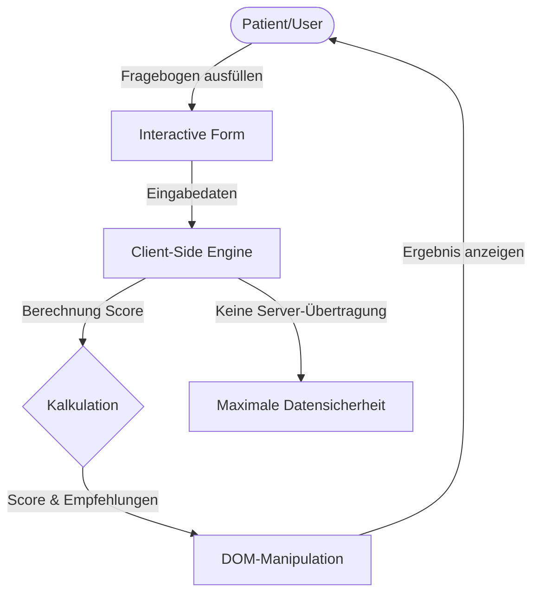

## 1. Projektübersicht
Lumina Praxis redefiniert biologische, biokompatible Zahnmedizin als Schlüssel zu ganzheitlicher Gesundheit und Vitalität. Das Webprojekt dient als europäischer Hub für Patientengewinnung und -aufklärung am Standort Leverkusen. Die Anwendung kombiniert ein anspruchsvolles, barrierefreies Frontend mit interaktiven Diagnosetools, um das Patientenvertrauen zu stärken und die Online-Terminbuchungen zu erhöhen.

## 2. Die Herausforderung
Klassische Zahnarzt-Websites sind oft rein informativ und steril. Für eine biologische Praxis müssen komplexe medizinische Zusammenhänge (z. B. Amalgamsanierung, biologische Implantologie und systemische Wechselwirkungen) verständlich und vertrauenswürdig erklärt werden. Folgende Kriterien mussten technisch erfüllt werden:
* **Interaktivität**: Einbindung eines interaktiven Vitality-Score-Rechners zur Steigerung der Interaktionsrate.
* **Barrierefreiheit (a11y)**: Einhaltung der WCAG 2.1 Richtlinien zur Gewährleistung der Zugänglichkeit für alle Patientengruppen.
* **Sicherheit**: Datenschutzkonforme Datenverarbeitung bei interaktiven Eingaben.

## 3. Technische Entscheidungen
* **Tailwind CSS für das UI-Styling**: Tailwind ermöglichte die schnelle Umsetzung eines modernen, barrierefreien Designs im Glassmorphism-Stil mit flüssigen Übergängen und Hover-Effekten.
* **Clientseitiges JavaScript für Interaktivität**: Der Vitality-Score-Rechner wurde vollständig clientseitig in nativem JavaScript implementiert. Dies schont Serverressourcen und garantiert eine sofortige, reibungslose Rückmeldung ohne Ladezeiten.
* **Medizinisches Schema (Dentist / MedicalBusiness)**: Integration spezifischer JSON-LD-Typen zur Kennzeichnung von medizinischen Qualifikationen, Behandlungen und lokalen Praxisdetails für Suchmaschinen.

## 4. Lösungsarchitektur
Das folgende Ablaufdiagramm veranschaulicht den Datenfluss und die Architektur des clientseitigen Vitality-Score-Rechners:

## 5. Hauptmerkmale
* **Vitality Score Rechner**: Ein mehrstufiger interaktiver Fragebogen zur Erfassung gesundheitlicher Faktoren (Ernährung, Entzündungsindikatoren), der direkt Empfehlungen zur oralen biologischen Optimierung ausgibt.
* **Medizinisches Entity-Schema**: Deklaration spezifischer zahnmedizinischer Leistungen für eine präzise Indizierung.
* **Optimierter Kontrast und Lesbarkeit**: Farbpalette und Schriftgrößen wurden für Menschen mit Sehschwächen nach WCAG-Standards kalibriert.

## 6. Entwicklungsprozess
* **Versionskontrolle**: Git-Branching-Modell zur sauberen Trennung von UI-Features und Berechnungslogik.
* **Automatisierte Qualitätsprüfungen**: Validierung der Barrierefreiheit über automatisierte Tests zur Einhaltung der Kontrastverhältnisse und Tastaturnavigation.
* **Performance-Audit**: Lighthouse-Analysen sicherten hervorragende Ladezeiten auf Desktops und Mobilgeräten.

## 7. Ergebnisse
* **Nutzerbindung**: Erhöhte Verweildauer (Dwell Time) auf der Seite durch die Nutzung des Vitality-Score-Rechners.
* **Conversion-Rate**: Spürbare Steigerung der Online-Terminanfragen durch das interaktive Aufklärungskonzept.
* **Datenschutz**: 100% datenschutzkonform, da keine gesundheitsbezogenen Daten an einen Webserver übertragen oder dort gespeichert werden.

## 8. Lernergebnisse
Die Verknüpfung von medizinischem Fachtext mit interaktiven Diagnosetools schafft ein hervorragendes Nutzervertrauen und steigert die Conversion-Rate spürbar. Clientseitige JS-Lösungen eignen sich ideal, um interaktive Mehrwerte ressourcenschonend und datenschutzfreundlich zu realisieren.
