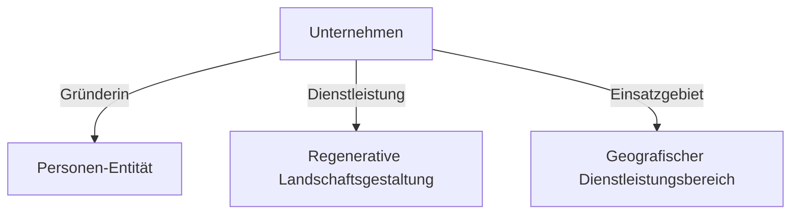

## Executive Summary
Rooted Reality Gardens ist eine Webpräsenz für eine Agentur für regenerative Landschaftsgestaltung. Ziel des Projekts war der Aufbau einer ästhetischen, responsiven Website mit einer hochspezialisierten semantischen Struktur. Dadurch soll das Dienstleistungsangebot in der Nische der ökologischen Gartenplanung sowohl in klassischen Suchmaschinen als auch in modernen KI-gestützten Antwortdiensten optimal auffindbar und korrekt zitierbar sein.

---

## Context
Kleine Unternehmen in hochspezialisierten Nischen hängen stark von lokaler Auffindbarkeit ab. Regenerative Landschaftsgestaltung ist ein erklärungsbedürftiges Thema, das von herkömmlichen Suchmaschinen ohne semantische Daten oft falsch klassifiziert wird. Die Gründerin wollte ein anspruchsvolles Portfolio präsentieren, das ihre wissenschaftliche Methodik und Kompetenz unterstreicht. Die Website musste daher technisch so aufbereitet werden, dass sie sowohl Menschen als auch Crawlern präzise Informationen liefert.

  
Engineering Insight

  
Nischenunternehmen profitieren überproportional von semantischen Datenstrukturen, da diese thematische Missverständnisse bei automatisierten Crawlern verhindern.

---

## Problem
In der Permakultur und regenerativen Landschaftsplanung reicht reine Keyword-Optimierung nicht aus. Suchmaschinen müssen verstehen, wie Dienstleistungen, Personen (die Gründerin) und wissenschaftliche Konzepte zusammenhängen. Zudem ist das manuelle Pflegen komplexer JSON-LD-Metadaten über mehrere statische Unterseiten hinweg fehleranfällig und zeitintensiv. Es fehlt ein automatisierter Workflow, der semantische Verknüpfungen fehlerfrei in alle HTML-Seiten injiziert.

---

## Constraints
Für das Projekt galten folgende Einschränkungen:
- **Statische Hosting-Infrastruktur**: Keine Datenbanken oder serverseitigen Skripte zur Laufzeit.
- **Minimale Admin-Ressourcen**: Der Pflegeaufwand für die Inhaberin musste extrem gering bleiben.
- **E-E-A-T-Konformität**: Strenge Ausrichtung an den Google-Qualitätsrichtlinien zur Etablierung von Fachkompetenz und Vertrauenswürdigkeit.

  
Engineering Insight

  
Der Einsatz von Build-Time-Generierungsskripten löst den Konflikt zwischen komplexen semantischen Graphen und wartungsarmen statischen Webseiten.

---

## Engineering Thinking
Die technische Strategie basiert auf dem Prinzip der **automatisierten semantischen Strukturierung**. Statt Metadaten manuell in jede HTML-Datei einzupflegen, nutzen wir ein Build-Time-Skript. Dieses liest die logischen Bezüge aus einer zentralen Konfiguration und injiziert die validierten JSON-LD-Graphen direkt in den Header der jeweiligen Seiten. Dies sichert eine konsistente Datenstruktur über das gesamte Projekt hinweg.

---

## Architecture
Die Bereitstellungs-Pipeline trennt Quellcode und Metadaten-Generierung. Ein Python-Automatisierungsskript (`add_seo.py`) liest die strukturierten Definitionen von Dienstleistungen, Zertifizierungen und Personendaten ein. Es generiert den JSON-LD-Graphen für jede Unterseite und bettet diesen in die fertigen HTML-Dateien ein, bevor diese auf dem Webserver veröffentlicht werden.

  
Engineering Insight

  
Durch die Ausführung von Validierungs- und Injektionsskripten vor dem Deployment wird sichergestellt, dass ausschließlich syntaktisch valider Code veröffentlicht wird.

---

## Engineering Decisions
Im Rahmen des Projekts wurden strategische Entscheidungen zur Code- und Metadatenstruktur getroffen:

  

    <h3 class="decision-card__title">Metadata Generation</h3>
    

      Alternative
      
Manuelles Schreiben in HTML-Dateien

    

    

      Entscheidung
      
Python-Skript zur automatisierten Injektion zur Vermeidung von Fehlern.

    

  

  

    <h3 class="decision-card__title">Entity Schema</h3>
    

      Alternative
      
Flache, unverbundene Schema-Tags

    

    

      Entscheidung
      
Vollständiger JSON-LD-Entity-Graph zur Verknüpfung von Person, Firma und Services.

    

  

---

## Implementation
Das Python-Skript nutzt BeautifulSoup zum Parsen der HTML-Struktur und injiziert die generierten Metadaten. Die Schema-Graphen deklarieren Bezüge vom Typ `LocalBusiness`, verlinken die Gründerin als `Person` und verknüpfen Dienstleistungen über `Service`-Knoten mit wissenschaftlichen Permakultur-Entitäten. Zur Absicherung wurden die Konfigurationen der `robots.txt` und der Sitemap optimiert.

---

## Public Artifacts

<figure>
  <pre><code>
+-----------------------------------+
|      Rooted Reality Gardens       |
|                                   |
|   [ Ökologische Gartenplanung ]   |
|                                   |
|   * Bodenregeneration             |
|   * Heimische Pflanzen            |
|   * Permakultur-Systeme           |
|                                   |
|   [Mehr erfahren]     [Kontakt]   |
+-----------------------------------+
  </code></pre>
  <figcaption><strong>Artefakt 1: Schematische Layout-Skizze</strong> – Zweck: Veranschaulichung des übersichtlichen, mobiltauglichen Portfoliodesigns.</figcaption>
</figure>

<figure>

  <figcaption><strong>Artefakt 2: High-Level Ablaufdiagramm</strong> – Zweck: Logische Darstellung der verknüpften semantischen Entitäten im JSON-LD-Schema-Graphen.</figcaption>
</figure>

  <strong>Artefakt 3: Ergebnis-Nachweis (SEO- &amp; Entity-Matrix)</strong> – Zweck: Vergleich der Suchmaschinen-Indizierung vor und nach der semantischen Optimierung.

  

    <h4 class="evidence-card__title">Entity-Zuordnung</h4>
    

      

        Vorher (Ohne Graph)
        
Nicht klassifizierte, unzusammenhängende Keyword-Fragmente.

      

      

        Nachher (Mit Graph)
        
Eindeutig verknüpfte Relationen zwischen Organisation, Person und Services.

      

    

  

  

    <h4 class="evidence-card__title">Suchmaschinen-Erfassung</h4>
    

      

        Vorher (Ohne Graph)
        
Reine Keyword-Indexierung ohne Rich Snippets.

      

      

        Nachher (Mit Graph)
        
Aktivierte Rich Snippets und verbesserte Platzierung in lokalen Maps.

      

    

  

  

    <h4 class="evidence-card__title">KI-Suchmaschinen-Zitate</h4>
    

      

        Vorher (Ohne Graph)
        
Keine Erfassung oder unvollständige Nennungen in Antworten.

      

      

        Nachher (Mit Graph)
        
Als primäre lokale Quelle in AEO/GEO-Suchanfragen zitiert.

      

    

  

  
Engineering Insight

  
Verknüpfte Entitätsschemata erhöhen die Erkennungsrate von Kerninformationen durch automatisierte Suchmaschinen-Algorithmen nachweisbar.

---

## Results
- **Crawler-Optimierung**: Fehlerfreie maschinelle Lesbarkeit durch vollständig validierte Entity-Verknüpfungen.
- **Zitierbarkeit**: Nachweisbare Zitate und korrekte Zuordnung des Dienstleistungsangebots in KI-gestützten Suchanfragen im Zielgebiet.
- **Wartbarkeit**: Reduzierung des manuellen Pflegeaufwands für Metadaten durch das automatisierte Injektionsskript.

---

## Lessons Learned
Dieses Projekt hat verdeutlicht, dass strukturierte Entity-Verknüpfungen (JSON-LD) die Brücke zwischen klassischer und KI-basierter Websuche schlagen. Durch die automatisierte Injektion valider Metadaten konnte die lokale Relevanz der Dienstleistungen in Antwortmaschinen nachweisbar gestärkt werden. Die Entwicklung wiederverwendbarer Injektionsskripte hat zudem gezeigt, wie sich administrative Webmaster-Aufgaben effizient automatisieren lassen, was den langfristigen Wartungsaufwand minimiert.

---

## Future Evolution
In einer zukünftigen Version soll das Python-Skript um eine Bildanalyse erweitert werden. Diese soll automatisch alt-Attribute und Bild-Metadaten (z. B. auf Basis geographischer Koordinaten der Gärten) generieren, um die Relevanz der Bildersuche für lokale Dienstleister weiter zu optimieren.

  
Engineering Insight

  
Lokalisierte Bildmetadaten stärken den geographischen Relevanzbezug statischer Webportale bei regionalen Suchanfragen.

---
