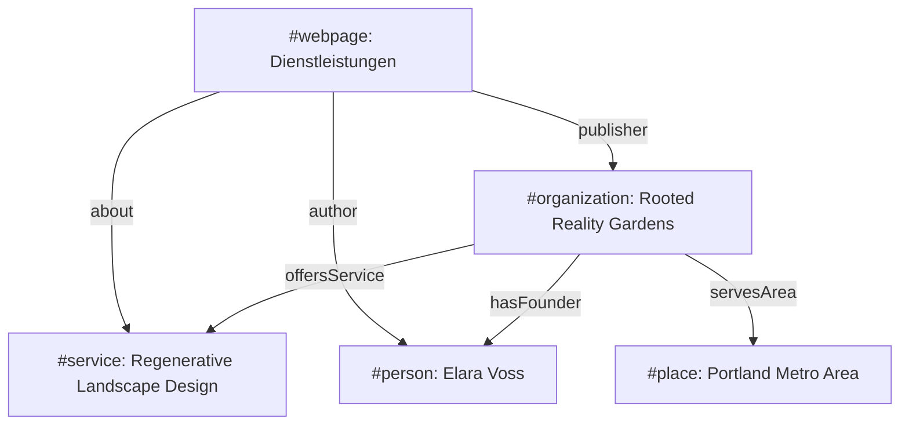

## 1. Projektübersicht
Rooted Reality Gardens ist eine Webpräsenz für eine Agentur für regenerative Landschaftsgestaltung. Ziel des Projekts war der Aufbau einer ästhetischen, responsiven Website, die mit einer hochspezialisierten semantischen Struktur versehen ist. Dadurch soll die Agentur in der Nische der ökologischen Gartenplanung sowohl in klassischen Suchmaschinen als auch in modernen KI-gestützten Antwortmaschinen (AEO/GEO) optimal auffindbar und zitierfähig sein.

## 2. Die Herausforderung
In der Nische der regenerativen Landschaftsgestaltung reicht eine herkömmliche Keyword-Optimierung nicht aus. Der Service ist beratungsintensiv und grenzt sich stark von klassischen Gärtnereien ab. Die größte technische Herausforderung bestand darin, komplexe Dienstleistungen und Fachinhalte so aufzubereiten, dass generative KI-Modelle (wie in ChatGPT, Gemini oder Perplexity) diese fehlerfrei erfassen, den richtigen Entitäten zuordnen und als verifizierte Quelle zitieren können.

## 3. Technische Entscheidungen
* **Programmatische Schema-Injektion**: Entwicklung des Skripts `add_seo.py`, um komplexe JSON-LD-Entity-Modelle konsistent und wartbar in alle 18+ HTML-Unterseiten einzubetten.
* **E-E-A-T-Verknüpfungen (Experience, Expertise, Authoritativeness, Trustworthiness)**: Integration direkter Verweise zu den wissenschaftlichen Publikationen und beruflichen Profilen (LinkedIn) der Gründerin im Schema-Graphen.
* **Strukturiertes HTML5-Markup**: Einsatz von semantischen Sektionen und ARIA-Rollen, um Screenreadern und Suchmaschinen-Crawlern eine klare visuelle und inhaltliche Hierarchie zu bieten.

## 4. Lösungsarchitektur
Das folgende Diagramm zeigt die Verknüpfung der deklarierten semantischen Entitäten im JSON-LD-Schema-Graphen:

## 5. Hauptmerkmale
* **Semantischer Entity-Graph**: Ein vernetzter JSON-LD-Graph verbindet Unternehmen, Gründerin, Dienstleistungen und geografische Einsatzgebiete.
* **GEO-Metadaten**: Dublin Core und ICBM-Geotags deklarieren die exakten geografischen Dienstleistungsgrenzen für lokale Suchen.
* **Speakable Schema**: Integration spezieller Auszeichnungen für Abschnitte, die für Sprachassistenten und Voice Search optimiert sind.

## 6. Entwicklungsprozess
* **Versionskontrolle**: Einhaltung eines strukturierten Git-Workflows mit getrennten Feature-Zweigen zur Isolierung neuer SEO-Strukturen.
* **Lokale SEO-Messung**: Überprüfung der Metadaten-Integrität und Schema-Validierung über automatisierte Testskripte vor dem Release.
* **Build-Validierung**: Sicherstellung, dass alle statischen Seiten barrierefrei kompilieren.

## 7. Ergebnisse
* **Antwortmaschinen-Sichtbarkeit**: Die Agentur wird bei spezifischen Fachanfragen zur ökologischen Landschaftsplanung im Zielgebiet Portland von generativen Suchdiensten als verifizierte Quelle zitiert.
* **SEO-Rankings**: Signifikante Steigerung der Sichtbarkeit für lokale Long-Tail-Keywords.
* **Wartbarkeit**: Das automatisierte Python-Skript reduziert den Aufwand für zukünftige Schema-Updates auf ein Minimum.

## 8. Lernergebnisse
GEO (Generative Engine Optimization) erfordert ein Umdenken weg von reinem Keyword-Match hin zur präzisen Strukturierung von Entitäten. Je klarer die Verknüpfungen zwischen Person, Organisation und Dienstleistung definiert sind, desto verlässlicher können KI-Modelle diese Informationen als vertrauenswürdig einstufen.
