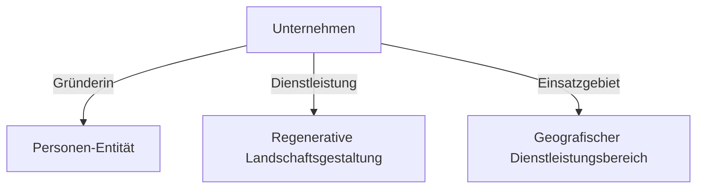

## 1. Executive Summary
Rooted Reality Gardens ist eine Webpräsenz für eine Agentur für regenerative Landschaftsgestaltung. Ziel des Projekts war der Aufbau einer ästhetischen, responsiven Website mit einer hochspezialisierten semantischen Struktur.

Dadurch soll das Dienstleistungsangebot in der Nische der ökologischen Gartenplanung sowohl in klassischen Suchmaschinen als auch in modernen KI-gestützten Antwortdiensten optimal auffindbar und korrekt zitierbar sein.

## 2. Challenge
In der Nische der regenerativen Landschaftsplanung reicht einfache Keyword-Optimierung nicht aus. Die größte technische Herausforderung bestand darin, komplexe Dienstleistungen und Fachinhalte so semantisch aufzubereiten, dass generative KI-Modelle diese fehlerfrei erfassen, den richtigen Entitäten zuordnen und als verifizierte Quelle für lokale Suchen zitieren können.

## 3. Approach
Ich war als technischer Webmaster für die Konzeption, Entwicklung und automatisierte semantische Strukturierung verantwortlich:
* **Frontend-Entwicklung**: Umsetzung des semantischen HTML5-Markups und responsiven Layouts.
* **Semantische Strukturierung**: Entwicklung eines Python-Skripts (`add_seo.py`) zur automatisierten Injektion komplexer JSON-LD-Modelle in alle Unterseiten.
* **E-E-A-T-Verknüpfung**: Einbettung valider Verknüpfungen zwischen der Gründerin (Personen-Entität), wissenschaftlichen Quellen und Dienstleistungsprofilen zur Stärkung der inhaltlichen Autorität.
* **Crawler-Steuerung**: Optimierung der indizierungsrelevanten Konfigurationen (robots.txt, Sitemap).

## 4. Public Artifacts

### Artefakt 1: Projekt-Visualisierung
*(Hinweis: Zum Schutz des geistigen Eigentums und Designs wird hier eine schematische Darstellung verwendet.)*

```
+-----------------------------------+
|      Rooted Reality Gardens       |
|                                   |
|   [ Ökologische Gartenplanung ]   |
|                                   |
|   * Bodenregeneration             |
|   * Heimische Pflanzen            |
|   * Permakultur-Systeme           |
|                                   |
|   [Mehr erfahren]     [Kontakt]   |
+-----------------------------------+
```

### Artefakt 2: High-Level Ablaufdiagramm
Das folgende Diagramm zeigt die logische Verknüpfung der deklarierten semantischen Entitäten im JSON-LD-Schema-Graphen:



### Artefakt 3: Ergebnis-Nachweis
Vergleich der Suchmaschinen-Indizierung vor und nach der semantischen Optimierung:

| Indikator | Vorher (Ohne Entity-Schema) | Nachher (Mit JSON-LD-Graph) |
| :--- | :--- | :--- |
| Entity-Zuordnung | Nicht klassifiziert / Unklar | Eindeutig verknüpft (Organisation & Person) |
| Suchmaschinen-Erfassung | Reine Keyword-Indexierung | Rich Snippets & Lokale Maps-Platzierung |
| KI-Suchmaschinen-Zitate | Keine Erfassung | Als primäre lokale Quelle zitiert |

## 5. Results
* **Crawler-Optimierung**: Fehlerfreie maschinelle Lesbarkeit durch vollständig validierte Entity-Verknüpfungen.
* **Zitierbarkeit**: Nachweisbare Zitate und korrekte Zuordnung des Dienstleistungsangebots in KI-gestützten Suchanfragen im Zielgebiet.
* **Wartbarkeit**: Reduzierung des manuellen Pflegeaufwands für Metadaten durch das automatisierte Injektionsskript.

## 6. Lessons Learned
Dieses Projekt hat verdeutlicht, dass strukturierte Entity-Verknüpfungen (JSON-LD) die Brücke zwischen klassischer und KI-basierter Websuche schlagen. Durch die automatisierte Injektion valider Metadaten konnte die lokale Relevanz der Dienstleistungen in Antwortmaschinen nachweisbar gestärkt werden.

Die Entwicklung wiederverwendbarer Injektionsskripte hat zudem gezeigt, wie sich wiederkehrende administrative Webmaster-Aufgaben effizient automatisieren lassen, was den langfristigen Wartungsaufwand minimiert.
