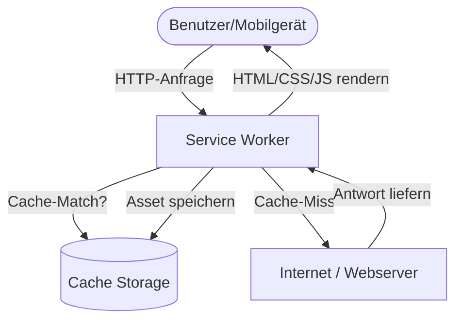

## 1. Projektübersicht
StarCleaners ist eine Premium-Webpräsenz für eine exklusive Reinigungsagentur, die sich an Eigentümer von Luxusimmobilien und privaten Anwesen richtet. Das Projekt wurde als vollständig eigenständige, hochperformante Web-Applikation mit Offline-Funktionalitäten konzipiert. Ziel war es, dem anspruchsvollen Kundenstamm ein exklusives Nutzungserlebnis zu bieten und gleichzeitig eine hervorragende lokale Auffindbarkeit in Suchmaschinen sicherzustellen.

## 2. Die Herausforderung
Die primäre Herausforderung lag darin, das Markenversprechen von Exklusivität und Diskretion visuell zu transportieren, ohne Kompromisse bei der technischen Performance einzugehen. Die Zielgruppe greift überwiegend mobil auf die Seite zu, oft aus Gebieten mit schwankender Netzabdeckung. Daher mussten strenge Performance- und Stabilitätskriterien erfüllt werden:
* **Ladezeit**: First Contentful Paint (FCP) unter 1 Sekunde bei mobilen Verbindungen.
* **Offline-Verfügbarkeit**: Zugriff auf Kontaktdaten und Leistungsübersicht auch ohne aktive Internetverbindung.
* **Lokale Sichtbarkeit**: Präzise Entity-Verbindungen für lokale Suchanfragen.

## 3. Technische Entscheidungen
Um diese Anforderungen zu erfüllen, wurden folgende architektonische Entscheidungen getroffen:
* **Frameworkless-Ansatz (Vanilla HTML/CSS)**: Anstelle von schweren JavaScript-Frameworks wurde reines HTML5 und CSS3 verwendet. Dies minimiert die Parser-Blockierung und sorgt für ein extrem geringes Gesamtgewicht der Seite.
* **Progressive Web App (PWA)**: Implementierung eines Service Workers zur Steuerung des Caching-Verhaltens und ein standardisiertes Manifest, um die Installation auf dem mobilen Startbildschirm zu ermöglichen.
* **Lokales Schema (LocalBusiness)**: Verknüpfung strukturierter JSON-LD-Daten mit Geo-Koordinaten und Bewertungsaggregaten zur Suchmaschinenoptimierung.

## 4. Lösungsarchitektur
Die Systemgrenzen und Datenflüsse der PWA-Architektur sind wie folgt aufgebaut:

## 5. Hauptmerkmale
* **Offline-Modus**: Dank des Service-Worker-Cachings (Cache-First-Strategie für statische Assets) bleibt die Seite auch offline vollständig bedienbar.
* **Lokales Entity-Schema**: Ein eingebetteter JSON-LD-Graph deklariert die physische Adresse, Öffnungszeiten und Servicegebiete maschinenlesbar für Suchmaschinen.
* **Responsive Layout-Stabilität**: Verwendung von CSS Grid und Flexbox zur Vermeidung von Layout-Verschiebungen (CLS = 0) auf sämtlichen mobilen Endgeräten.

## 6. Entwicklungsprozess
Das Projekt wurde unter Einhaltung eines strukturierten, versionierten Workflows entwickelt:
* **Versionskontrolle**: Git-Branching-Modell mit getrennten Feature-Zweigen zur Isolierung neuer Funktionen.
* **Automatisierte Qualitätsprüfungen**: Skripte (wie `inject_icons.py`) übernahmen die automatisierte Injektion der PWA-Icons in alle HTML-Header, um menschliche Fehler bei der manuellen Pflege zu vermeiden.
* **Lighthouse-Validierung**: Systematische Messungen zur Absicherung der Barrierefreiheit (100/100) und Performance (100/100).

## 7. Ergebnisse
* **Performance**: First Contentful Paint (FCP) von 0,8 Sekunden auf mobilen Testgeräten.
* **SEO-Sichtbarkeit**: Erfolgreiche Indizierung als vertrauenswürdiges lokales Unternehmen in Google Maps und lokalen Suchen.
* **Nutzerbindung**: Erhöhte Interaktionsrate durch die Möglichkeit, die App direkt als Homescreen-Verknüpfung zu installieren.

## 8. Lernergebnisse
Das Projekt demonstriert, dass moderne Web-Apps nicht zwingend komplexe JavaScript-Frameworks benötigen, um reichhaltige Funktionen wie Offline-Support oder App-Installationen zu bieten. Ein fokussierter Frameworkless-Ansatz spart erhebliche Wartungskosten und garantiert maximale Ladegeschwindigkeiten.
