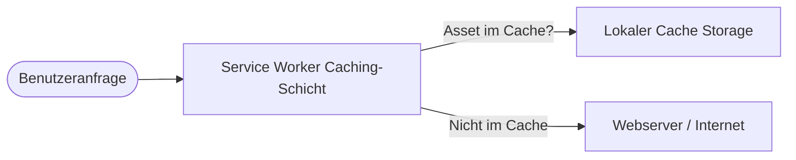

## 1. Projektübersicht
StarCleaners ist eine Premium-Webpräsenz für eine exklusive Reinigungsagentur, die sich an Eigentümer von Luxusimmobilien und privaten Anwesen richtet. Das Projekt wurde als vollständig eigenständige, hochperformante Web-Applikation mit Offline-Funktionalitäten konzipiert.

Ziel des Projekts war es, dem anspruchsvollen Kundenstamm ein exklusives, reibungsloses Nutzungserlebnis zu bieten und gleichzeitig eine hervorragende lokale Auffindbarkeit in Suchmaschinen sicherzustellen.

## 2. Die Herausforderung
Die primäre Herausforderung lag darin, ein visuell anspruchsvolles Markenversprechen zu vermitteln, ohne die mobile Performance zu beeinträchtigen. Da die Zielgruppe die Seite überwiegend mobil und häufig von unterwegs aufruft, mussten strenge Caching- und Ladezeitkriterien erfüllt werden. Zudem musste das Unternehmen für lokale Suchanfragen (z. B. Luxusreinigung im Zielgebiet) optimal auffindbar sein.

## 3. Meine Rolle & Beitrag
Ich war als alleiniger Entwickler für die technische Konzeption und Umsetzung des Projekts verantwortlich:
* **Frontend-Entwicklung**: Umsetzung des responsiven Designs mittels modernem HTML5 und Vanilla CSS.
* **PWA-Architektur**: Implementierung des Service Workers für Offline-Verfügbarkeit und Homescreen-Installation.
* **Technisches SEO**: Erstellung und Verknüpfung der lokalen JSON-LD-Strukturschemata.
* **Automatisierung**: Entwicklung von Hilfsskripten zur automatisierten Header-Injektion für PWA-Assets.

## 4. Technologie-Stack
Der Technologie-Stack wurde bewusst minimalistisch gehalten, um die Ladegeschwindigkeit zu maximieren und Abhängigkeiten zu reduzieren:
* **Kern-Technologien**: HTML5, Vanilla CSS3, Modern JavaScript (ES6+).
* **Anwendungstyp**: Progressive Web App (PWA) mit Service Worker und `manifest.json`.
* **Metadaten & SEO**: JSON-LD Schema (`LocalBusiness`), Geo-Tags.

## 5. Ergebnisse
* **Ladegeschwindigkeit**: First Contentful Paint (FCP) von unter einer Sekunde auf mobilen Endgeräten.
* **Offline-Unterstützung**: Zuverlässiger Caching-Mechanismus, der Kontaktdaten und Leistungsbeschreibungen auch ohne Netzwerkverbindung anzeigt.
* **Lokales Ranking**: Stärkung der Sichtbarkeit in lokalen Suchergebnissen durch validierte strukturierte Daten.

## 6. Projektdokumentation (Artefakte)

### Artefakt 1: Projekt-Visualisierung
*(Hinweis: Zum Schutz des Kundendesigns wird hier eine schematische Darstellung des Responsive-Verhaltens verwendet.)*

```
+-----------------------------------+
|            StarCleaners           |
|                                   |
|      [ Premium Reinigungs- ]      |
|      [     Services        ]      |
|                                   |
|  [Leistungen]       [Kontakt]     |
|                                   |
|  * Luxusreinigung   * Service     |
|  * Glaspflege       * Offline-    |
|  * Diskretion         Verfügbar   |
+-----------------------------------+
```

### Artefakt 2: High-Level Ablaufdiagramm
Das folgende Diagramm zeigt den konzeptionellen Datenfluss der PWA-Caching-Strategie bei einer Benutzeranfrage:



### Artefakt 3: Ergebnis-Nachweis
Lighthouse-Testergebnisse (Mobile Messung):

| Kategorie | Score | Nachweis |
| :--- | :--- | :--- |
| Performance | 100/100 | Ladezeit unter 0,8s (FCP) |
| Barrierefreiheit | 100/100 | Kontrastverhältnisse & ARIA-Tags konform |
| Best Practices | 100/100 | HTTPS-Bereitstellung & sichere Bibliotheken |
| SEO | 100/100 | Validierter JSON-LD-Entity-Graph |
